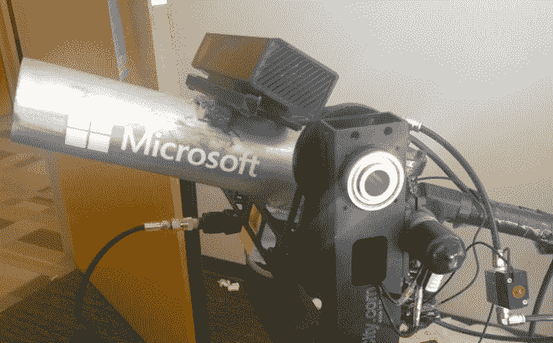

# KinectKannon 是一个机器人 t 恤大炮，可以跟踪你的运动，并在黑暗中看到 

> 原文：<https://web.archive.org/web/https://techcrunch.com/2014/11/20/kinectkannon-is-a-robotic-t-shirt-cannon-that-can-track-your-movements-and-see-in-the-dark/>

# KinectKannon 是一个机器人 t 恤大炮，可以跟踪你的运动，并在黑暗中看到

【YouTube https://www.youtube.com/watch?v = _ VG 13 H3 CSU & w = 560 & h = 315]

你可以跑。你可以躲起来。见鬼，你甚至可以关灯。做你想做的，但是这个东西*会*给你……一件免费的 t 恤。

认识一下 KinectKannon，这是一个半自动的 t 恤大炮，可以跟踪你的运动，进入夜视模式，并向人群发射 t 恤。这就像 [T-1000](https://web.archive.org/web/20221207013912/http://en.wikipedia.org/wiki/T-1000) 的糊涂小弟。

由微软开发者福音传道者 Steven Edouard 建造的 KinectKannon 很大程度上是由商店购买的零件组成的——包括，正如你可能从名字中猜到的，Kinect。添加一些重型伺服系统、一些超级时髦的电磁阀和几千行代码，你就有了一个机器人大炮。总的来说，这个项目花费了大约 2500 美元。

鉴于这个项目处理的是高压二氧化碳罐(如果处理不当，它会很乐意炸掉你的手指/手/脸)，这…可能不是大多数人应该在空闲周末在车库里做的那种 DIY 项目。但是如果你认为你能胜任这项任务，史蒂文在这里分享了源代码。

[经由 [HN](https://web.archive.org/web/20221207013912/https://news.ycombinator.com/item?id=8638385)