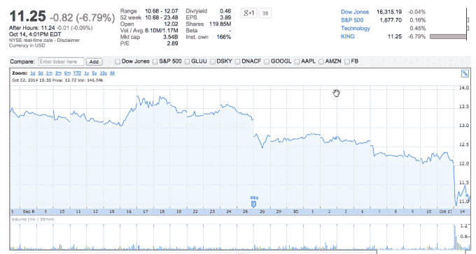

# King Digital 跌至其 IPO 价格的 50% 

> 原文：<https://web.archive.org/web/https://techcrunch.com/2014/10/14/king-digital-falls-to-50-of-its-ipo-price/>

# 国王数码跌至其 IPO 价格的 50%

今天，曾经无处不在的游戏《糖果粉碎》(Candy Crush)的创始人和供应商王者数码(King Digital)收于 11.25 美元。这个数字正好是其每股 22.50 美元发行价的一半。这家公司[在交易的第一天](https://web.archive.org/web/20230203205758/https://techcrunch.com/2014/03/26/king-ipo-2/)就下跌了，在此期间它的日子很不好过。

快速浏览一下图表会发现，该公司的股价仅在最短暂的时间里超过了其 IPO 价格。对于公众投资者来说，这是一段艰难的旅程。

部分陷入最近科技股的回调中，King 脱颖而出:虽然大多数科技股今天设法保住了自己，甚至收复了部分失地，King 下跌了 6.79%。在盘后交易中，该公司股价又下跌了一小部分。

评论对该公司产生了负面影响。我私下从投资者那里听说，King 根本就不应该被允许上市。今天，我从其他人那里[听到](https://web.archive.org/web/20230203205758/https://twitter.com/alex/status/522113899126988800)公开[反映了这种情绪。这也是一个相当不错的观点:](https://web.archive.org/web/20230203205758/https://twitter.com/rpmcb/status/522114289159532544)

https://twitter.com/howardlindzon/status/522047908380938241

具有讽刺意味的是，King 赚了钱，并在上一季度收益报告中宣布了 1 . 5 亿美元的股息。然而，与其每股下跌相比，现金支出是微不足道的，对该公司给一些投资组合造成的不当损害几乎没有影响。

现在从它的标价下降了 50 %, King 的下一步是什么？投资者看跌。叫不叫底就看你自己了。

这是图表:

