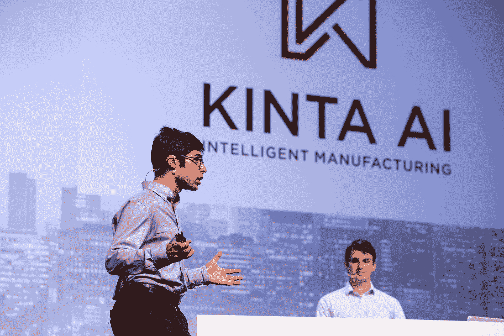

# Kinta AI 利用人工智能提高工厂效率 

> 原文：<https://web.archive.org/web/https://techcrunch.com/2018/09/06/kinta-ai-startup-battlefield/>

Kinta AI 的目标是让制造商更智能地配置他们的设备和其他工厂资源。

该公司今天在 TechCrunch 位于旧金山的初创公司战地上展示，由一个在金融、科技和人工智能领域拥有丰富经验的团队创建。

首席执行官史蒂文·格林纳特曾在金融科技初创公司担任管理和人工智能职务，首席技术官罗布·唐纳利正在斯坦福大学攻读博士学位，正在研究机器学习和经济学的交叉领域，工程副总裁本·扎克斯曾在脸书和谷歌工作过。

Glinert 告诉我，当工厂主做出生产决策时，他们通常依赖“愚蠢的软件”来决定何时应该使用哪些机器，这可能导致机器在错误的时间或以错误的顺序部署，或者在不应该的时候闲置。因此，他说，调度错误占了后期制造订单的 45%。

所以 Kinta AI 试图用人工智能来解决这个问题，具体来说就是[强化学习](https://web.archive.org/web/20221206014936/https://en.wikipedia.org/wiki/Reinforcement_learning)。格林纳特表示，该公司将运行“数以百万计的工厂模拟”，其中该系统获得“对你的工厂如何工作的统计理解，并学习你采取什么行动来获得什么结果”——然后它可以使用这些模拟来选择最佳日程。

“我们经历了，不是每一种可能的情况，但我们试图经历其中的一些，”他说。

Glinert 补充说，Kinta AI 与客户合作，了解每个工厂的细微差别。他还将该技术与谷歌的 AlphaGo AI 和 OpenAI 的 Dota 2 神经网络进行了比较——除了不是使用 AI 来玩 Go 或 Dota 2，吉尔纳特说 Kinta AI 正在利用它“做这些在工厂车间做出的详细的生产计划决策”

“并不是所有的工厂彼此都那么不同，”他说——就像“如果你学会了如何下围棋，你可以很容易地教会神经网络如何下象棋或其他类似的游戏。”

Kinta AI 已经有了一些客户，包括化学品制造商 [BASF](https://web.archive.org/web/20221206014936/https://www.basf.com/) 和一家医疗设备制造商。

格林纳特说，最终，Kinta AI 可能会成为制造过程中至关重要的一部分。他预测，“在未来的工厂中，将会有更少的人和更多的自动化，以及广阔的物联网设备环境。”

在那种环境下，他希望 Kinta AI 成为“制造商执行系统”。