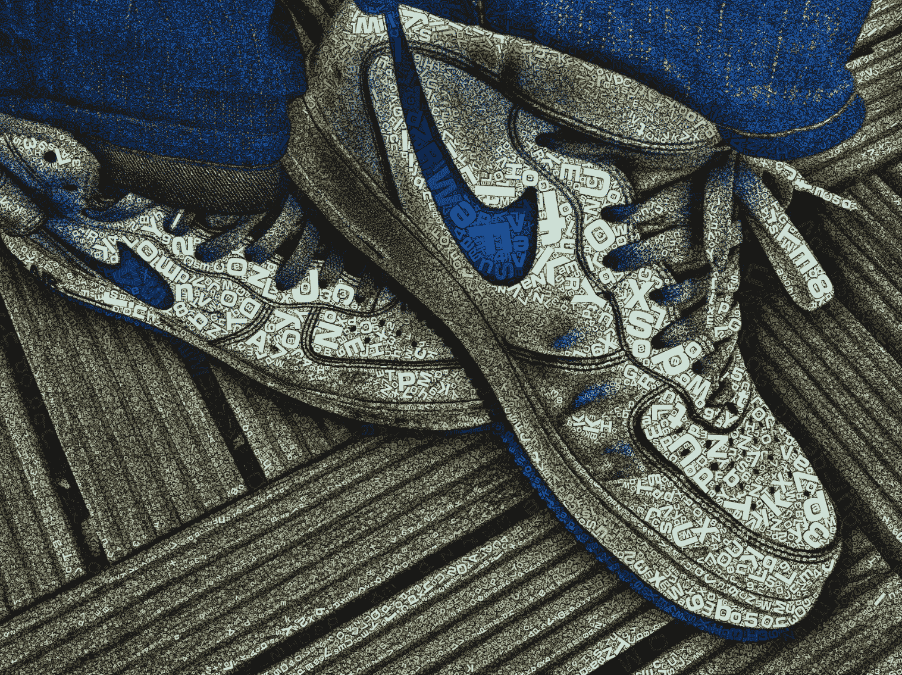
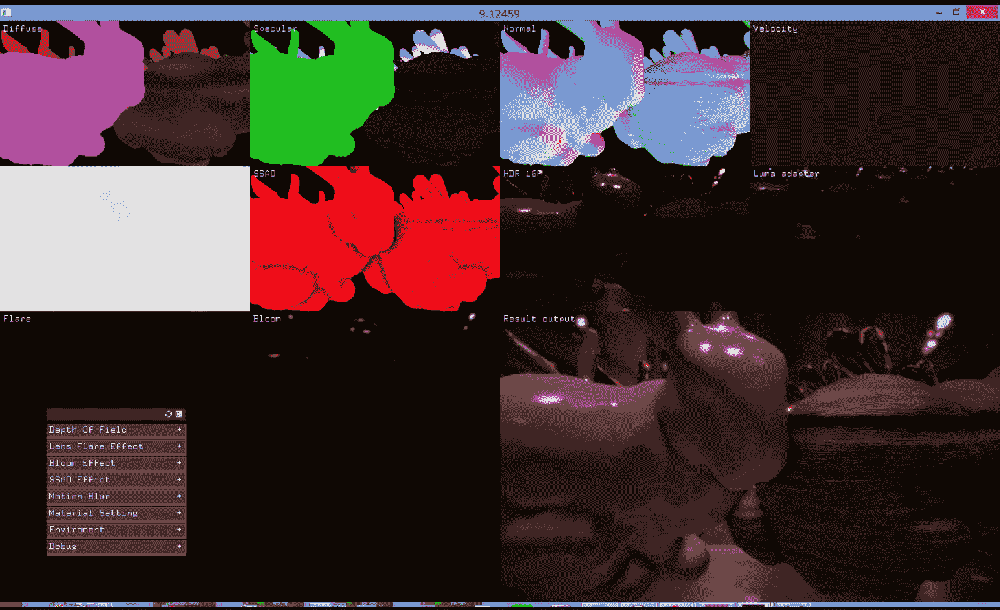
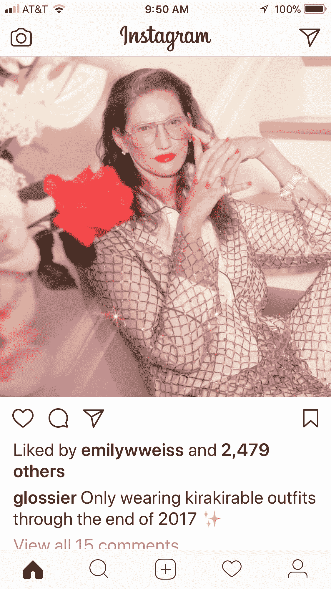
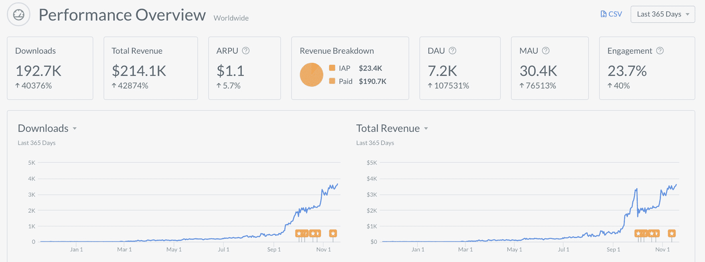
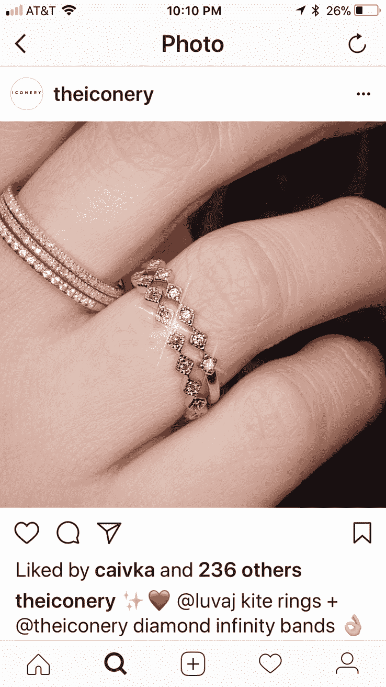

# 时代之光

> 原文：<https://web.archive.org/web/https://techcrunch.com/2017/12/17/kirakira-vs-the-world/>

为了让光如此明亮，黑暗必须存在
—弗朗西斯·培根和/或 [Lady Gaga](https://web.archive.org/web/20230326200005/https://www.goodreads.com/quotes/288725-if-you-dont-have-any-shadows-you-re-not-in-the)

亚历克西亚·措特西斯撰稿人

Alexia Tsotsis 是一个大书呆子，在雷达下工作。在此之前，她在商学院，在此之前，她在 TechCrunch。

More posts by this contributor [Kirakira](https://web.archive.org/web/20230326200005/http://kirakiraapp.com/)

在本文撰写之时，这款为你的照片增添光彩的应用是 iOS 应用商店中排名第一的付费应用。它的创造者，健太郎·亚玛，是一名日本开发人员，全职为东京 tha 有限公司设计工作室工作。

他没有想到他的 side hustle 会突然流行起来，而且肯定没有想到它会在 2017 年 11 月吸引 27.5 万名月活跃用户、30 万美元收入和大约 30 万美元下载量，Apptopia 还估计该应用的平均每位用户收入为 0.99 美元。(Yama 对 Apptopia 的估计提出质疑，认为该应用仅在 10 月份就有 40 万次下载。)

在 tha 有限公司，Yama 为资生堂和日本男子体操队工作过。他坚持说他的 Kirakira 的发现不是来自他的工作，而是来自一个在实时应用程序中创建照片级的 OpenGL 和 Shaers 效果的异想天开的追求。

健太郎实时挑战极限…

…相对于他在 CG 中的叛逆。

那么是什么推动 Kirakira 从 App Store 的渣滓变成了任何值得他们喜欢的有影响力的人的主屏幕呢？

“这种效果很容易理解，也很有趣，”Yama 给我写道。但这并不能解释为什么 Kirakira 直到今年 9 月才真正被发现，时尚界传说 Instagram 的合作伙伴 Eva Chen 偶然发现了它，并在 2018 春夏时装周上开始使用它。

虽然 Instagram 新闻团队尚未回应我们的置评请求，但陈很可能是该应用的“零号病人”。“我非常非常惊讶，”Yama 告诉我，两个月前看到这款应用突然走红。“由于下载次数增加，我更新了我认为需要的功能。“超出我的想象，人们喜欢发光，”他诗意地沉思道。

Yama 在 tha ltd .制作后期灯光效果时，偶然发现了 Kirakira 的灵感。

Yama 预感到，这种活跃的增强照明也适合手机的摄像头，因此开发了一个具有相同效果但实时的应用程序。但是几年来没有任何结果，直到今年秋天的春夏时装周(是的，我知道这听起来有多奇怪，但那完全是另外一篇文章)。

Yama 为自己的成功感到谦卑，他意识到已经有过多的过滤器应用。他还担心 Instagram 和脸书带来的生存威胁，这两家公司对践踏竞争对手毫无顾忌。

“是的，我有点担心，”他解释道。“我认为新功能 Kirakiragraph 是个好主意。如果这也是抄袭的，我(将)感到抱歉。”

Yama 认为，Kirakira 坚持只专注于放大光，而不是篡夺你的整个社交图，这可能是一种竞争优势。

Apptopia 统计

Kirakiragraph 是 Kirakira 于 11 月 13 日最新更新的[中的主角，是一张只会移动光线的照片，在我们慢慢接近一年中最明亮的节日:圣诞节和新年前夕时，这是一个有先见之明的发布。](https://web.archive.org/web/20230326200005/https://itunes.apple.com/us/app/kirakira/id955687901?mt=8)

这次更新还允许你在静态图像上获得 Kirakira 效果，像 [Iconery](https://web.archive.org/web/20230326200005/https://www.iconery.com/) 这样的在线品牌已经在使用 Photoshop 模仿这种效果。

Yama 不愿分享自己的下载指标，并表示他没有该应用每日和每月活跃用户的数据。它的收入和利润也是如此，尽管他告诉我 Apptopia 上的数字是近似值。他的未来计划包括建立一个 Android 版本的 Kirakira，但不是一个社交网络。他从来没想过拿风投的钱。

Yama 对像金·卡戴珊这样的世界名人使用他的应用程序感到敬畏。

“世界对我来说太不一样了。”尽管如此，Yama 说还没有一个使用 Kirakira 的名人联系过他。“虽然不是，但有几个与公司合作的故事，”他解释道。

他认为 AR 有很多机会像 Kirakira 那样影响时尚。“因为 CG 将更适合照片般真实的表达，我认为 CG 和相机将变得更加熟悉，更多各种各样的表达将作为 ar 诞生，”他解释道。

虽然 Kirakira 是故意简单的，但在美容和时尚领域，还有更复杂的 AR 相互作用的空间:Sephora 和 Mac 都利用了 Modiface SDK，允许你尝试猫眼或闪光唇，而不会出现混乱。像 Fabby Look [这样的应用程序帮助](https://web.archive.org/web/20230326200005/https://itunes.apple.com/us/app/fabby-look-hair-color-editor/id1246307850?mt=8)你改变你的头发颜色，还有一个[的应用程序聚宝盆](https://web.archive.org/web/20230326200005/https://www.youtube.com/watch?v=Bch1lxd7prs)可以让你进行数字手术(不管是好是坏，阿曼达·赫斯的)。

随着人工智能、CV 和 CG 的进步，类似的语义图像识别技术也将应用于你衣服的颜色或你整个身体的形状，这只是一个时间问题——大声喊出戴维·福斯特·华莱士对反乌托邦[化身技术的愿景。](https://web.archive.org/web/20230326200005/http://declineofscarcity.com/?page_id=2527)

如果亚马逊最近对 Body Labs 的收购是一个指标，那么技术黑手党已经在开发应用程序，使全红色或全黄色或全毛皮服装在社交媒体照片中更具冲击力，这越来越成为唯一重要的指标。据传，为安娜·温图尔打扮本人曾说过，时装秀现在只是人们在 Instagram 上发布服装的借口。

那么软件会吃跑道吗？简单的[点击#kirakira 标签](https://web.archive.org/web/20230326200005/http://link%20to%20this%20on%20the%20words%20https//www.instagram.com/explore/tags/kirakira/%C2%A0%C2%A0%E2%80%9Cclick%20on%20the%20#kirakira%20hashtag%E2%80%9D)就可以清楚地看到这个应用已经影响了影响者——见上文。这些闪闪发光的香奈儿靴子是[当季的鞋子](https://web.archive.org/web/20230326200005/https://www.instagram.com/p/BZJ_sy4npNv/?taken-by=evachen212)。还有[这些闪闪发光的裙子](https://web.archive.org/web/20230326200005/http://www.harpersbazaar.com/uk/fashion/shows-trends/a43906/sparkle-sequin-trend-ss18/)。而[这个](https://web.archive.org/web/20230326200005/https://www.farfetch.com/shopping/women/gucci-embroidered-polka-dot-tulle-gown-item-12316456.aspx?fsb=1&storeid=10952&size=20&pid=googleadwords_int&af_channel=Search&c=871228739&af_c_id=871228739&af_siteid=&af_keywords=pla-381862307886&af_adset_id=43514616163&af_ad_id=204345266782&is_retargeting=true&gclid=CjwKCAiApJnRBRBlEiwAPTgmxFHZB210jdsXG-C2LS4MIl8Ut2LptjvtVTuOULd_mXXqGnoRLyAuwhoCwacQAvD_BwE)。还有[这个眼影。](https://web.archive.org/web/20230326200005/http://www.harpersbazaar.com/beauty/makeup/g8668/fall-2017-makeup-trends/)和[这个](https://web.archive.org/web/20230326200005/https://www.modaoperandi.com/dundas-r18#lkcell-131269)。

“在 2017 年底之前只穿 Kirakirable 服装，”新美容品牌 [Glossier](https://web.archive.org/web/20230326200005/https://www.instagram.com/glossier/) ，Insta-tastemakers 的终极目标，最近发布，回想起新方向的早期迹象(他们也是首批倾向于“千禧粉红”的人之一)。

毕竟，除了光的增强，美是什么？

*文章于 12 月 17 日更新，新增 Apptopia 下载数据。*