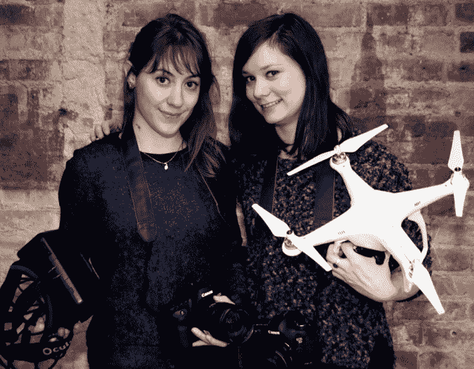

# 相机租赁初创公司 KitSplit 融资 210 万美元

> 原文：<https://web.archive.org/web/https://techcrunch.com/2018/02/21/kitsplit-seed-funding/>

运营创意设备在线租赁市场的 KitSplit 宣布，它已经筹集了 210 万美元的种子资金。

可用的设备可以包括相机、灯光和镜头，也可以包括 VR 设备和无人机。租赁者可以以较低的价格获得这种设备(首席执行官 Lisbeth Kaufman 估计 KitSplit 的成本通常比传统租赁低 30%至 50%)，而所有者在不使用设备时可以从设备中赚些外快。

[我在 2016 年第一次写了关于 KitSplit 的文章](https://web.archive.org/web/20230328183314/https://techcrunch.com/2016/05/26/kitsplit-dc/)，总裁 Kristina Budelis(《纽约客》前视频制作人)说，从那时起，这项服务的会员已经从 5000 人增长到了 30000 人。T4 还收购了它的一个竞争对手 CameraLends 。

客户包括 NBC、Vox 和国家地理。根据 Kaufman(特罗马联合创始人洛伊德·考夫曼的女儿)的说法，KitSplit 正被用于各种各样的制作中，但一些最强烈的兴趣来自数字媒体公司，因为他们试图满足在线视频制作的不断需求。([该行业的“转向视频”可能会遇到困难](https://web.archive.org/web/20230328183314/http://www.niemanlab.org/2017/12/r-i-p-pivot-to-video-2017-2017/)，但对视频内容的需求不会消失。)

种子轮的投资者包括赫斯特实验室(它也投资了 [KitSplit 的种子前资金](https://web.archive.org/web/20230328183314/https://techcrunch.com/2016/05/26/kitsplit-dc/))、企业家圆桌会议、3311 Ventures、NYU 创新风险基金、WTI 和 Instagram 联合创始人迈克·克里格(Mike Krieger)。

除其他外，这笔资金应该有助于 KitSplit 继续扩大其在洛杉矶的业务——用户可以在美国的任何地方租赁设备，但该公司目前专注于纽约市和洛杉矶市场。

最终，考夫曼说她希望 KitSplit 成为“内容创作者的一站式商店”

“我们正在把好莱坞制片厂重新想象成一个本地市场，”她补充道。“我们希望让所有内容创作者更容易获得设备、人员和位置等资源。”

Budelis 指出，像 KitSplit 的保险选项、其[礼宾服务](https://web.archive.org/web/20230328183314/https://intercom.help/kitsplit/kitsplit-concierge-service)(帮助实际运输设备的物流)和其[活动](https://web.archive.org/web/20230328183314/https://www.eventbrite.com/e/kitsplit-hq-happy-hour-tickets-43257669855)等事情是该公司如何“开始涉足”不仅仅是市场领域的早期迹象。

**更新:**这个故事的早期版本将 KitSplit 描述为一个点对点市场，但 Budelis 说这已经不太准确了，因为现在租赁者和设备所有者之间有业务。