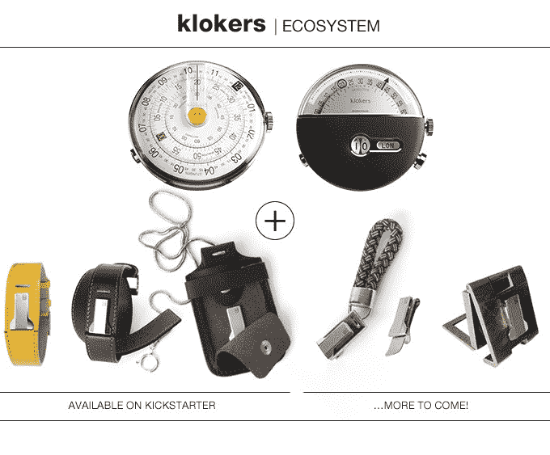

# Klokers 希望你的手腕回到过去 

> 原文：<https://web.archive.org/web/https://techcrunch.com/2015/10/13/klokers-wants-your-wrist-to-go-back-in-time/>

# 克洛克想让你的手腕回到过去

作为手表爱好者，我寻找一些东西。首先，我寻找复杂的机芯——手表内部的内脏——其次，我寻找有趣的设计。这些手表， [KLOK-1 和 KLOK-2](https://web.archive.org/web/20221208032057/https://www.kickstarter.com/projects/1221639153/watches-to-travel-through-time/description) 符合要求。这两款手表的设计看起来像一个计算尺和一个聪明的“燃料表”模型，都使用定制的石英电动机芯来显示时间。

早期支持者的手表价格约为 400 美元，有多种款式和颜色。手表可以从表带上取下，作为怀表使用，也可以夹在笔记本或夹克口袋里。创造者，尼古拉斯·鲍特林和理查德·皮拉斯，来自日内瓦的，他们将 KLOK 设计得非常独特。

例如，KLOK-1“由三个以不同速度滑过对方的圆盘组成”，而 KLOK-2 则使用逆行指针显示时间，并为其他时区提供窗口。这些复杂功能在实践中相当困难，但因为它们实际上是使用微型电机来驱动指针，所以比机械运动更便宜、更精确。

他们只要求 56，000 美元，但已经筹集了 50 多万美元，所以你很有可能在 2 月份发货时看到你的手表。

