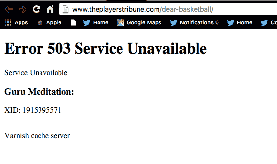

# 科比·布莱恩特通过推特和脸书宣布退役

> 原文：<https://web.archive.org/web/https://techcrunch.com/2015/11/29/kobe-bryant-announces-nba-retirement-over-twitter/>

# 科比通过推特和脸书宣布退役

***提示老人音乐***

在我那个时代，我们这个时代最优秀的体育运动员坐在摄像机前，他们的家人站在他们身边，宣布他们退役。

1993 年，迈克尔·乔丹第一次退役。记者们围着他问问题:

[https://web.archive.org/web/20220928003307if_/https://www.youtube.com/embed/IATBa_K0mgE?feature=oembed](https://web.archive.org/web/20220928003307if_/https://www.youtube.com/embed/IATBa_K0mgE?feature=oembed)

视频

如果乔丹在“我们的”时代打球会怎么样？数字时代。目前，[乔丹的品牌飞人](https://web.archive.org/web/20220928003307/https://twitter.com/Jumpman23)在推特上有 250 万粉丝，但他不与粉丝互动，也不分享很多个人更新。另一方面，[科比拥有 792 万粉丝](https://web.archive.org/web/20220928003307/https://twitter.com/kobebryant)，并经常与其他球员和粉丝互动。今天，科比跳过了新闻发布会的喧闹(到目前为止),通过推特宣布他打算在本赛季结束后从 NBA 退役。

他用信息链接到的[网站，也就是](https://web.archive.org/web/20220928003307/http://www.theplayerstribune.com/dear-basketball/)[棒球巨星德瑞克·基特的](https://web.archive.org/web/20220928003307/https://beta.techcrunch.com/2015/06/15/derek-jeters-players-club-raises-9-5-million-led-by-nea/)，在所有点击的压力下崩溃了。当网站启动时，杰特说他的目标是消除运动员和球迷之间的过滤。起作用了。

这条推文本身目前有 33，796 条转发和 22，828 个赞。这将如何转化为观众，比如说，ESPN，观看它。虽然科比在效力 20 年后从湖人退役并不令人震惊，但他选择分享这个消息的时间和方式无疑是一个惊喜。

如果这种全球影响力还不够的话(这条推文将在电视上播放)，科比继续跟进(一分钟后，时间戳显示)，在脸书上发了一个简单的[帖子，他在那里有 20，406，055 个“赞”，这也是越来越多。](https://web.archive.org/web/20220928003307/https://www.facebook.com/Kobe/photos/a.115811505418.97520.69025400418/10153758232030419/?type=3&theater)

这进一步证明了我们已经进入了一个想要更接近行动的时代。我们在电视上观看的娱乐的一部分。在这个世界上，我们从来没有像现在这样，与我们所崇拜的人，与和你一样崇拜同样的人的志趣相投的人变得如此亲近。在某种程度上，科比通过推特发布的退役消息充分说明了球迷们对那些年收入数百万美元的运动员的期望。有时，Twitter 会给玩家带来麻烦，因为他们经常在没有过滤器或公关人员的情况下发布推文。或者至少是这样的。

NBA 甚至在推特上发布了他们的声明:

Twitter 在历史上的地位早已巩固，这只是又一次提醒人们，这不再是你爷爷的~~的~~我们的世界。斯蒂芬·库里会因为一次[现场直播的虚拟现实体验](https://web.archive.org/web/20220928003307/https://beta.techcrunch.com/2015/11/27/moments-are-selling-the-promise-of-vr-right-now/)而退役吗？那种感觉就像我们和他在体育馆里一样。抓紧你的帽子。

如果你看不懂科比的信，这里有一段摘录:

> 亲爱的篮球，
> 
> 从
> 我开始卷我爸爸的筒袜
> 并在大西部论坛
> 上拍摄想象中的
> 赢得比赛的镜头
> 的那一刻起，我就知道有一件事是真实的:
> 
> 我爱上了你。
> 
> 爱得如此之深，以至于我给了你我的全部——从我的思想、身体到我的精神、灵魂。