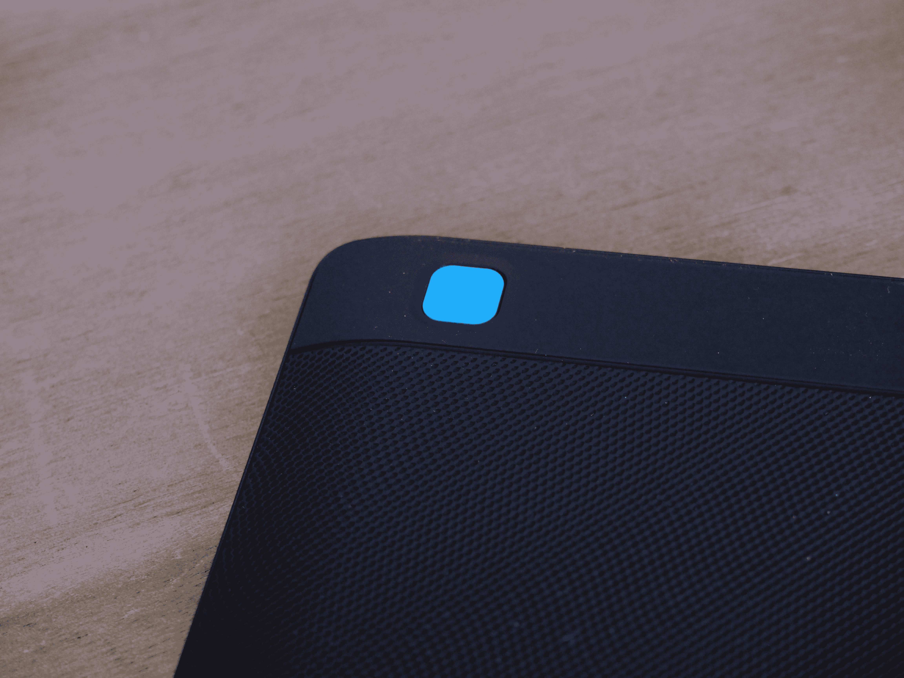

# Kobo 的 Aura H2O 得到了升级，但防水仍然是它的突出特点

> 原文：<https://web.archive.org/web/https://techcrunch.com/2017/05/02/kobos-new-reader-isnt-much-of-an-upgrade-but-waterproofing-keeps-it-ahead-of-the-kindle/>

Kobo 并没有对其产品进行太多的升级，因为，让我们面对现实吧，电子阅读器市场已经今非昔比了——剩下的仍然由亚马逊主导。尽管如此，这家由加拿大转为日本的公司一直在发布一些最好的电子阅读器。虽然今天早上 Aura H2O 的发布并不标志着与其前任的巨大差异，但它继续提供 Kindle 没有的一个关键功能:防水。

当然，这里有一些不错的升级，大部分来自该公司更高端的 [Aura One](https://web.archive.org/web/20230320023622/https://techcrunch.com/2016/08/17/kobo-aura-one-review/) 。存储空间增加了一倍，达到 8GB，这意味着你可以存储 6000 本书，而不是 3000 本。更引人注目的是苹果夜班电子阅读器版本 ComfortLight PRO 的采用，它降低了穿过屏幕的蓝光量，因此睡前阅读不太可能让你整夜睡不着。

然而，这里真正的杀手级功能是该系列自 2014 年以来一直炫耀的功能，也是亚马逊尚未赶上的功能。越来越多的旗舰手机都采用了防水功能，包括苹果和三星等大牌手机，但如果你想在将设备带到游泳池、在浴室阅读或只是考虑到被暴雨淋湿的可能性时增加保险，目前真的只有一个选择。

Aura One 与 H2O 相比仍有一些关键优势，包括更大的屏幕，但就 E Ink 而言，6.8 英寸和 265ppi 仍是一个相当不错的屏幕。我自己也玩了一会儿，觉得自己其实更喜欢 H2O 的屏幕尺寸。它很好地分割了这种差异，添加了更多的文本，而不会让单手阅读变得笨拙。

除此之外，在过去几代人的时间里，你已经习惯了电子阅读器。这是明显缺乏竞争的主要不利因素之一——当市场上有更多参与者时，创新不会来得那么快。MicroUSB？这是什么，2014 年？

售价 179 美元，比 One 便宜 50 美元，也比亚马逊的 premium Voyage 便宜。设计语言比 Kindle 更老派，包括更结实的塑料边框和没有翻页按钮，但 Kobo 在设法保持价格竞争力方面很好，尽管亚马逊积极的硬件补贴。

Kobo 显然看到了产品线多样化的优势，但考虑到目前每个人都在为残羹剩饭而战，我建议孤注一掷。把所有的鸡蛋都塞进一个篮子里。选择一个而不是 H2O(反之亦然)需要做出一些妥协。但另一方面，一款真正优质的防水电子阅读器呢？这很难被打破。电子阅读器市场并不是很大，但为什么不用最好的设备击败竞争对手呢？

与此同时，新款 H2O 将于 5 月 15 日开始预售。