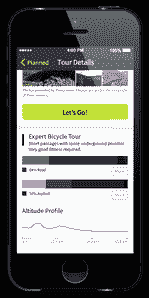

# Komoot 在美国推出，因此您可以享受一次有导游的户外旅行 

> 原文：<https://web.archive.org/web/https://techcrunch.com/2014/09/25/komoot-launches-in-the-u-s-so-you-can-enjoy-a-guided-trip-through-the-great-outdoors/>

# Komoot 在美国推出，所以你可以享受一次有导游的户外旅行

大约四年来，在荒野中跋涉的欧洲人可以使用一款应用程序，只要他们有手机，就能确保他们总能在森林里找到路……并且已经下载了[komout](https://web.archive.org/web/20221006182441/https://www.komoot.de/?hl=en)。

现在我们这些在美国的人可以得到同样的好处；该公司刚刚在北美推出了 iOS 和 Android 应用。它覆盖面很广。据 Komoot 的创始人 Markus Hallerman 说，你可以在美国的几乎任何地方找到一条周末徒步旅行或自行车道(有地图和 GPS 支持)。

“我们整合来自用户的数据和开源数据，”Hallerman 说。“使用我们的解决方案，无论您身在何处，都能获得推荐。因为我们有地图技术，我们有逐路段导航。我们现在也可以在可穿戴设备上使用。”

因此，Komoot 应用程序切片、切块，以及…嗯…做你期望从应用程序中得到的事情。

该公司始于 2010 年，在德国推出了第一款 iPhone 应用。去年，该公司开始整合开源地图技术，并将其用户数据库中的数据与自己创建的地图整合在一起。

哈勒曼不仅仅是一个创始人。他也是一名顾客，在和他的孩子穿越奥地利阿尔卑斯山的徒步旅行中使用这款应用。

总部位于柏林的 Komoot 不同于健身跟踪应用程序，或徒步旅行的编辑应用程序，因为它为每个技能水平提供地图和编辑建议。该公司的导游实际上可以推荐徒步旅行，而不是跟踪运动。

它以免费增值模式销售其产品包。你可以免费获得第一张地图和行程单，但后续套餐需要付费。

到目前为止，该公司已经从投资者那里筹集了 160 万美元，其中包括德国地区基金和 KRW Schindler Private Ventures，该基金的主要投资者是谷歌副总裁菲利普·辛德勒。

“我们拥有大量技术，通过可穿戴设备和 Apple watch，我们有巨大的机会颠覆一个行业，”哈勒曼说。“根据一项户外研究，有 5000 亿美元花费在旅行和户外活动上。”

https://www.youtube.com/watch?v=AJN_QFh4QJQ