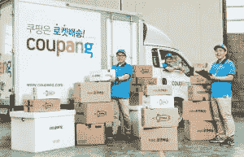

# 韩国电子商务领袖 Coupang 由贝莱德领投 TechCrunch 融资 3 亿美元

> 原文：<https://web.archive.org/web/https://techcrunch.com/2014/12/10/korean-e-commerce-leader-coupang-raises-300m-led-by-blackrock/>

总部位于首尔的在线零售商 Coupang 今天宣布，它已经筹集了令人印象深刻的 3 亿美元新资金，由 BlackRock 私募股权合作伙伴牵头，参与方包括 Wellington Management Company、LLP、Greenoaks Capital Management 和 Rose Park Advisors。

在接受 TechCrunch 采访时，Coupang 的创始人 Bom Kim 表示，这笔资金将投资于两个关键领域:其移动应用背后的技术，该技术产生了 Coupang 70%的收入和 80%的总流量，以及其物流网络，该网络可以在当天(或韩国一些地区的几个小时)提供交付。它还将为位于硅谷、西雅图、上海和首尔的工程和研发办公室增聘人手。

该公司没有披露其目前的估值，但由红杉资本(Sequoia Capital)牵头的 [Coupang 在 5 月份的最后一轮 1 亿美元融资中，估值超过 10 亿美元。Kim 表示，自那以来，公司的估值已经上升，最近一次融资也是一次融资。](https://web.archive.org/web/20221205152529/https://beta.techcrunch.com/2014/05/28/sequoia-backs-coupang-koreas-answer-to-amazon-with-100-million/)

这是过去两个月来首尔公司一系列重大投资的最新一例。 [Yello Mobile](https://web.archive.org/web/20221205152529/https://beta.techcrunch.com/2014/11/10/yello-formation8/%E2%80%9C) 和游戏开发商[4:33 Creative Lab Game Studio](https://web.archive.org/web/20221205152529/https://beta.techcrunch.com/2014/11/13/line-and-tencent-pour-110m-into-koreas-433-creative-lab-games-studio/%E2%80%9C)都透露他们已经筹集了 1 亿美元或更多，而运营食品配送应用 [Baedal Minjok](https://web.archive.org/web/20221205152529/http://www.smartbaedal.com/info/) 的 [Woowa Brothers](https://web.archive.org/web/20221205152529/http://www.woowahan.com/) 则筹集了由高盛牵头的 400 亿韩元(约 3600 万美元)的资金。

Coupang 自称是韩国“资金最雄厚的私营技术公司”，拥有近 5 亿美元现金。2013 年，该公司表示，其年度商品总值超过 10 亿美元，目前年化运营率超过 22 亿美元。它的主要竞争对手是易贝韩国，但主要是 C2C 业务，而 Coupang 则是 B2C 业务。

既然金库里有这么多现金，为什么 Coupang 这么快就又融资了呢？

“我们认为，这仍是电子商务的初级阶段。我们都知道亚马逊和阿里巴巴发生了什么，但大规模的商业活动仍在线下进行。由于(韩国)的人口密度和移动基础设施，我们有机会做电子商务公司最终会在其他国家做的事情，”2011 年创立 Coupang 的 Kim 表示。

“我们正在解决两个基本的摩擦点:通过线下商务，你可以通过手握产品获得大量信息，这是我们无法以数字方式提供的，但我们越来越接近于提供几乎与线下商店一样丰富的体验。线下商务的另一个好处是你可以把东西带回家并马上使用。我们不能通过你的手机做到这一点，但我们每天也越来越接近，在几个小时内就能把产品送到你手中，”他补充道。

**利用韩国的移动基础设施**

虽然很容易将 Coupang 与亚马逊进行比较，但这两家公司和市场之间存在几个关键差异。

一个是韩国移动基础设施的广度和速度。当 Kim 四年前创建 Coupang 时，他说智能手机在韩国的渗透率与美国相当，但现在 T2 是世界上最高的。

该国每 10 个手机用户中有 7 个是智能手机，而顶级运营商 SK Telecom 和 LG Uplus Corp. 已经部署了网络服务，他们声称网络服务的速度是上一代 LTE 的四倍。

韩国强大的移动网络使 Coupang 能够采取移动优先的方式来开发其电子商务平台。该公司声称其移动应用程序已被下载 1900 万次(相比之下，韩国人口为 5120 万)。

“一切都是优化的，首先是为移动开发的，这与其他环境相反，在其他环境中，您可能会将移动视为平行或扩展，”Kim 说。

虽然包括阿里巴巴和亚马逊在内的 Coupang 在其他国家的同行仍在想办法让更多用户通过他们的移动应用进行购买，但 Coupang 现在的主要挑战是建立一种移动购物体验，这种体验将更接近于复制在线下商店浏览商品的感觉。这包括添加更多内容和提高加载速度。

“如果你看到我们如何展示产品，信息量和内容越来越丰富，加载速度比美国的移动商务平台更快。人们说你要么拥有丰富的信息和缓慢的加载速度，要么几乎没有信息和快速的速度。解决这种权衡是我们工作的一大部分，”金说。

“这就是我认为技术帮助我们的地方，所以你可以获得越来越丰富的体验，即尽可能接近于在你的手中握住、触摸和旋转产品，但仍然为你提供非常快速的体验，你可以在上班的路上访问，”他补充道。

**构建 Coupang 的物流网络**

Coupang 核心战略的第二部分是在韩国建立物流网络。自今年年初以来，Coupang 一直在提供当天送达服务，在某些情况下，还会在几个小时内送达。除了履行中心，Coupang 还有自己的卡车和司机车队，它称之为“Coupang men”

金说“Coupang 人”不仅仅是运送货物。他们还担任客户服务代表。为了复制购物者在百货商店的体验，Coupang men 还做一些事情，如给顾客发送手写的感谢信，分发糖果和产品样品。

该公司两年前开始试验自己的当天送达服务，之后才开始建立自己的履行中心网络。

在此之前，Coupang 依赖于第三方运营商。在美国，已经尝试提供当天送达服务的公司包括[谷歌](//web.archive.org/web/20221205152529/http://beta.techcrunch.com/2014/10/14/google-shopping-express-expands-to-more-cities-rebrands-as-google-express/%E2%80%9C)、[亚马逊](//web.archive.org/web/20221205152529/http://beta.techcrunch.com/2014/08/06/with-newly-announced-expansions-amazons-same-day-delivery-service-now-outpaces-competitors/%E2%80%9C)和易贝(尽管易贝现在[正在重组其当天送达本地服务](//web.archive.org/web/20221205152529/http://beta.techcrunch.com/2014/11/24/ebay-now-pulled-from-app-store-as-company-rethinks-its-same-day-delivery-plans/%E2%80%9C)，名为易贝 now，因为运营这项服务的成本很高)。

Kim 认为，Coupang 的当天交付模式最终可以为其他国家的电子商务公司提供一种模式。

“人们正试图在美国试验这一点，我们觉得我们已经解决了这个问题，并正在大力投资移动物流技术，”他说。

金表示，Coupang 正着眼于“在适当的时候”进行首次公开募股，但它也希望在其他国家的移动基础设施赶上韩国时，向这些国家扩张。然而，在不久的将来，Coupang 计划继续专注于韩国，“我们认为这是一个非常令人兴奋和快速增长的市场，”Kim 说。