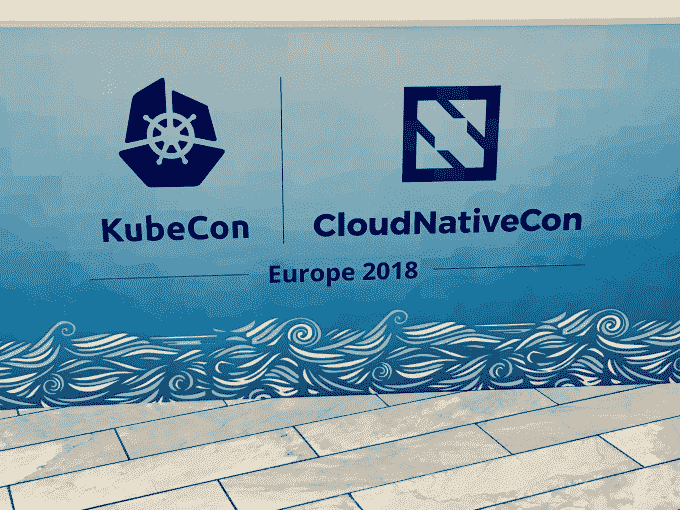
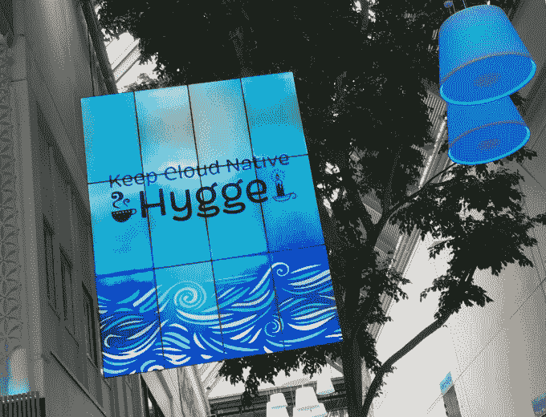

# Kubernetes 站在一个重要的转折点上

> 原文：<https://web.archive.org/web/https://techcrunch.com/2018/05/06/kubernetes-stands-at-an-important-inflection-point/>

上周在哥本哈根举行的 KubeCon 和 CloudNativeCon 上，我们看到一个开源社区走到了一起，充满活力，散发着积极的能量，因为它认识到了自己在企业世界中日益增长的影响力。Kubernetes 是几年前从谷歌出来的，它以惊人的速度获得了认可和欢迎——这既带来了可能性，也带来了一大堆问题。

在今年的欧洲版会议上，社区似乎正在应对这种快速增长，因为像 Red Hat、IBM、Google、AWS 和 VMware 这样的大型企业组织都与开发人员和初创公司聚集在一起，试图弄清楚他们在这里找到的这个新东西到底是什么。

该项目作为事实上的[容器](https://web.archive.org/web/20230224212417/https://techcrunch.com/2016/10/16/wtf-is-a-container/)编排工具已经被接受，随着这种情况的发生，它不再是简单地让一个项目起飞并证明它可以在生产中工作。它现在需要更高水平的工具和成熟度，这在以前是不必要的，因为这太快了。

随着这种情况的发生，组成这个不断增长的用户群的各种成员需要弄清楚，当它不再仅仅是几个开发人员和一台笔记本电脑时，如何使它全部工作起来，大多数情况下是在运行中。现在有 big boy 和 big girl 实现，它们需要新的复杂程度才能工作。

在这种背景下，我们看到了一个似乎处于转折点的项目。就像一家创业公司意识到它实际上实现了它所假设的产品市场匹配一样，Kubernetes 社区必须找出如何将这一点提升到下一个水平——这一现实提出了一些严峻的挑战和巨大的机遇。

## 转型中的社区

Kubernetes 项目由云计算原生计算基金会(简称 CNCF)赞助。想想看，在开幕主题演讲中，CNCF 导演丹·科恩(Dan Kohn)热情洋溢，自豪地向挤满的观众大声说出数字，展示了该项目的巨大增长。

照片:罗恩·米勒

如果你想证明 Kubernetes(以及云原生计算)的迅速崛起，想想上周哥本哈根 KubeCon 有 4300 名注册参与者，是去年柏林的三倍。

酒店和会议中心充满了交谈声。每个角落和走廊，酒店开放式大堂酒吧的每个酒吧凳子，在大型早餐室吃早餐时，在分散在整个场地甚至整个城市的许多咖啡机旁，人们聊天，辩论和讨论 Kubernetes，能量是显而易见的。

大卫·阿龙奇克现在在谷歌负责开源的 Kubeflow Kubernetes 机器学习项目，他在早期(早在 2015 年)就在运营 Kubernetes，他当然很惊讶地看到它在如此短的时间内变得如此之大。

“我没想到会是这样。我于 2015 年 1 月加入，负责谷歌 Kubernetes 的项目管理。我对这种东西被压抑的需求感到震惊，”他说。

## 成长起来

然而，需求是巨大的，随着每一次飞跃和每一个新的成熟水平，都出现了一系列新的问题需要解决，这反过来又为新的服务和创业公司创造了填补许多空白的机会。正如谷歌 Kubernetes 集团产品经理阿帕娜·辛哈(Aparna Sinha)在她的会议主题演讲中所说，企业公司希望获得某种程度的确定性，即早期采用者愿意放弃投入令人兴奋的新容器世界。

图片:云原生计算基金会

正如她所指出的，要想带动其他人，并真正达到另一个采用水平，就需要一些企业级功能，包括安全性、更高级别的应用工具和更好的整体应用开发体验。所有这些类型的功能都将出现，无论是来自谷歌还是来自无数的服务提供商，这些服务提供商围绕该项目出现，旨在使构建、交付和管理 Kubernetes 应用程序变得更加容易。

Sinha 表示，该项目能够如此迅速发展的原因之一是，它的根源在于一个名为 Borg 的容器编排工具，该工具已经在公司内部使用了多年。虽然这演变成了我们今天所知的 Kubernetes，但它肯定需要一些重大的重新打包才能在谷歌之外工作。然而，谷歌早期的改进让它比一般的开源项目领先了一大截——这可能是它迅速崛起的原因。

“当你把在谷歌这样的全球环境中如此成熟和成熟的东西放在那里，它不像任何开源项目那样，在没有太多知识的情况下从头发明，事情正在实时发展，”她说。

## 对于每一个动作

在 KubeCon，每个人似乎都认识到了一件事，即尽管有了良好的开端和早期的成功，但仍有许多工作要做，许多问题要解决。今天使用它的公司大部分仍然属于早期采用者。即使有一些成熟的企业实施，如欧洲物理组织 CERN，它已经建立了 210 个 Kubernetes 集群，或者中国互联网购物巨头 JD.com，它有 20000 台服务器运行 Kubernetes，最大的集群由 5000 多台服务器组成。不过，公平地说，大多数公司还没有走那么远。

照片:罗恩·米勒

但是像 Kubernetes 和 cloud native computing 这样热情的开源社区的力量意味着有一些公司，一些新的和一些已建立的公司，试图解决这些问题，并且随着每个新的里程碑和每个已解决的问题出现了大量新的问题。

正如运营另一个开源项目 Cloud Foundry Foundation 的 Abby Kearns 在她的主题演讲中所说，开源的部分魅力在于它能够解决大量问题，这些问题是随着项目超出最初的范围而不可避免地会出现的。

“开源给了我们机会去做我们自己永远做不到的事情。思想的多样性和参与是开源如此强大和创新的原因，”她说。

值得注意的是，几位发言者指出，思想的多样性也需要成员的实际多样性，才能真正将想法扩展到其他思维方式和其他生活经历。这仍然是一个挑战，就像在技术和整个社会中一样。

尽管如此，Kubernetes 还是迅速成长和发展，同时受益于社区的热情支持。未来的挑战是将早期的热情转化为更实际的业务用例。这是该项目发现自己的转折点，问题是它是否能够朝着更广泛的采用迈出下一步，或者达到一个高峰并回落。