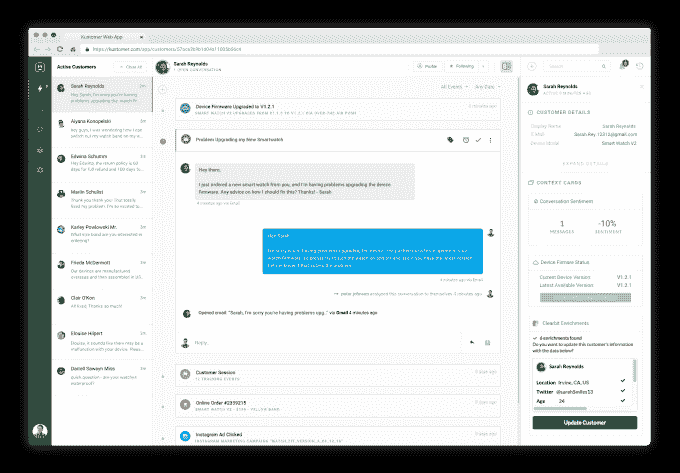

# 由 Salesforce 校友创建的 Kustomer 获得 1250 万美元用于修复客户服务 

> 原文：<https://web.archive.org/web/https://techcrunch.com/2016/09/27/kustomer-customer-care/>

联系客户支持的需要是许多现代消费者存在的祸根:不仅你这样做可能是因为你有一个需要解决的问题，而且你不可避免地被卷入一个漩涡，你不得不在电话上坐很长时间(或静止不动地等待电子邮件回复)，向随后的助理重复几次你的细节，并有可能失去联系并重新开始。

一家名为 [Kustomer](https://web.archive.org/web/20221225014817/http://kustomer.com/) 的新创公司正准备走出秘密，旨在通过从客户代表的角度重建 CRM 来解决所有这些问题。它还雄心勃勃地试图在这个过程中改变一般的商业思维。Kustomer 认为，通过建立一个每个人都可以使用的平台，以及其中包含的整体数据，公司中的任何人，不仅仅是那些被归入 CRM 筒仓的人，都可以充当客户服务代表。

“每个人都应该能够支持客户，”首席执行官兼联合创始人布拉德·伯恩鲍姆说道。

在今年晚些时候推出之前，它今天宣布获得 1250 万美元的资金。这包括由迦南公司领投的 1000 万美元的 A 轮融资，投资方包括 BoxGroup、即插即用风险投资公司(Plug and Play Ventures)，以及前 Salesforce 的首席运营官·胡宇威等天使投资人；Campaign Monitor 首席执行官、服务云(Salesforce)前执行副总裁亚历克斯巴德(Alex Bard)；和 Jeff Leventhal，工作市场的创始人和前首席执行官。它还包括来自 Boldstart Ventures 和 Social Leverage 的 250 万美元种子资金。

对于一家 CRM 初创公司来说，Kustomer 有一些值得注意的 DNA。它的两位联合创始人伯恩鲍姆和杰瑞米昔拉(CTO)都有创立、建设和出售企业科技公司的历史。

最近的一个例子是一家名为 Assistly 的初创公司，这是一个基于云的应用程序，也试图重新发明一些管理客户的做法。它最终在 2011 年被 Salesforce 以 8000 万美元的价格[收购——考虑到 Salesforce 最终](https://web.archive.org/web/20221225014817/https://techcrunch.com/2011/09/21/salesforce-buys-social-customer-service-saas-startup-assistly-for-50m-in-cash/)[将其更名为 Desk.com](https://web.archive.org/web/20221225014817/https://en.wikipedia.org/wiki/Desk.com)，使其成为其数十亿美元业务的基石之一，这是一笔划算的交易。

在 Salesforce 呆了三年后，伯恩鲍姆和昔拉出人意料地避开了这一职位，分别担任了肖恩·帕克的视频聊天初创公司 [Airtime](https://web.archive.org/web/20221225014817/https://www.airtime.com/) 的首席技术官和首席架构师，这家公司早期很难站稳脚跟(帕克曾将它的艰难推出描述为“[吃玻璃](https://web.archive.org/web/20221225014817/http://allthingsd.com/20121002/like-eating-glass-sean-parker-on-airtimes-bumpy-launch-exec-departures-and-more/)”)。

Airtime 经历了大量的人员变动，伯恩鲍姆是其第三任首席技术官，任期仅一年。“我这是一次有趣的经历，”他简单地说(或许还有点外交辞令)。

这就把我们带到了 Kustomer，这是两人离开 Airtime 后开始的。

目前处于封闭测试阶段，该公司尚未向公众推出其平台，尽管你可以看到上面的截图。

伯恩鲍姆和曾担任 DataSift 首席执行官的该公司的首席运营官·罗伯·拜利也告诉我，它打算做什么，以及它与众多其他 CRM 软件包的不同之处，这些软件包来自许多新的创业公司；像 Twitter 这样的大玩家，也希望进入客户服务市场；当然还有像他们自己的 Assistly 这样的大产品，它本质上仍然在使用，并随着其背后的 Salesforce 的力量而更新。

“市场上有相当多的 CRM 参与者，但只有少数几家是认真的，”伯恩鲍姆说。“它们中的大多数都有十年以上的历史，我们认为这是改进产品的机会。我们认为所有东西都需要每十年重新发明一次，而这些产品很多都停滞不前，甚至是在 iPhone 出现之前发明的。”

Birnbaum 将今天的许多 CRM 软件描述为“点解决方案，像麻烦单一样做得很好，但没有关注整体的客户体验。”

Kustomer 是 CRM 挑战的现代版。它始于这样一个前提，即处理客户支持的通常方式——为客户和他/她的问题分配一个票证——是错误的，因为它会立即创建案例库，并使整个工作失去人性。

“人需要成为原子单位。这是为了支持一个客户，而不是一个案例，”他说。他似乎真的觉得，你越是把一个人当成一个数字，这个人受到的待遇就越差。然而，更实际的是，另一个问题是，当一个问题变得更复杂时，就更难找到合适的人来帮忙了。

Kustomer 的平台让公司可以在时间轴上查看用户对产品和公司的整个历史，这样接听支持电话的人可以更好地与那个人互动，试图找出解决方案(或将那个人送到正确的部门解决问题)。

假设你买了一个联网的火警报警器。当您购买产品时，公司会为您创建一个文件，然后您在尝试使用该产品时会遇到问题。你打电话，得到你需要的帮助，然后记录下来。然后，如果您再次打电话询问问题，因为他们有您过去的购买历史，他们可以自动询问固件更新和其他诊断细节。

该平台还可以“小睡”和“唤醒”可能需要升级的客户，以便联系他们。Kustomer 似乎还包括一些智能，以帮助向处理入站查询的员工建议行动，衡量该查询的“事件、对象和情绪”。

该公司最初针对小型企业的决定符合 Kustomer 的前提，即理论上，企业中的每个人都可以从事客户支持工作。在许多较小的公司，有时这实际上只是因为缺少员工。但总的来说，中小企业部门是巨大的:根据 Gartner 的数据，仅在美国，它就由 70 亿个企业组成，仅 CRM 服务就价值 360 亿美元。

尽管如此，对我来说，这似乎是一个很大的挑战，我认为每个人都可以或愿意与客户互动。库斯托默似乎也在利用一个更大的趋势，即人们在工作场所同时处理多项任务，并准备好扮演多种角色。

为了让人们达到这一点，你必须拥有让他们的生活变得更轻松的产品，这是初创公司正在利用的另一种技术趋势:

“除了经验丰富的团队，我们选择投资 Kustomer，因为这个平台是真正革命性的，”迦南合伙人沃伦·李(Warren Lee)说。“企业的消费化是我们在 Slack 等案例中看到的良好效果，但 Kustomer 解决这一问题的方法确实是同类方法中的第一个。”

Kustomer 将于 11 月开始提供第一批商业产品(届时将公布价格)，最初目标是员工不超过 100 人的小企业。