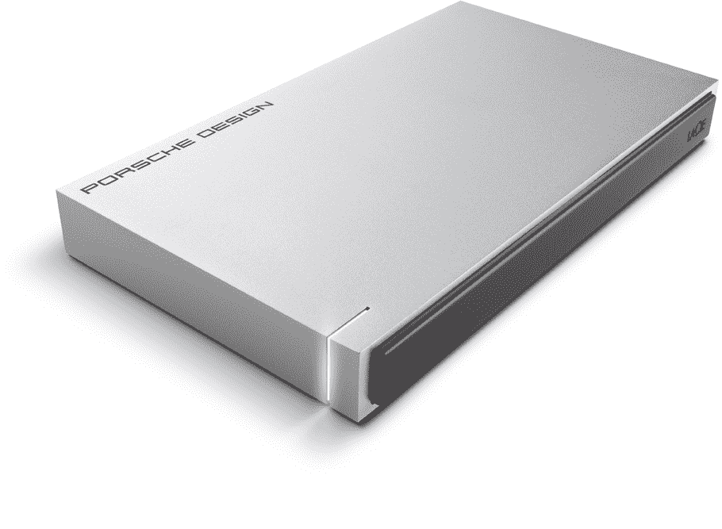

# LaCie 的新 USB-C 移动硬盘与新 MacBook 完美匹配 

> 原文：<https://web.archive.org/web/https://techcrunch.com/2015/03/10/lacies-new-usb-c-mobile-hard-drive-matches-the-new-macbook-perfectly/>

# LaCie 的新 USB-C 移动硬盘与新 MacBook 完美匹配

[新款 MacBook 的](https://web.archive.org/web/20221007121643/https://beta.techcrunch.com/2015/03/09/apple-introduces-a-reinvented-macbook-air/)最奇怪的特点可能是它没有端口——机器的边缘只有两个端口，左边一个用于 USB-C 电源、数据和显示器连接，右边一个 3.5 毫米立体声耳机插孔用于任何标准音频设备。单一端口意味着配件制造商将争夺这一令人垂涎的空间，LaCie 没有浪费时间在郊游的硬盘驱动器，将与创新的新笔记本电脑。

当然，[保时捷设计 USB-C](https://web.archive.org/web/20221007121643/https://www.lacie.com/products/product.htm?id=10649) 将与任何 USB-C 端口运动设备配合使用，随着该标准被更广泛地采用，这将是越来越多的硬件。所述 USB-C 连接器是可逆的，并且驱动器本身也使用 type-C 连接器，这意味着简单的 USB-C 电缆可以将任一端插入任一设备，而不必担心哪一端朝上。传输速度运行在 USB 3.0 级别，这意味着您可以获得高达 100 MB/s 的数据发送和接收速率。

LaCie 的阵容一般针对 MAC，不一定是因为 I/O 技术而是因为共享的设计相似性，新的 USB-C Porsche Design 也不例外。它有一个与新款 MacBooks 相匹配的哑光铝合金外壳(尽管它只有银色)，但外壳有整整 3 毫米厚，以防止意外跌落和溅出造成的损坏。

 该硬盘还向后兼容现有的 USB 3.0 和 USB 2.0 端口，这要归功于包装盒中包含的适配器电缆，因此非常方便。有三种大小可供选择，有 500GB、1TB 或 2TB 盘片驱动器选项，它们将从“下个季度”开始发货，但尚未宣布任何定价。

这种新奇的 USB-C 连接器可能看起来有点新奇和怪异，但 LaCie 的渴望只是一个特别新的例子，说明它最终将被广泛采用，所以预计在笔记本 4 月 10 日发布之前会看到更多这样的东西。