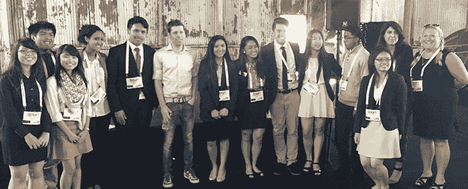
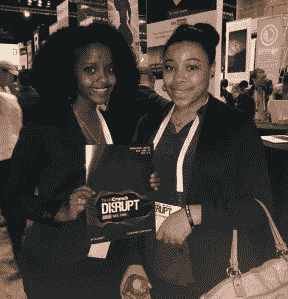

# 上周，青年团体申请来扰乱纽约 

> 原文：<https://web.archive.org/web/https://techcrunch.com/2017/04/10/last-week-for-youth-groups-to-apply-to-come-to-disrupt-ny/>

# 上周青年团体申请来扰乱纽约

学生团体可以申请参加 5 月 16 日(星期二)或 5 月 17 日(星期三)在曼哈顿 36 号码头举行的[扰乱纽约](https://web.archive.org/web/20221206190828/https://beta.techcrunch.com/event-info/disrupt-ny-2017/)。这是您申请的最后一周，申请将于 2017 年 4 月 19 日(周三)截止。

该计划是 TechCrunch 的多样性和包容性计划【T4 包含】的一部分，旨在为技术领域中未被充分代表的群体提供更多机会，以更好地进入初创企业。在过去的几次中断中，TC 与[BUILD.org](https://web.archive.org/web/20221206190828/http://www.build.org/)、[企业家精神教学网络(NFTE)](https://web.archive.org/web/20221206190828/https://www.nfte.com/) 、[软件工程学院](https://web.archive.org/web/20221206190828/http://afsenyc.org/)、[纽约计算机科学教育基金会](https://web.archive.org/web/20221206190828/https://csnyc.org/)、布朗克斯&阿斯托里亚、[红钩倡议](https://web.archive.org/web/20221206190828/http://rhicenter.org/)、 [Mission Bit](https://web.archive.org/web/20221206190828/https://www.missionbit.com/) 、[城市装配制造商学院进行了非正式和正式的合作](https://web.archive.org/web/20221206190828/http://www.uamaker.nyc/)

*Y Combinator 首席执行官 Sam Altman 与来自创业教育网络(NFTE)的学生在 Disrupt SF 2015*

作为该计划的一部分，年轻人将有机会与 TechCrunch 的一名编辑人员一起参观初创企业胡同，聆听主舞台上的讨论，并与演讲者进行一对一的问答。

要获得资格，青少年必须是初中或高中年龄，在纽约的合理通勤距离内，并有一名成年监管人能够与他们一起参加。教师或从事技术领域人口统计数据不足工作的组织将优先考虑。传统班级、另类教育、导师项目、非营利项目等。欢迎所有人参与。

申请截止日期为 2017 年 4 月 19 日。我们将在 2017 年 4 月 24 日之前通知各组的参与状态。如有任何问题，请发电子邮件给 include@beta.techcrunch.com。

[申请这里](https://web.archive.org/web/20221206190828/https://docs.google.com/a/beta.techcrunch.com/forms/d/e/1FAIpQLScs8n0MPOGSh6youJgg-UtDIlxFNC1HeST8VDIHuBKHZqw2eg/viewform)！

*来自软件工程学院的两名学生在 2015 年纽约扰乱大会*的创业路上

*图片鸣谢:@afsenyc*