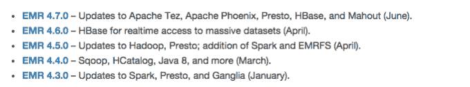

# 最新的亚马逊弹性 MapReduce 版本支持 16 个 Hadoop 项目

> 原文：<https://web.archive.org/web/https://techcrunch.com/2016/08/02/latest-aws-elastic-mapreduce-release-supports-16-hadoop-projects/>

亚马逊今天宣布发布弹性 MapReduce (EMR) 5.0.0 ，其中包括对 16 个开源 Hadoop 项目的支持。

随着 AWS 继续完善其各种工具来帮助客户管理云中的各种企业功能，最新的工具旨在帮助数据科学家和其他感兴趣的人使用 Hadoop 管理大数据项目。

对于那些不熟悉 Hadoop 的人来说，“从根本上来说，它是存储和处理大型数据集的基础设施软件，”[报道这一领域的 Forrester 分析师 Mike Gualtieri](https://web.archive.org/web/20230306045025/http://blogs.forrester.com/mike_gualtieri/13-06-07-what_is_hadoop) 说。

它不同于传统的数据处理软件，因为它将存储和处理分布在一组节点(可以扩展到数千个)上，为处理大量数据提供了一个更加高效的系统。

更重要的是，它是一个非常受欢迎的[开源 Apache 项目](https://web.archive.org/web/20230306045025/http://hadoop.apache.org/)(有一个非常可爱的吉祥物)和围绕它的一个巨大的生态系统，它不断地添加项目来帮助填补漏洞和需求。

Hadoop 由这些不同的项目组成，以帮助用户在管理大型数据集时完成他们需要承担的任务，如 Hadoop 的数据仓库 Hive 和可扩展的分布式数据库 HBase，这两者都受 AWS 支持。

它的流行催生了一些公司，如 Cloudera、Hortonworks 和 MapR，它们在开源项目的基础上创建了商业版本。

自去年 7 月以来，AWS 实际上一直在以疯狂的速度不断更新这一工具，并为越来越多的 Hadoop 项目提供支持，以便为其客户提供最广泛的选择。

图表由 [AWS](https://web.archive.org/web/20230306045025/https://aws.amazon.com/blogs/aws/amazon-emr-5-0-0-major-app-updates-ui-improvements-better-debugging-and-more/) 提供。

AWS 一直在使用另一个名为 Bigtop 的 [Apache 开源工具，根据项目页面，该工具可以帮助“基础设施工程师和数据科学家寻找领先的开源大数据组件的全面打包、测试和配置。”据公司博客文章](https://web.archive.org/web/20230306045025/http://bigtop.apache.org/)[称，这帮助他们加快了发展的步伐。](https://web.archive.org/web/20230306045025/https://aws.amazon.com/blogs/aws/amazon-emr-5-0-0-major-app-updates-ui-improvements-better-debugging-and-more/)

所有这些对于数据科学家和其他处理大量数据的员工来说都是好消息，他们希望在云中工作。这个版本提供了越来越多的选项，使得处理数据的人更容易在 AWS 上找到对他们重要的 Hadoop 项目。

虽然 Hadoop 关乎效率，但大数据仍然是 AWS 的一个很好的用例，因为它需要大量使用此类工具以及大量存储和计算来处理所有数据。对于用户来说，基于云的基础设施的弹性意味着他们可以根据需要处理尽可能多的数据，而不必担心遇到资源限制，因为他们可能会在内部部署。