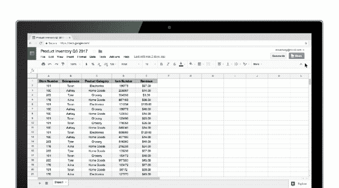

# 最新发布的 Google Sheets 有助于自动创建数据透视表 

> 原文：<https://web.archive.org/web/https://techcrunch.com/2017/12/06/latest-google-sheets-release-adds-smarts-to-pivot-table-creation/>

# 最新发布的 Google Sheets 帮助自动创建数据透视表

您组织中的电子表格专家知道如何使用数据透视表从大量数字中提取有意义的见解。这是将这些人与我们其他人分开的原因，但是谷歌今天宣布了最新版本的谷歌数据表,它将使数据透视表民主化。

谷歌正在通过在引擎盖下添加一些人工智能来实现这一目标。新功能建立在[公司去年增加的探索功能](https://web.archive.org/web/20221209024540/https://www.youtube.com/watch?v=9TiXR5wwqPs)之上。这里的想法是开始将自动化应用于数据堆，以帮助获得有意义的见解。

今天的功能将机器学习添加到数据透视表中，以实现几项重大突破。首先，Google Sheets 可以根据您在 Google Sheets 中的数据自动为您建议一个数据透视表，而不是手动创建一个数据透视表来整理您的数据集。我们中间的凡人不再在大师的门前乞求电子表格。这使得他们几乎可以被任何人接触到。

Gif:谷歌

在 Explore 窗格中还有一个自然语言查询界面，所以你可以用简单的英语(或者你最终选择的语言；它目前只支持英语)，应用程序可以为您找到数据透视表中的数据。你不再需要去寻找数据。你可以问一个问题，然后得到一个答案(当然，假设答案就在那里)。

对于那些守旧派，想从头开始创建数据透视表的人，谷歌也有一些爱给你。它使用为普通人提供的相同智能来创建数据透视表，以提供建议来帮助你。

你知道，这并不全是智力的问题。你希望你的数据透视表界面看起来也不错，谷歌已经更新了数据透视表用户界面，包括可定制的标题，行和列。

谷歌也没有将智能局限于数据透视表。它试图将它添加到整个电子表格体验中，所以如果你正在输入数据，它可能会弹出建议，告诉你对于给定类型的信息应该使用什么公式。如果这样做效果很好，可能会很有帮助，但是如果效果不好，可能会很烦人。

据谷歌称，所有这些以及更多的功能将在未来几个月陆续推出。