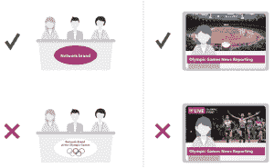

# 最新奥运媒体规则 nix GIFs、Vines 和流媒体应用 

> 原文：<https://web.archive.org/web/https://techcrunch.com/2016/08/04/latest-olympics-media-rules-nix-gifs-vines-and-streaming-apps/>

# 最新奥运媒体规则 nix GIFs，Vines 和流媒体应用

T2 奥委会一直对谁可以在什么时候使用什么镜头有严格的限制，但 2016 年奥运会引入的几条新规则更进了一步。官方社交媒体指南现在禁止流媒体应用程序、Vines 甚至低级的 GIF。

部分新限制出现在[官方广播规则(PDF)](https://web.archive.org/web/20221006223622/https://stillmed.olympic.org/media/Document%20Library/OlympicOrg/Games/Summer-Games/Games-Rio-2016-Olympic-Games/Social-Media-Blogging-Internet-Guidelines-and-News-Access-Rules/News-Access-Rules-Rio-2016.pdf) 中的“互联网和移动平台”下

> …明确禁止使用转换成图形动画格式的奥运材料，如动画 gif(即 GIFV)、GFY、WebM 或短视频格式，如 Vines 等。

“奥运材料”被定义为几乎所有的奥运会图片，无论其来源如何。

然后，在[社交和数字媒体指南(PDF)](https://web.archive.org/web/20221006223622/https://stillmed.olympic.org/media/Document%20Library/OlympicOrg/Games/Summer-Games/Games-Rio-2016-Olympic-Games/Social-Media-Blogging-Internet-Guidelines-and-News-Access-Rules/IOC-Social-and-Digital-Media-Guidelines-Rio-2016.pdf) 的常见问题解答中:

> 奥运场馆内禁止通过直播应用程序(如 Periscope、Meerkat)播放图像。

为 2014 年索契奥运会更新的这些文件版本没有任何类似的语言，或者至少没有这么具体的内容。一个可能的例外是[“摄影师的承诺”](https://web.archive.org/web/20221006223622/https://stillmed.olympic.org/Documents/Various/IOC_Photographers_Undertaking.pdf)，其中规定:

> 严禁通过任何媒体，包括互联网、移动平台和其他互动媒体或电子媒体上的显示器，传播在奥运场馆拍摄的动态图像或声音。

但是这份文件没有注明日期，所以很难说国际奥委会什么时候会让这份文件更具包容性。

总的来说，该规定可以归结为:在奥运村或某个场馆拍摄的视频必须由注册媒体拍摄，并在广播规则范围内使用，否则只能用于个人目的。这实际上宣布流媒体是非法的，但新规则让这一点变得更加明确。没有提到 gif，更不用说 gifv，gfy 或任何其他新的自定义循环图像格式。

这东西的来源还有很多。

当然，任何试图打击伴随这样一个重大媒体事件的不可避免的模因制造的努力都注定会失败。

见鬼，即使是职业选手也可能因为没有严格遵守每一条规则而被国际奥委会嗤之以鼻。试着确保你的广播、首页、片段、vlog 或其他内容符合这里列出的所有限制。