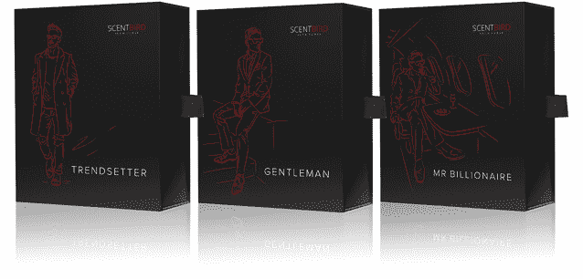

# 香水订阅提供商 Scentbird 推出新服务，投入 280 万美元 

> 原文：<https://web.archive.org/web/https://techcrunch.com/2016/03/30/launching-a-new-service-fragrance-subscription-provider-scentbird-feathers-its-nest-with-2-8-million/>

# 香水订阅提供商 Scentbird 推出了一项新服务，投资 280 万美元

香水和古龙水的订阅服务 Scentbird 在其 100 万美元的种子资金中又增加了 280 万美元的风险投资，因为它推出了一项超越订阅模式的新服务。

由玛利亚·努尔斯拉莫娃领导的 Y Combinator 校友吸引了一批新投资者，他们愿意向这家飙升的香水公司投入更多种子期资金。

Scentbird 的这项新服务允许人们购买 8 毫升装的香水和古龙水，无需订阅，立即发货。这是为用户每月排队添加香味的一种替代方式。

这家总部位于纽约的公司拥有 600 万美元的运营成本，自 2014 年在[企业家圆桌会议加速器](https://web.archive.org/web/20221006012816/http://eranyc.com/)推出以来，已经成功运送了超过 30 万份样品，其目标是为男性和女性提供一种新的方式来发现他们可能喜欢的香水。

该公司的商业模式为顾客提供 30 天的 450 多种香水供应，每月只需 14.95 美元就能送货上门。该公司还鼓励其客户创建气味档案，并在网站上添加评论等内容。

这种方式吸引了知名天使投资人的注意，如 Reddit 创始人亚历克西斯·奥哈尼安(Alexis Ohanian)、SocialCam 的迈克尔·赛贝尔(Michael Seibel)、Parse 的吉洪·伯恩斯塔姆(Tikhon Bernstam)和 Casper 的菲利普·克里姆(Philip Krim)，以及包括 Eclipse Ventures、Vaizra Investments、FundersClub、Scrum Ventures、SGH 资本和 Ludlow Ventures 在内的基金。

“Scentbird”被冠以“[香水的网飞](https://web.archive.org/web/20221006012816/http://www.instyle.com/news/fragrance-subscription-site-netflix-perfume)”的绰号，就像它的竞争对手[香水箱](https://web.archive.org/web/20221006012816/https://scenttrunk.com/)一样，希望在全球大约 401 亿美元的香水市场上分一杯羹。

虽然两家公司都试图打入香水和古龙水市场，但他们的方法不同。Nurislamova 的 Scentbird 坚持品牌名称，而 Scent Trunk 则更加手工化，依靠独立香水制造商的网络。

新的种子投资将用于继续快速增长，并致力于从该平台构建更多的产品。

除了订阅服务，Scentbird 已经开始销售各种气味的礼品盒，以匹配该公司的时尚设计师和策展人选择的不同性格类型。而且，现在有一个全尺寸香水购买选项，所以顾客可以通过 Scentbird 的网站购买时，以 15 美元的折扣购买他们最喜欢的气味。

奥哈尼安是该公司的早期支持者，当时该公司刚从 Y Combinator 毕业，就推出了首个面向男性的产品。Reddit 创始人[在产品搜索上发布了](https://web.archive.org/web/20221006012816/http://www.producthunt.com/tech/scentbird-men)关于这项服务的男性版本，称之为“科隆的美元剃须俱乐部”