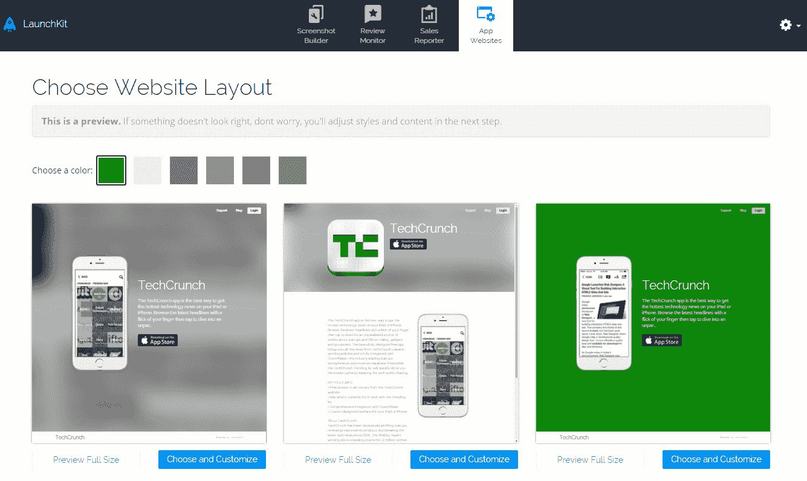

# LaunchKit 让构建移动应用程序的登录页面变得极其简单 

> 原文：<https://web.archive.org/web/https://techcrunch.com/2015/07/08/launchkit-makes-building-landing-pages-for-mobile-apps-ridiculously-easy/>

# LaunchKit 让构建移动应用程序的登录页面变得异常简单

在过去的几个月里， [LaunchKit](https://web.archive.org/web/20221007093340/http://launchkit.io/) 团队发布了许多工具，让应用程序开发者更容易在 T2 发布他们的应用程序。LaunchKit 阵容现在包括一个[审查监视器](https://web.archive.org/web/20221007093340/https://launchkit.io/reviews)，一个[截屏工具](https://web.archive.org/web/20221007093340/https://launchkit.io/screenshots)以使向移动商店提交应用更容易，以及一个用于[监控应用销售的服务](https://web.archive.org/web/20221007093340/https://launchkit.io/sales)。今天，LaunchKit 发布了其最新的免费服务，这使得开发者可以非常容易地为他们的应用程序建立[登陆页面](https://web.archive.org/web/20221007093340/https://launchkit.io/websites/lbdXkb8YhMY/)。

LaunchKit 联合创始人布兰登·穆里根认为，对许多开发者来说，建立一个移动应用网站往往是事后的想法。“通常一些东西被扔在一起只是为了把人们引向应用商店，”他告诉我。“通常情况下，这些最后一分钟的页面并不聪明。他们没有考虑用户是从哪个平台访问的。他们不会为分享而优化。一般来说，它们并不好看。”

因此，LaunchKit 团队开始着手让为移动应用程序创建响应性登录页面变得非常容易。

如果你的应用程序已经在 App Store 中，你可以使用该服务搜索它，然后它会自动导入你的应用程序描述、截图，甚至为网站找出正确的配色方案(我猜是基于你的徽标)。然后你从九个预先做好的布局中选择一个(你可以随时返回并改变颜色、字体、图标等)。)你就可以走了。

如果你的应用还没有出现在苹果应用商店或谷歌 Play 商店，你也可以手动输入你的所有数据，并上传你自己的图片。

LaunchKit 将为你托管网站，但你需要[为此建立自己的域名](https://web.archive.org/web/20221007093340/http://blog.launchkit.io/private/121139102739/tumblr_npp7mdlL8H1uorm1o)。这很简单，但是考虑到 DNS 系统的工作方式，你的网站可能需要一天的时间才能真正上线。

一旦启动并运行，新的登录页面将自动适应您正在使用的设备，因此 Android 用户将看到 Play Store 的链接，而在 iPhone 上，您将被带到 App Store。

这些网站也是为分享而设置的，将自动包含正确的元数据，这样 Twitter 和脸书就可以显示不同应用商店的直接链接。

