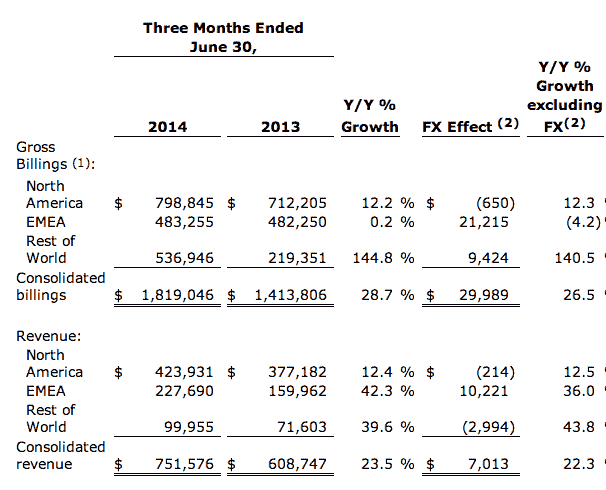
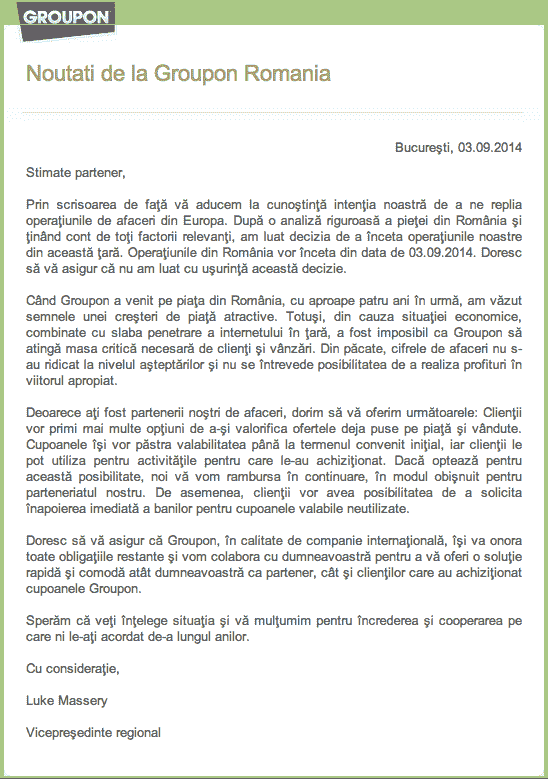
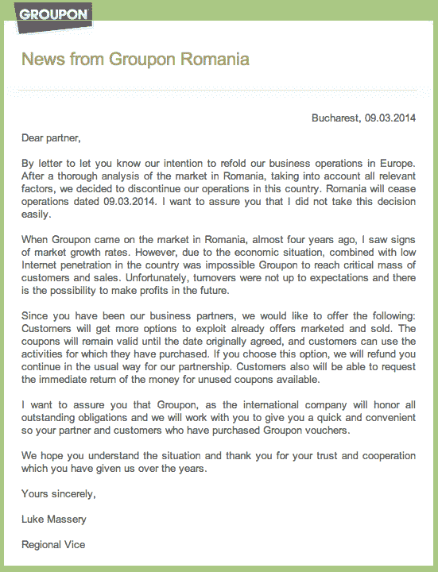

# La Revedere: Groupon 关闭了在罗马尼亚的服务

> 原文：<https://web.archive.org/web/http://techcrunch.com/2014/09/03/le-revedere-groupon-shuts-down-service-in-romania/>

今天，Groupon 的国际业务规模有所缩小，确切地说，是在 T2 缩小了 92，043 平方英里。由于未能在市场上找到足够的吸引力，该公司决定从今天起逐步减少在罗马尼亚的业务。这一消息是在一封由 EMEA 副总裁卢克·马塞里(Luke Massery)签名的电子邮件中发送给其在中国的商业合作伙伴的，我们在下面复制了这封邮件，我们已经直接向 Groupon 确认了细节。

一位发言人在一份电子邮件声明中指出:“在对罗马尼亚市场进行彻底分析并考虑所有相关因素后，我们决定关闭在罗马尼亚的业务。”“宏观经济形势和中国互联网普及率低的综合因素，使得 Groupon 很难达到预期的临界规模。我们在罗马尼亚的运营将于 2014 年 9 月 3 日关闭。”

对于那些已经购买了 Groupons 的人，或者已经在平台上提供了 Groupons 的商家，他们将在最初约定的日期前兑现这些商品。或者，顾客可以为他们购买的任何未使用的 Groupon 交易获得退款。

该发言人证实，其他国家不会进一步关闭，称罗马尼亚是该地区的一个“特例”。“我们在 EMEA 的业务做得很好，”她指出。“(罗马尼亚的)业务几乎没有出现在总销售额中，因为它的规模很小。”

你可能会想，“我为什么要关心 Groupon 关闭它在这个拥有 2000 万人口的美丽小国的运营呢？”

在某种程度上，你是对的。但另一方面，Groupon 在罗马尼亚凸显了 Groupon 和其他电子商务希望之星的机遇和挑战。

罗马尼亚的运营在大约四年前首次开业，当时萨姆维尔兄弟(T4)在 2010 年将 Groupon 的克隆版 CityDeal 出售给了 Groupon)仍在运营。它有大约 40 名员工。

罗马尼亚处于欧洲数字鸿沟的“发展中”一方，与该类别中的许多其他国家一样，电子商务是其他技术发展的门户服务。《华尔街日报》指出，在接下来的两年里，中国出现了许多其他本地交易网站，在 2012 年达到了 100 家左右的峰值。但也许是由于缺乏质量，加上缺乏兴趣和基础设施，这个数字在最近急剧下降。

Groupon 可能是罗马尼亚市场上规模较大的公司之一，但这并不总是转化为利润。2013 年，该公司报告在€损失了 54 万英镑(合 70.9 万美元)。这低于 2012 年€77.3 万英镑(100 万美元)的亏损，但显然是因为客户数量下降。

Groupon 在欧洲的大背景是，在收购 CityDeal 后，该公司在欧洲经历了一些具有挑战性的[岁月](https://web.archive.org/web/20230326082811/http://www.theverge.com/2013/3/13/4079280/greed-is-groupon-can-anyone-save-the-company-from-itself)，在美国和欧洲发生的事情之间缺乏运营、技术(或许还有文化)整合。

这就是为什么 Groupon 经常在美国推出无法在其他地方同时推出的新服务的原因之一(一个例子:Groupon 今天推出的[定时预订功能](https://web.archive.org/web/20230326082811/https://techcrunch.com/2014/09/03/groupon-nips-at-yelp-and-opentable-with-time-based-deals/))。

不过，这种情况现在正在改变。尽管 Groupon [上个季度](https://web.archive.org/web/20230326082811/http://investor.groupon.com/releasedetail.cfm?releaseid=864396)公布的 EMEA 地区毛账单收入与去年同期持平，但收入却是一个更令人鼓舞的故事，EMEA 是三个地区中收入增长最快的:

尽管如此，该公司的上一份收益报告[还是让](https://web.archive.org/web/20230326082811/http://www.forbes.com/sites/greatspeculations/2014/08/08/groupon-is-trying-but-the-results-have-yet-to-show-up/)投资者失望，该公司未能达到分析师的预期。随着北美继续成为 Groupon 的增长引擎，看到该公司清理门户并寻求巩固其他地方表现不佳的业务就不足为奇了。这一策略是否会在其他方面体现出来，还有待观察。

下面是罗马尼亚语的信件，随后是通过谷歌翻译的英语版本:

图片: [Flickr](https://web.archive.org/web/20230326082811/https://www.flickr.com/photos/camilg/171387798/in/photolist-g9pC3-cFgyPU-cFgCZG-cAS3MU-cTD9mu-cyCgJA-cDHHHu-cSKJ39-cFgAey-cFeTCw-cSKVGS-cMRbXL-cSKRiw-cvRCvf-cwpiVJ-cA1wzo-cxthbm-iVgUyr-jFm2Me-iZWVjW-cK3qGm-cvRngb-cBPA47-iuTnDb-cBNxXC-cuQDDN-cA1pZN-jGpnYT-cFgo6s-cA1FYh-iWkwXE-cJPhEh-cSKEGQ-g9m2Q-cuQEyb-cSKUQs-g9ohP-cK3h5U-hZm6xg-cDJfiw-cNPqCJ-cwpJuj-cA1JXS-cvRrKU-cFhnYW-cBPvR5-cyC4T1-cvRoiY-cuQsZS-cFgNvd)