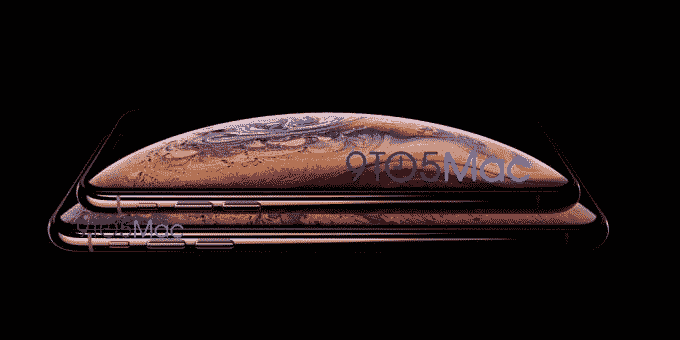

# 巨大的泄露展示了新的 iPhone XS

> 原文：<https://web.archive.org/web/https://techcrunch.com/2018/08/30/leak-shows-the-swanky-new-iphone-xs/>

# 巨大的泄漏展示了新的 iPhone XS

准备好一睹新 iPhone XS 的风采吧。苹果下一代 iPhone 硬件的图片已经到手，未来看起来相当美好。

泄露的图片展示了苹果即将推出的旗舰无边框设备的新尺寸，可能分别有 5.8 英寸和 6.5 英寸的屏幕。报道称，这款手机将被命名为 iPhone XS。图中的设备代表了更高端的有机发光二极管屏幕型号，而不是传闻中更便宜的 notch LCD iPhone。

该设备将采用新的金色外壳。iPhone X 目前有太空灰和银色可选。

图片来源:9to5mac

一张照片胜过千言万语，但显然还有很多细节我们还在等待。预计苹果将在 9 月 12 日的硬件活动上展示新的手机硬件和新版本的 Apple Watch。