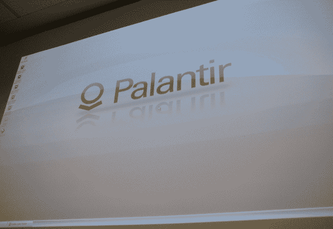

# 泄露的 Palantir 文档揭示了用途、具体功能和关键客户

> 原文：<https://web.archive.org/web/https://techcrunch.com/2015/01/11/leaked-palantir-doc-reveals-uses-specific-functions-and-key-clients/>

自从 2004 年成立以来， [Palantir](https://web.archive.org/web/20230404105008/https://www.palantir.com/) 已经成功成长为[一家价值十亿美元的公司](https://web.archive.org/web/20230404105008/https://techcrunch.com/2014/12/12/palantir-raises-50-million-of-reported-400-million-round/)，而[则非常隐秘](https://web.archive.org/web/20230404105008/https://gigaom.com/2013/12/05/palantir-the-worst-kept-9b-secret-in-silicon-valley/)它到底在做什么。猜想[比比皆是](https://web.archive.org/web/20230404105008/http://www.forbes.com/sites/andygreenberg/2013/06/07/startup-palantir-denies-its-prism-software-is-the-nsas-prism-surveillance-system/)。记者挖掘出的模糊事实证实了 Palantir 已经创建了一个数据挖掘系统，被执法机构和安全公司广泛用于连接已知罪犯之间的点。

TechCrunch 收到了一份 2013 年的私人文件，其中披露了该公司大量的数据分析工具，并列出了许多关键客户。这份文件目前正被作为新一轮第二轮融资的投资者招股说明书传阅。

简而言之，上面的描述部分是正确的。但是，由于这些泄露的信息，我们现在对这家神秘的公司有了更多的了解。

Palantir 的数据分析解决方案针对三个行业:政府、金融部门和法律研究。这些行业中的每一个都必须处理大量的数据。为了做到这一点，Palantir 的工具集针对大规模数据缓存，允许诉讼律师和警察建立否则看不见的联系。例如，[证券投资保护公司](https://web.archive.org/web/20230404105008/http://www.sipc.org/)雇佣的一家公司使用 Palantir 的软件整理了大量数据，超过 40 年的记录，给庞氏骗局策划者[伯尼·麦道夫](https://web.archive.org/web/20230404105008/http://en.wikipedia.org/wiki/Bernard_Madoff)定罪。

Palantir 的软件基于现有的数据集，为用户提供了一个看似革命性的界面。用户不必使用 SQL 查询或雇用工程师编写字符串来搜索数 Pb 的数据。相反，使用自然语言来查询数据，并实时返回结果。

客户包括洛杉矶警察局，他们使用 Palantir 来解析和连接 160 个数据集:从侦探到交通警察到国土安全官员，每个人都在 LAPD 使用 Palantir。根据这份文件，Palantir 提供了事件的时间表，并帮助庞大的警察部门整理其记录。

泄露的报告援引 LAPD 警官彼得·杰克森的话说:“侦探喜欢它(帕兰蒂尔)提供的信息类型。他们现在可以做我们以前不能做的事情。他们现在可以准确地看到大量信息以及事件和人之间的联系。它给 LAPD 带来了巨大的成功。它支持街上的警察和做调查的官员。这是一个很好的工具。他们正在成为更有效率和更有效的警察。Palantir 让他们更好地服务于公众。”

Palantir [在其网站上解释说，这是一个用于人体分析的工具集](https://web.archive.org/web/20230404105008/https://www.palantir.com/2007/12/what-do-we-do/)。然而，我们现在明白了，这项服务是一种更智能的显示数据的方式，以供人类分析。它能够建立全面的活动模型来检测可疑的异常情况，甚至能够提供对欺诈的免疫力，这要归功于创始人在 PayPal 时学到的策略。

Palantir 的反欺诈系统使用算法来检测和隔离分析师指定的模式。泄露的文件称，这种方法是受 PayPal 对抗适应性威胁的启发。Palantir 管理团队中五分之四的人在 PayPal 工作。Palantir 的联合创始人彼得·泰尔也是 PayPal 的联合创始人。

该文件证实，帕兰提尔受雇于多个美国政府机构。该公司的首批合同之一是 2006 年与联合 IED 击败组织签订的。从 2007 年到 2009 年，Palantir 在华盛顿的工作从 8 个试点扩展到 50 多个项目。

截至 2013 年，美国政府内部至少有 12 个组织使用了 Palantir，包括中央情报局、DHS、国家安全局、联邦调查局、疾病预防控制中心、海军陆战队、空军、特种作战司令部、西点军校、联合 IED-failure 组织和盟友、恢复问责和透明委员会以及国家失踪和被剥削儿童中心。医疗补助和医疗服务中心计划在 2013 年对 Palantir 的使用进行试点测试，以调查通过热线收到的提示。同一组织还进行了第二次测试，以识别美国南部地区潜在的欺诈性医疗提供商。

然而，截至 2013 年，并不是军队的所有部门都使用 Palantir。美国陆军开发了自己的数据分析工具，名为分布式公共地面系统，耗资 23 亿美元，但据信并不太受欢迎。泄露的文件引用了 2012 年的一项研究，在该研究中，96%接受调查的阿富汗战斗人员推荐 Palantir。

招股书认为，美军使用帕兰提尔非常成功。五角大楼使用该软件跟踪路边炸弹部署的模式，并能够得出结论，车库开门器被用作远程引爆装置。有了 Palantir，海军陆战队现在能够从远程位置上传 DNA 样本，并利用多年来收集的指纹和 DNA 证据信息。结果几乎会立即返回。如果没有帕兰蒂尔，当外勤人员收到结果时，嫌疑人可能已经转移到另一个地方了。

该文件引用了在阿富汗为美国军事承包商 NEK Advanced Securities Group 工作的前海军陆战队员塞缪尔·雷丁(Samuel Reading)的话说，这是你能想到的所有分析工具的组合。你会知道你所在地区的每一个坏人。"

> “这是你能想到的所有分析工具的组合。你会知道你所在地区的每一个坏人。”

美国间谍机构还利用 Palantir 连接跨部门的数据库。在此之前，中央情报局和联邦调查局使用的大多数数据库都是孤立的，迫使用户单独搜索每个数据库。现在一切都通过 Palantir 联系在一起。事实上，为现已解散的信息战监控系统工作的网络分析师利用该系统挖掘中国网络组织 GhostNet 和影子网络的数据。

然而，Palantir 并不仅仅被政府或执法机构所使用。该公司的数据解决方案同样适用于更普通的追求。

国际调查记者联盟利用 Palantir 深入了解全球人体组织贸易和非法贩运。正如我们之前提到的，K2 情报公司受雇于 SIPC，在针对伯尼·麦道夫的案件中攻克了 20tb 的数据。泄露的报告援引 K2 的首席执行官和联合创始人杰里米·克罗尔的话说，帕兰蒂尔能够在短短几个小时内围绕麦道夫传奇中的几个关键事件构建一个故事。

在处理一些世界上最敏感的数据集的业务中，保密显然对 Palantir 的成功非常重要。这份文件很可能只是对 Palantir 真正的能力和影响力的一瞥，特别是因为它仅仅是在一年半前才出现的。很可能还有大量的帕兰提尔信息等待被发现——比一个马多夫的价值还要多。

#### 中间图像通过 [aki51](https://web.archive.org/web/20230404105008/https://www.flickr.com/photos/aki51/1675246969/in/photolist-ho767-98WgAW-9f45EW-6UrPSe-9YwUkw-8gbYhW-7VDdzW-7VDfJ3-3gw8tc-3y35yr-6CgrHq-6RL2Bz-8Ac93-66hriF-3y7pky-3y7pHJ-euswg-8FPVe6-9AP5qg-3y3ib2-5nHzWh-6VLnFn-6VLnzv-6VQnMu-6VLnhB-6VQqjL-6VLne4-6VQqnL-6VLjEe-8qnRT3-9ARXNo-9AP5yg-9ARYrh-9ARYe5-3y7EBE-3y3iC6-6VLfgt-3y7Fkm-3y7FWs-5nDntc-6VQirL-8W3eVQ-6hkrY7-5FYKPa-6hks57-5G41TU-6hggXZ-6hks4m-5aLb8U-5FYKVV)