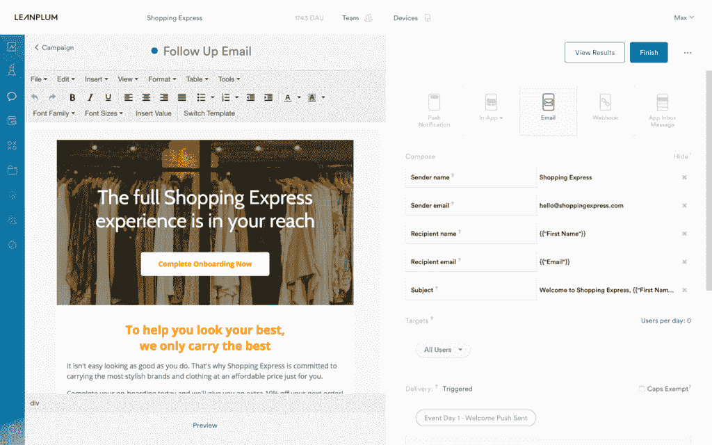

# Leanplum 为其移动营销平台筹集了 2900 万美元的 C 轮融资

> 原文：<https://web.archive.org/web/https://techcrunch.com/2016/10/19/leanplum-raises-29m-series-c-round-for-its-mobile-marketing-platform/>

# Leanplum 为其移动营销平台筹集了 2900 万美元的 C 轮融资

[Leanplum](https://web.archive.org/web/20230322160428/https://www.leanplum.com/) [最初](https://web.archive.org/web/20230322160428/https://techcrunch.com/2014/07/28/ab-testing-service-leanplum-raises-4-8m-series-a-round-adds-marketing-automation-tools/)是一个移动 A/B 测试平台，但后来在此基础上发展成为一个成熟的移动营销平台。该公司现在已经筹集了 2900 万美元的 C 轮融资，由迦南合伙人公司牵头，现有投资者 Kleiner Perkins cau field&Byers 和 Shasta Ventures 参与其中。这使 Leanplum 迄今为止的资金总额达到 4640 万美元。

Leanplum 表示，在过去两年里，其收入增加了两倍，预计在 2016 年将再次增加两倍。它的客户现在包括 Tinder、Lyft、Zynga 和梅西百货等。该公司每天跟踪近 40 亿个事件，预计到今年年底这一数字将达到 120 亿。

Leanplum 计划利用新的资金来扩大其销售、营销和工程团队，并推动其全球扩张。该公司预计，至少部分增长将来自其新的[电子邮件互动渠道](https://web.archive.org/web/20230322160428/http://www.leanplum.com/blog/email/leanplum-launches-email-expands-mobile-engagement-channels)。虽然 Leanplum 已经为营销人员提供了通过推送通知和应用内消息来联系用户的能力，但今天推出的新电子邮件功能将为其用户提供另一种联系用户的途径。

像类似的个性化电子邮件平台一样，Leanplum 将允许其客户根据位置、应用内行为、购买历史等来细分和定位电子邮件。因为它已经为用户提供了使用通知和应用内消息的能力，营销人员也将能够在这些平台上协调他们的消息。

Leanplum 首席执行官兼联合创始人 Momchil Kyurkchiev 在今天的公告中写道:“营销的圣杯是了解每个客户的需求，以便在最佳时刻提供无与伦比的价值。“手机开启了我们在纯网络时代从未想过的行为智能和个性化水平。”