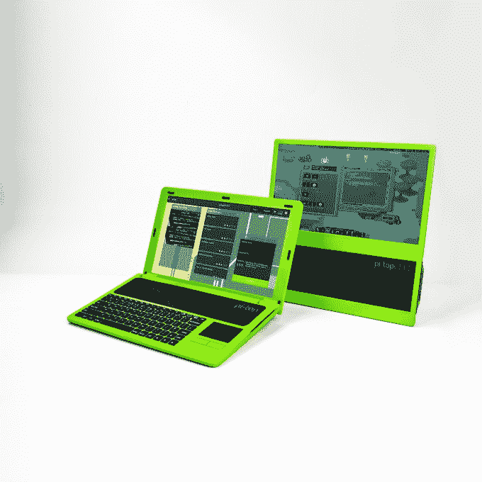

# 学习编码初创公司 pi-top 投资 430 万美元，资助全球教育科技项目 

> 原文：<https://web.archive.org/web/https://techcrunch.com/2016/11/03/learn-to-code-startup-pi-top-pulls-in-4-3m-to-fund-a-global-edtech-push/>

总部位于伦敦的计算和学习编码初创公司 [pi-top](https://web.archive.org/web/20221025222502/https://www.pi-top.com/) 已经完成了 350 万英镑(430 万美元)的首轮融资，由[汉布罗津贴](https://web.archive.org/web/20221025222502/http://www.hambroperks.com/)领投，[承诺资本](https://web.archive.org/web/20221025222502/http://www.committedcapital.co.uk/)也参与了融资。

这家初创公司——从 2014 年的学生项目开始，到 [3D 打印一台 Raspberry-Pi 驱动的笔记本电脑](https://web.archive.org/web/20221025222502/https://beta.techcrunch.com/2014/09/19/uk-engineers-3d-print-their-own-raspberry-pi-laptop/)，变成了一场为低成本微处理器提供笔记本电脑外壳套件的[众筹](https://web.archive.org/web/20221025222502/https://beta.techcrunch.com/2014/10/14/the-pi-top-a-raspberry-pi-powered-laptop-is-hitting-the-crowdfunding-trail/)——现在已经筹集了超过490 万英镑的资金，并在短短 18 个月内将其团队从 2 人增加到 26 人。

Pi-top 去年 12 月完成了一个 130 万美元的种子，还通过 Indiegogo 获得了超过 41 万美元的资金，用于开发其两款 Pi 驱动的产品:最初的 Pi-top 笔记本电脑和价格更实惠的 [pi-topCEED](https://web.archive.org/web/20221025222502/https://beta.techcrunch.com/2015/12/02/pi-topceed-is-a-99-desktop-computer-for-makers/) 台式电脑。

这两款产品都运送给了支持者，后者在去年 5 月几乎按时到达——而最初的 pi-top 花费的时间稍长，但会在 2015 年底前发货。

据联合创始人杰西·洛扎诺(Jesse Lozano)称，迄今为止，他们共售出了 11，000 台圆周率陀螺(265 美元+1 圆周率)，刚刚超过 10，000 台圆周率陀螺(115 美元+1 圆周率)，其中大多数是在过去六个月随着团队规模的扩大而售出的。

除了容纳低成本 Raspberry Pi 微型计算机的硬件之外，该团队还开发了软件，旨在让大约 10 至 16 岁的目标年龄范围内的学习编码变得更简单、更有趣。

因此，这两款设备都坚定地瞄准了教育市场，尽管 Lozano 表示，他们确实有“很大一部分”成年人购买硬件，用于开发应用程序或从事自己的电子爱好项目。“我们专注于迎合那些想要学习的人，他们往往在年轻时就想学习，”他补充道。

pi-top 的软件堆栈包括 pi-topOS，它建立在 Raspberry Pi 的 Raspbian 之上，具有易于使用的界面，支持标准的计算任务，如浏览网页、检查电子邮件、创建和编辑文本文档以及玩游戏。

该团队的旗舰软件产品是其 CEEDUniverse learning game 和 pi-topCODER，它们都旨在在游戏化的环境中教授编码——前者是一个 MMORG，但游戏知识与编码和实际计算技能紧密相连。

他们声称，这些工具将使学生在“三到六个月的游戏”中在计算和 STEM 科目上取得更高的成绩。虽然企业的首要任务是为世界各地的学校建立一个可扩展的生态系统，以便更有效地教授计算机科学和基于 stem 的学科，从而使教师和学生也能够接入其他相关的教育资源。

Lozano 告诉 TechCrunch:“2016 年是美妙的一年，16 多家零售商和分销商购买了 Pi-Top 产品，其中包括一些世界上最大的教育分销商。”“我们现在已经完成了这一规模更大的 350 万美元的融资，以便将我们的团队扩展到美国，并专注于扩大我们在整个教育领域的用户群。”

为了进军美国市场，他们计划于 2017 年在德克萨斯州开设一个办事处。

向中国和印度的教育市场扩张也在计划之中，Pi-Top 在后一个市场与当地巨头 Educomp 合作。到目前为止，他们已经获得的其他 edtech 分销合作伙伴包括美国的 BT Education、RS Components 和 Adafruit。圆屋顶现在销往 70 个国家。

他们现在在中国也有自己专门建造的工厂——每月生产超过 5000 台——预计 2017 年用户将超过 75000 人。因此，在众筹产品开发资金后，他们已经从有效地生产订单单位扩大到能够每月生产数千台设备，并完全重建了他们在中国的组装点以满足需求。

“在这一点上，我们是一家教育技术公司，这在很大程度上是我们从一开始的意图。洛扎诺说:“虽然我们有很大一部分销售面向零售和消费者，但在 DIY 和 STEM 领域，确实意味着总会有一些交叉。“但我要说的是，我们的运营方式确实与大多数人对教育公司的期望大相径庭。

“我们是一个工程师团队，除了树莓派之外，我们创造了我们产品的每一个方面，我们 100%拥有我们的供应链(我的联合创始人 Ryan 现在已经在我们深圳的组装点生活了一年多，负责这方面的 pi-top)，我们甚至设计了自己的货运箱，以将运输损坏降至绝对最低。我们所做的每一个方面都是经过精心设计的，旨在以超出行业承受能力的价格提供高质量的产品。”

“这种方法让我们完全重新定义了 STEM 教育中负担得起的含义，pi-topCEED 仅为 149.99 美元，远低于市场上任何可比设备的成本，”他补充道。

Lozano 说，由于电池寿命超过 10 小时，更昂贵的 pi-top 在家庭和代码俱乐部使用中特别受欢迎。而价格较低的 pi-topCEED 在寻找“一台很棒的低价电脑”的学校和组织中卖得很好。

“它的 14 英寸高清屏幕 pi-topCEED 实际上是普通学校计算机设置的一半成本，在我们所有的课程映射 STEM 内容之下，它是一个很棒的小桌面，可以像普通学校计算机一样使用，”他补充道。“这两款设备的特别之处在于，每当发布新的 Raspberry Pi 时，它们都能够进行升级，这使得我们的笔记本电脑和台式机的使用周期非常长，同时以前所未有的价格保持在技术浪潮的前沿。”

学习编码 Pi 驱动的硬件领域的一个竞争对手是(也是)总部位于伦敦的[Kano](https://web.archive.org/web/20221025222502/https://beta.techcrunch.com/tag/kano/)——但同等的 Kano 产品(带键盘和屏幕)价格为 300 美元或更高。所以你可以明白为什么资源短缺的学校和代码俱乐部会对 pi-tops 感兴趣。

根据 Lozano 的说法，目前有超过 500 所学校正在使用 pi-tops，有“数千名”学生对 CEEDUniverse 游戏提供反馈，该游戏目前仍处于测试阶段(需要 pi-top 硬件来运行)。

【YouTube = https://www . YouTube . com/watch？v=dbOxTFAsA0w&w=853&h=480]