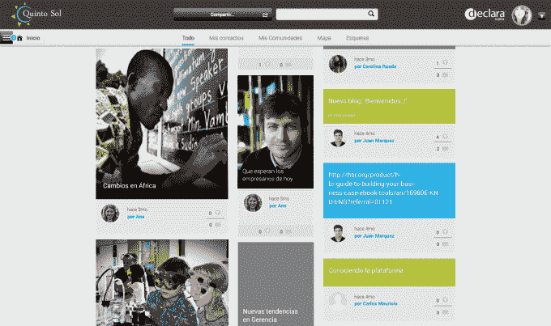

# 学习平台 Declara 融资 900 万美元，着眼于亚洲 

> 原文：<https://web.archive.org/web/http://techcrunch.com/2014/06/11/learning-platform-declara-raises-9m-sets-sights-on-asia/>

# 学习平台 Declara 筹集 900 万美元，将目光投向亚洲

专注于为个性化学习工具开发技术的初创公司 Declara 已经从林登风险基金和新加坡 EDBI 获得了 900 万美元。这使其首轮融资总额达到 2500 万美元。今年 4 月，该公司首先获得了由 GSV 资本牵头的 1600 万美元，并计划在新加坡开设一个办事处，作为其向亚洲分销 Declara 平台计划的一部分。

Declara 的技术包括为个别学生定制的学习工具，通过结合语义搜索、预测分析和机器学习来构建一个学习平台，它称之为“认知图”它根据用户的互联网活动，包括搜索、社交网络上的互动以及他们阅读的内容，来研究用户如何与数据进行交互。然后，该平台会为每个人创建一个包含个性化课程材料的“学习地图”。它的总部设在帕洛阿尔托，目前在博伊西、爱达荷和墨西哥设有办事处。

该公司的平台目前被几所学校、大学和组织用来补充课程。其中包括澳大利亚教育服务，它使用 Declara 帮助教师学习新技能；SNTE，墨西哥最大的教师工会，利用 Declara 帮助培训 160 万名教师和管理人员；宾夕法尼亚大学；和基因泰克。