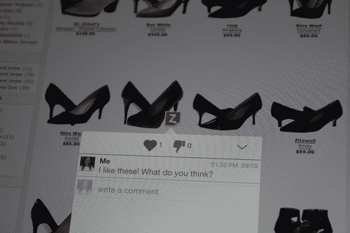

# 使用 Zurf 移动浏览器在网站上留下“便笺”

> 原文：<https://web.archive.org/web/https://techcrunch.com/2014/09/12/leave-sticky-notes-on-websites-with-zurf-mobile-browser/>

我以前见过让网上购物“社会化”的尝试。已经有了 Chrome 插件，Firefox 插件，浏览器覆盖…我不确定它曾经成功过。

然而，在[TechCrunch Disrupt San Francisco 2014](https://web.archive.org/web/20221007042045/https://beta.techcrunch.com/events/disrupt-sf-2014/event-home/)上展示的一家名为 [Zurf](https://web.archive.org/web/20221007042045/http://www.zurfapp.com/) 的初创公司却有不同的想法。我发现[他们的概念](https://web.archive.org/web/20221007042045/http://www.zurfapp.com/wp-content/videos/ZurfDemo2.mp4)有些有趣，它解决了一些问题。

首先，网络上有很多零售商品分类和分享的工具。我应该从哪里开始:Pinterst，Wanelo，Fancy，Fab，Polyvore…名单还在继续。但 Zurf 注意到的一件事是，有许多用户仍然以老式的方式分享在线商品的链接，只是复制链接，并在智能手机上相互发短信(讽刺的是，发短信已经过时了)。

这种方法既麻烦又难以管理，因此 Zurf 试图通过提供另一种工具来解决这个问题，使移动设备上的社交购物变得更容易。

Zurf 为 Android 和 iOS 开发了一个独立的网络浏览器，用一种叫做 zNotes 的类似便利贴的机制来标记物品相当容易。使用 Zurf 浏览器(而不是 Safari 或其他移动浏览器)，客户可以在任何网站上按住他们喜欢的项目，并用 zNote 标记该图像(图像上会显示一个小图标)。然后，他们可以在 zNote 上附加一条消息，并向朋友发送该页面的链接，以查看他们为他们标记的项目。

如果收件人也在他们的设备上安装了 Zurf，链接会作为推送通知直接发送到应用程序，直接在 Zurf 中打开带有标记项目的特定页面。收件人看到的是网页本身，但为他们标记的项目是可见的，上面有 zNote。他们可以点击 zNote 来查看附加到该项目的消息，并通过该 zNote 直接回复。

如果收件人没有安装 Zurf，他们会通过短信或电子邮件收到一个链接。当他们访问该链接时，它会在常规的默认浏览器中打开，并且他们可以在只读视图中看到 zNote。他们可以选择通过 Smartbanners 和/或移动覆盖来安装 Zurf，这样他们就可以通过 zNote 进行交互。

使用 Zurf 不需要创建账户，尽管让人们安装新应用或改变他们的浏览方式总是一个障碍，但该公司至少试图让安装过程尽可能无摩擦。

我认为 Zurf 有趣的原因是因为它将项目标记为“内联”。它试图保持网页原样，只在商品上添加注释，但让用户停留在产品所在的实际页面上，而不是把他们送到其他一些策划好的网站上。

联合创始人沙欣·沙德法(Shahin Shadfar)打赌，品牌也会喜欢这一功能——让用户留在实际品牌的网站上查看商品，而不是跳转到 Pinterest 或 Wanelo 等不同的网站。

毫无疑问，该公司将面临让人们安装新应用程序的巨大挑战。尽管有引人注目和独特的工具集，但许多移动浏览器已经寿终正寝。Zurf 需要做好教育目标用户群的工作，让他们知道这比他们目前的剪切粘贴文本方法更容易突破。如果他们能理解这些好处，也许这对习惯性移动购物者会有用。

但是值得注意的是，Zurf 的研究表明，用户并没有真正将 Zurf 视为一个浏览器(尽管它可以作为一个常规的旧 Webkit 浏览器使用)。相反，他们的焦点小组中的用户倾向于将 Zurf 视为更多的消息应用程序，因为他们通过 zNotes 来来回回地交流。从这个角度来看，让用户采用一个新的消息应用程序的障碍似乎比让人们改变他们的浏览习惯要低一些。

但对我来说，Zurf 的真正机会可能是给这项服务贴上白色标签，并让品牌在自己的零售应用程序中使用它，作为移动商务共享的集成服务。对我来说，这似乎是一个巨大的胜利，因为许多消费者已经在他们的设备上安装了品牌应用程序，他们正在使用这些应用程序查看和购买产品。我问沙欣这是否是他们战略路线图的一部分，他说是的，他们已经在与某些零售商谈判。

但目前他们也推出了独立版本，以建立用户群，并为这些用户提供分享零售商品信息的新方式。

这款应用大约一个月前在 iOS 应用商店为他们的焦点群体软发布了[(现在每天都会有一个小的更新)，而](https://web.archive.org/web/20221007042045/https://itunes.apple.com/us/app/zurf-social-web-browser/id702387094?mt=8)[的 Google Play 版本在 9 月 9 日更新](https://web.archive.org/web/20221007042045/https://play.google.com/store/apps/details?id=com.xerzees.zurf)。