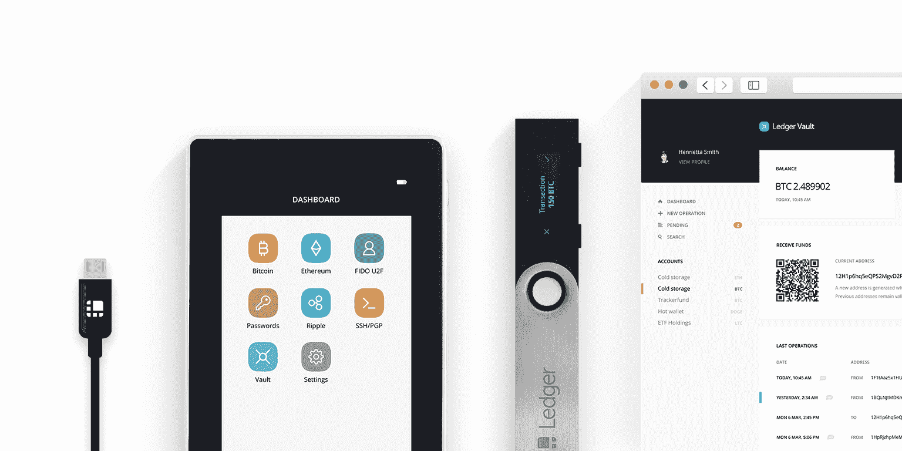
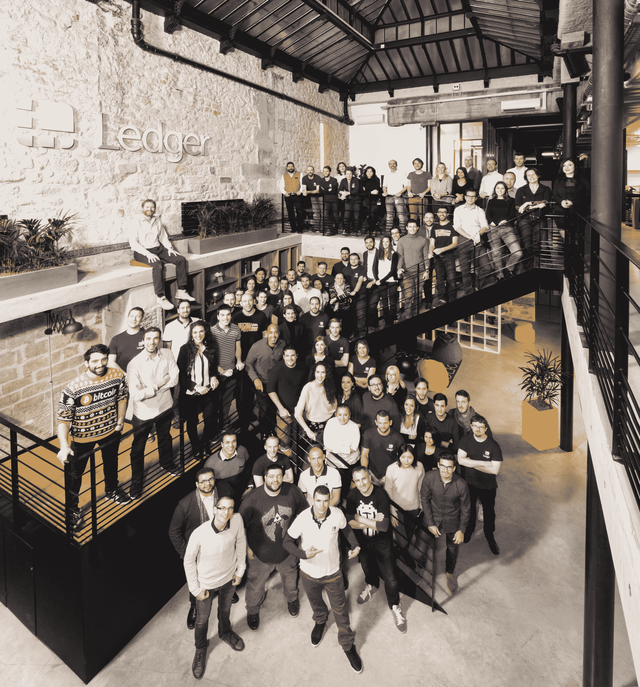

# Ledger 再融资 7500 万美元，成为加密货币硬件钱包的领导者 

> 原文：<https://web.archive.org/web/https://techcrunch.com/2018/01/18/ledger-raises-another-70-million-to-become-the-leader-in-cryptocurrency-hardware-wallets/>

莱杰刚刚筹集了令人印象深刻的 7500 万美元的 B 轮融资(€6100 万美元)，由 Draper Esprit 牵头。这家初创公司去年已经在[融资 700 万美元。但是对加密货币的狂热可能使得筹集更多资金变得容易。](https://web.archive.org/web/20230130100805/https://techcrunch.com/2017/03/30/ledger-grabs-7-million-for-its-cryptocurrency-hardware-wallets/)

如果你有很多加密货币，你可能听说过[分类账](https://web.archive.org/web/20230130100805/https://www.ledgerwallet.com/)钱包。这家法国初创公司一直在设计一些最安全的硬件钱包。如果你不想被黑，就买个账本吧。

Draper Venture Network 基金，包括 Draper Associates、Draper Dragon 和 Boost VC 也参与了资助。FirstMark Capital、Cathay Innovation、Korelya Capital 以及现有投资者 CapHorn Invest、GDTRE 和 Digital Currency Group 也参与了本轮投资。XAnge 仍然留在首都。莱杰说，这轮融资被超额认购，如果不包括 ico，这是加密货币初创公司中最大的 B 轮融资。

该公司在 2017 年已经销售了 100 万个硬件钱包。虽然这听起来令人印象深刻，但与 2016 年相比，这更令人印象深刻。莱杰在 2016 年仅售出 3 万个钱包，同比增长 33 倍。

这是理解莱杰钱包的关键。很少有人预测到 2017 年的加密货币热潮。这就是为什么莱杰一直在努力跟上订单。当您今天购买 Ledger Nano S 时，您将在 2018 年 3 月获得交付。

因此，该公司将利用今天的融资来提高产量，并解决这些延期交货的问题。需要注意的是，Ledger 已经盈利了。莱杰目前在巴黎、旧金山和维尔松有 82 名员工。

该公司还计划推出 Ledger Vault，这是一种针对希望投资加密货币的银行、对冲基金和家族理财室的安全解决方案。

“对于钱包，我们将我们的操作系统集成在一个安全芯片中，对于金库，我们将它集成在一个硬件安全模块中，”Ledger 联合创始人兼首席执行官 Eric Larchevêque 告诉我。“其背后的想法是提供额外的功能和服务，如多账户、多签名或时间锁。”

莱杰相当于一个金镐制造商。当出现淘金热时，卖黄金的人最终会比寻找黄金的人赚得更多。

*更正:本文的早期版本称，莱杰筹集了 7000 万美元。该公司最终筹集了 7500 万美元。*

*披露:我拥有少量各种加密货币。*

