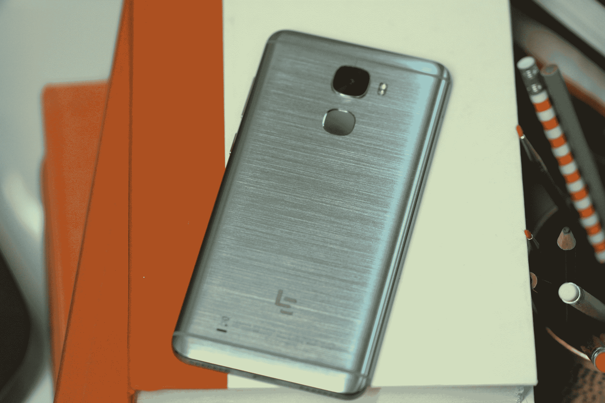
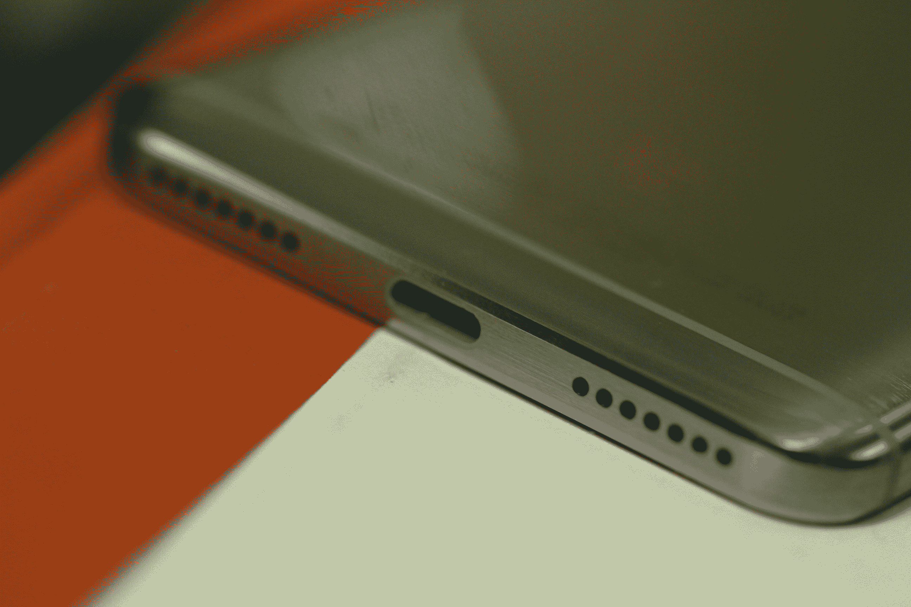
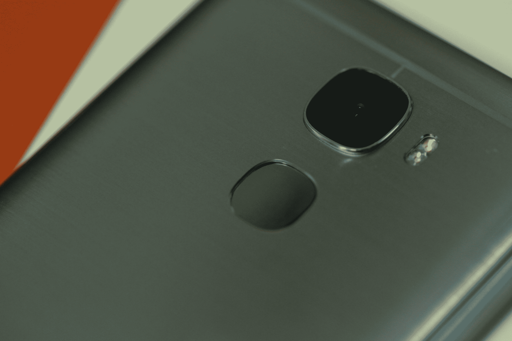
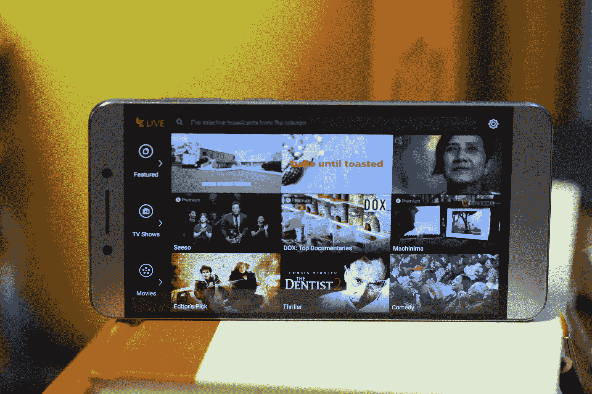
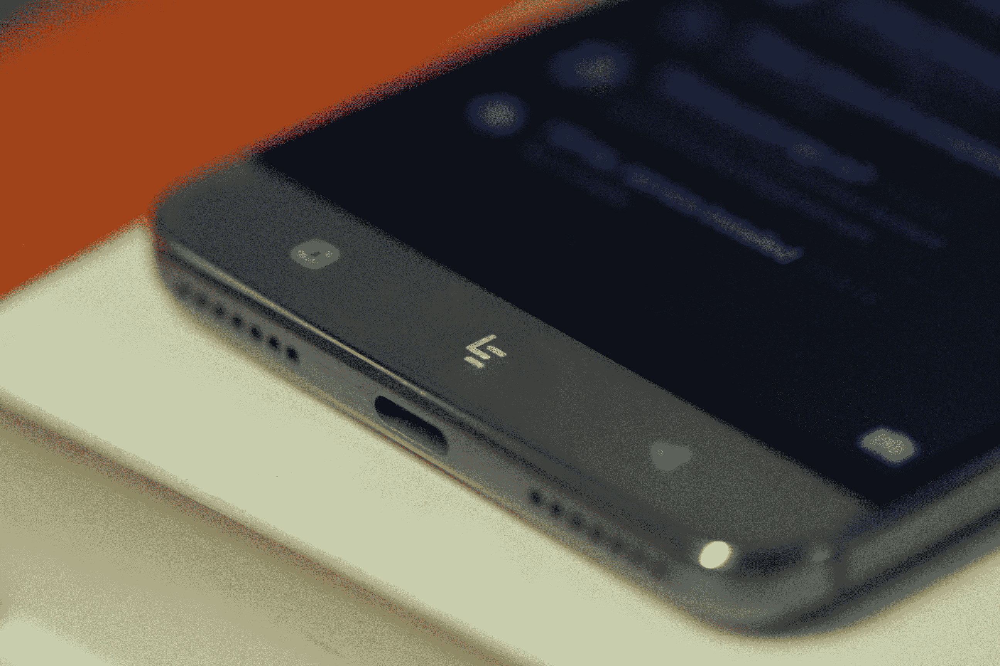

# LeEco 的 Le Pro3 便宜、快速且令人沮丧 

> 原文：<https://web.archive.org/web/https://techcrunch.com/2016/11/24/leeco-lepro3-review/>

LeEco 最想做的就是成为每个人的一切。这种冲动在几个月前该公司在美国的首次亮相中得到了最好的体现，其中包括从手机和平板电视到自行车、电动汽车、虚拟现实耳机的所有东西，是的，还有迈克尔·贝直接从最新的变形金刚中客串的角色。

在这个奇异的场景中推出的所有产品中，Le Pro3 是最引人注目的，原因很简单，它就在这里，而且确实存在。我手里拿着它。另一方面，展会上展示的许多其他产品在美国的零售前景就不那么确定了。

那么，抛开盛况不谈，乐视的乐 Pro3 带来了什么？它的大多数中国智能手机制造商都指望同样的事情——低价。事实上，在一个 700 美元和 800 美元旗舰设备的世界里，400 美元的价位非常诱人。

但市场上充斥着来自相对不知名的制造商的廉价手机(至少在美国)，这使得仅凭价格点来区分自己变得很困难，特别是像 T2 一加 T3 这样的公司提供一些真正物超所值的产品。

## led 设计

乐 Pro3 的设计掩盖了它的轻薄。7.5 毫米，并不比许多竞争对手厚多少，但块状设计和厚重的金属结构给手机增加了难以撼动的厚重感。然而，金属外壳确实有助于手机的坚固(尽管不防水)构造和引人注目的设计。当然，它并不适合所有人，但极其闪亮的拉丝金属背衬无疑有助于它脱颖而出。它也是，为了记录，有点像指纹磁铁。

手机的右侧有两个物理按钮——电源和音量摇杆，这两个按钮都可以从边缘的额外圆角中受益。两个大扬声器格栅位于底部，USB-C 插槽的侧面。另一方面，耳机插孔却无处可寻。

是的，LeEco 已经加入了 iPhone 和 Moto Z 的勇敢行列，成为首批放弃这种熟悉连接器的廉价设备之一，所以你可能想把蓝牙耳机的价格加入手机的底线。背面是一个额外闪亮的(相当挑剔的)指纹读取器和一个 2600 万像素的后置摄像头，增加了一个明显的凸起。

同样值得注意的是，虽然正面没有任何明显的品牌，但触觉消失的 home 键采用了该公司的“le”标志的形式，这是一个无法避免的额外品牌。

在 1920 x 1080 的分辨率下，这款显示器的价格还不错。当然，如今许多手机价格都高得多，但它足够锐利和明亮，将为大多数用户完成工作。

## 莱斯佩克斯

总的来说，Le Pro3 的引擎罩下有一些相当令人印象深刻的功能，与一些真正优质的手机不相上下。骁龙 821 处理器是该系列的顶级产品，与谷歌 Pixel 和最近的 OnePlus 3T 一样，这款手机仍然是相当罕见的公司。再加上相当大的 4GB 内存和 64GB 存储空间——不过没有 microSD 插槽，所以你只能用它了。但这对大多数人来说应该够了。

然而，规格方面最突出的是 4，070 毫安时的电池，它击败了一加最近适度升级到 3，400 毫安时的电池。老实说，这是 LeEco 真正应该主导的规范。奇怪的是，在它自己的新闻材料中，它吹嘘“长达 318 小时的 4G 待机时间。”我可能会去两天以上，你可以去，不需要收费。

## LeSoftware

乐视显然希望在软件领域脱颖而出。该公司将会吸取多年来各种 Android 制造商一次又一次的教训——少即是多。但是建立你自己的征服世界的生态系统的一部分是定制你的基本操作系统。但是，如果这种整体体验是赋予该公司名称的生态系统的象征，它可能注定要被绘制。

EUI 实际上是层叠在 Marshallow 之上的皮肤。其他令人不快的是缺乏默认的应用抽屉——迫使你将所有的应用都放在主屏幕上。该公司自己的应用程序已经占据了一部分空间，包括视频应用程序 Le 和位于中间底部的直播按钮 dab，这也是一个视频应用程序。

乐视真的想把你纳入它的视频生态圈。事实上，从 Kindle Fire 及其同类产品最终成为内容交付设备的方式来看，人们可以感觉到该公司将其低端手机视为将其视频服务推向新领域的后门。嘿，该公司完成了即将上映的大预算马特达蒙电影，墙，所以它真的希望你购买其服务，非常感谢。

## 勒博特姆线

Le Pro3 的价格当然是合适的——尤其是如果你参加了该公司的一次闪购，并且被打折 100 美元。硬件是尖端和笨重的奇怪组合，但在 399 美元的价位上，它仍然感觉是一笔坚实的交易。就整体体验而言，OnePlus 3T 价格略高，但它是一个更安全的赌注——即使它拥有超长的电池寿命。

LeEco 有一些问题需要解决，特别是在软件方面，但 Le Pro3 感觉像是一个相当不错的首次尝试，如果简单地简化其软件皮肤，会做得更好。