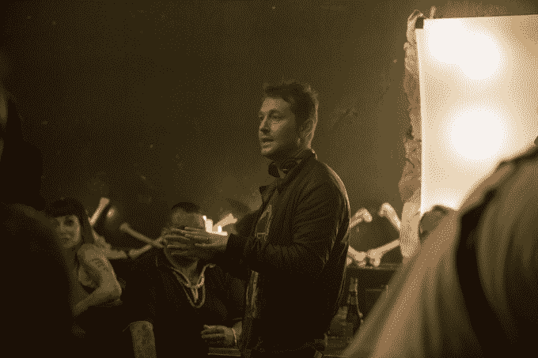

# 《升级》导演雷·沃纳尔谈低预算世界建设

> 原文：<https://web.archive.org/web/https://techcrunch.com/2018/06/01/leigh-wannell-upgrade-interview/>

《升级》讲述了格雷·特蕾西的故事，一个在不久的将来因车祸和抢劫而四肢瘫痪的男人。

在一个插曲之后，格雷与他的新残疾做斗争，一个名为 Stem 的实验性计算机芯片被植入他的脊髓，在那里它不仅让他再次控制他的四肢，还让他变成了一个近乎超人的人，准备追捕那些使他瘫痪并杀害他妻子的人。

这部电影今天在美国上映，听起来像是一个直截了当的复仇情节，但它是由雷·沃纳尔编剧和导演的，他以创作《电锯惊魂》和《阴险》而闻名。(最近，他的导演处女作是《阴险 3》。)他解释说，他对把这变成一部超级英雄电影不感兴趣。而是想讲这个故事的“出租车司机版”。

没有进入细节，公平地说，升级没有感觉到*远离 Whannell 的恐怖电影。它还包括大量发自内心的动作场景，并触及了关于我们与技术关系的更大问题。*

上周，我在纽约会见了 Whannell，讨论这部电影，以下是经过编辑的谈话记录。有一段有点剧透，但我会在到达那里时提醒你，所以你可以跳过。

Whannell 在他的家乡澳大利亚墨尔本拍摄升级，所以我们从悉尼和墨尔本之间的竞争开始说起。

雷·沃纳尔

**雷·沃纳尔:**我已经在洛杉矶生活了 12 年，所以我不再关心悉尼-墨尔本。我们在墨尔本拍摄这部电影，但实际上我们是在悉尼剪辑的。

我在悉尼呆了几个月，我非常喜欢那里。我坚持住在[邦迪海滩](https://web.archive.org/web/20221229131458/https://en.wikipedia.org/wiki/Bondi_Beach)的一套公寓里，这对于剪辑室的位置来说一点也不实用，但我并不在乎，因为我想，“看，如果我要在冰上行走，那我就要去跳踢踏舞。”如果我要住在悉尼，我想住在邦迪海滩。

TechCrunch: 那么科学虚构的 Stem 概念是从何而来的呢？

就像我所有的想法一样，这个想法真的是突然冒出来的。这是一个非常随机的过程，这种随机性令人沮丧，因为我觉得我总是在试图思考电影创意。大多数想法都不好，它们会因为糟糕的想法而被立即归档。

时不时地，当我开车或洗澡时，一些东西会突然出现在我的脑海中，你会得到一个图像，它会一直伴随着你。它不需要太多，不需要是一个故事，它可以只是一个图像。但它不会离开你的头脑，那时候你就知道你得到了什么。

事情就是这样开始的。我并没有在杂志上读到关于科技发展方向的文章。我记得当时我在后院，天气很好，就像这样，我突然想到一个坐在轮椅上的四肢瘫痪者，他从椅子上站起来，从脖子以下被电脑控制。那个画面和那个场景不会离开我的脑海，我开始在里面逆向设计一个故事。我不停地写，做笔记，然后，切到许多年后，我坐在这里和你说话。

TechCrunch: 有趣的是，它来自你的想象，因为在某些方面，它感觉非常有先见之明。几周前我们有自己的机器人活动，舞台上最重要的时刻之一是[一个坐在轮椅上的人，由于外骨骼](https://web.archive.org/web/20221229131458/https://techcrunch.com/2018/05/13/here-are-all-the-robots-we-saw-at-tc-sessions-robotics/)，他能够走几步。

**Whannell:** 所以帮助瘫痪病人行走和移动的外骨骼，这部电影是它的内在版本，它更进了一步，没有任何外在的东西。这是一个芯片。

看着世界赶上我的剧本很有趣。因为我写这个剧本初稿的时候，自动化汽车和智能厨房还是科幻小说。在接下来的几年里，它们变得无处不在。我是说，我妻子的车会自动停车并和她说话。我女儿认为在厨房里有一个声音和她说话是完全正常的，她让它播放歌曲，它就播放了。所以在某种程度上，我觉得自己生活在多年前写的电影世界里。

TechCrunch: 那是什么时候？

**Whannell:** 天啊，初稿大概至少是六年前的事了。

**TechCrunch:** 你说很多想法会找上你，你会想:这些有的不好，有的好。显然，你以恐怖闻名，所以在这种情况下，当你想到一个科幻小说的想法时，会产生任何恐惧吗？

**Whannell:** 在我准备执导这部电影的时候，我有一点害怕。我写的时候不怎么喜欢。但我开始担心科幻迷，因为我非常了解恐怖迷，我很幸运地遇见了他们中的许多人，我觉得我就在那个社区里，我自己也是一个恐怖迷。但我意识到，科幻小说有自己的一群忠实粉丝，他们会挑选《星际迷航》和《星球大战》之类的东西。我确实记得有那么一刻我想，哇，他们会不会看到这个然后认为我是个骗子，我是这个世界上的一个游客？

我刚刚在全国进行了为期两周的旅行，在不同的城市放映这部电影，之后我会经常和人们聊天。在接受这部电影的过程中，我意识到这些类型不属于任何一种类型的人。我觉得科幻迷的反应只是人们试图用一些新的东西来打击他们，一些他们没见过的东西。如果你这样做了，你会没事的。

**TechCrunch:** 当你在导演[科幻小说]的时候，你觉得你在使用不同的技能组合吗？

制作一部恐怖电影的技巧是如此的特别，以至于我显然没有用到任何技巧。在恐怖电影中那些安静的时刻，你真的依赖于对事物的期待，这部电影没有使用这些。但是我觉得我在恐惧中学到的一些节奏和电影制作节奏，我想它们是天生就根植于我的。

例如，我喜欢创造突然被行动打断的寂静时刻。我想我一定是下意识地在寻找你从恐怖电影中得到的声音反应。这几乎就像是我把那些恐怖的节拍放入了一个科幻的背景中:建造，建造，宣泄。建造，建造，宣泄。所以也许这是根深蒂固的。

**【如果不想被《升级》中的一个早期场景剧透，以及影片的大方向，跳过后面几段。]**

**TechCrunch:** 我的经验的确如此。大部分时间我都非常紧张，当他的头被切开的时候，我只是尖叫。

**Whannell:** 【笑】手术中？

**TechCrunch:** 不，在第一杀。

啊，是的，Pez 自动售货机！

**TechCrunch:** 天啊，是啊。那是非常令人不安的。

**Whannell:** 如果你看着那个场景，分析它的结构，它有一种恐怖风格的节拍器，那里很安静，很紧张，然后有什么东西爆炸了。

在观看的过程中，有趣的是看到那个场景得到了有声的反应。这和恐怖电影得到的反应不一样，那种观众的尖叫，但这几乎就像肾上腺素激增，当他离开地板时，我看到人们跟着鼓掌。我想，“哦，酷，这是一项观赏性运动，他们作为参与者正在进入它。”

**TechCrunch:** 当我阅读这部电影的描述时——显然，营销强调了这种反乌托邦的、几乎恐怖的元素，但你仍然会想，“哦，他基本上会成为这个超级英雄，可能会有这种黑暗的一面，但它仍然会是这个最终胜利的故事。”然而在整部电影中，这种黑暗的底色让人感觉非常不同。

我感觉就像这部电影的超级英雄版本，有人被赋予了某种东西——一种力量或一个计算机芯片，不管它是什么——这种事情已经发生了，尤其是在我们生活的这个时代，这种事情已经发生了很多。所以我发现更有趣的是做出租车司机版本，做你意识到坏人在你身体里的版本，战斗不是在你和外部力量之间。实际上是两个实体在争夺同一个肉体。我对此很感兴趣。

**【剧透】**

**TechCrunch:** 你在新闻材料中提到的一件事是，既有独立电影的自由，又有大型科幻电影的范围。我不知道预算是多少，但我认为它不是复仇者联盟的规模。

**Whannell:** 【笑】很低。

**TechCrunch:** 你说“嗯，我们没有那么多钱，但我们仍将努力建设一个有发展空间的世界”时，你采取的总体策略是什么？

**Whannell:** 这是我真正的目标和梦想。制作一部享受科幻世界的电影，但利用了独立的创作自由。问题是一个应该抵消另一个。如果你要去拍未来动作片，你应该需要制片厂的资金。所以我真的很想拥有我的蛋糕并吃掉它，但是我被它迷住了。

作为模特，我用的是伴随我成长的 80 年代科幻片。我用原版《终结者》作为一个很好的例子，因为如果你真的一个场景一个场景地研究这部电影，科幻小说和科技会非常明智和有节制地分发。这是一部披着科幻外衣的精益求精的电影。我喜欢这样。

我觉得，如果他们能在 80 年代实现这种技巧，那么我们现在也能做到。特别是有了新的优势，他们甚至没有当时的 CG。我们可以用电脑合成来增加一些场景。我们不能用它发疯，但我们可以在某些时候利用它。我想我离这部电影太近了，我花了太多时间来了解我们是否真的成功了，但我希望观众感觉他们在看一部更大的电影，你知道吗？他们是更大世界的一部分。

**TechCrunch:** 没错，开始时有几件事让人感觉很大—

**Whannell:** 就像，这就是世界！

**TechCrunch:** 如果我回到临床上看它，我会看到这些都是非常有战略意义的。但它确实起作用了。这也是一个有趣的限制，因为这意味着在许多其他场景中，你有一两个科幻元素，但你主要使用的是真实世界的位置或场景，而不是一个创造的世界。

当然，这是一个非常有意识的决定。不仅仅是预算，对我来说是一个创造性的决定:让我们把这部电影设定在不久的将来。让我们建立一个观众能在其中看到自己的世界。

此外，世界不会在一夜之间完全改变，它是逐渐发生的。30 年后，纽约市仍会有 19 世纪的建筑。他们不会拆掉它们，建一座玻璃塔。所以 30、40 年后，你将会看到曼哈顿的一幅风景，它是过去之上的未来，它将会是一个混合体。

人们仍然会驾驶老式汽车！这是你在很多未来电影中看到的另一件事，突然间路上的每个人都在驾驶未来的汽车。我想，不，20 年后仍然会有人开着 90 年代早期的本田，破车，你知道吗？这个世界的规模是重要的，但一个额外的奖励是它在预算上帮助了我们。

**TechCrunch:** 你提到这是你六年前开始写的东西。在这段时间里，科技在发展，但我们谈论或思考残疾的方式，以及我们谈论四肢瘫痪或截瘫的方式也发生了变化。那在多大程度上是你研究的一部分，比如和残疾人活动家交谈？

**Whannell:** 我没怎么和激进分子交谈过。当我在写这部电影的时候，我想要一个芯片可以治愈瘫痪的想法，我希望这是一个有形的东西，我和一个外科医生谈过，他说，“看，你所说的是假设的，但在理论上，这是可以做到的。电脑可以弥合我们大脑和神经末梢之间的差距。”这是伟大的离开，知识的技术是可信的。

当然，当我们准备拍摄这部电影时，我们非常认真地对待它的四肢瘫痪的一面。扮演格雷的洛根(马歇尔-格林)，他和一个四肢瘫痪的人一起工作，这个人很友好，愿意花很多时间和洛根在一起，和他分享生活，和洛根聊天，让洛根看看他的日常习惯是什么样的，让他真正使用一把椅子。

洛根对此很诚实。他觉得他欠这位先生一份责任，他有责任真实地描绘它，他真的在看着它，看着他握着手的方式。在这部电影中，他四肢瘫痪的时间并不长，但对我们来说很重要，因为那一刻和电影中的其他事情一样完整。尤其是现实生活中人们正在经历的事情。你不会想用一些不靠谱的电影版本来反驳他们。

TechCrunch: 我想说的一部分是，你提到的他从椅子上站起来的开场画面。这是一个令人难以置信的感人场景，因为你和他一起经历了所有这些可怕的事情。但与此同时，你可以想象一个四肢瘫痪的人在看这部电影，你不一定想让他们看着自己思考—

**Whannell:** 他们想，“哦，你把这说成是胜利，好像这样更好。”是的，这很有趣，这是把电影推向世界的一部分，不是吗？这个世界会向你反映，我认为你只需要接受这些打击。没有任何恶意。

我不认为我们试图提出四肢瘫痪是这种地狱般的情况，只有身体健全的人才能治愈。我认为我们所做的是讲述一个讨厌技术的人变成了技术的故事。我们在故事中能够做到这一点的方式是通过他的状况，他的四肢瘫痪。所以这是一个意外的结果，他得到了这个芯片，现在他完全依赖它，你知道吗？对我们来说完全是一个故事点。

**TechCrunch:** 又一次，没有过多剧透，你说这是故事的出租车司机版本。有多少是为了表达你对人们变得越来越自动化的担忧？

我想了很多。首先，我试图讲述这种类型的故事，我试图建立一个独特的电影。然后电影的主题和问题就在它下面。

但是我在两个阵营中都涉足了技术。尤其是在研究剧本和阅读雷·库兹韦尔(Ray Kurzweil)及其作者的书籍时，他们谈论的是奇点以及人类和技术将会融合的点。因为我不想拍机器人电影。以前有人拍过机器人电影，我对此并不感兴趣。我感兴趣的是人类自愿将科技植入他们的身体。我觉得这是我没见过的东西。

通过我的研究和阅读这些书，我看到了两面。我看到了我们在医学上依赖科技的美好一面。如果我们可以在我们的血液或身体中安装某种东西来治疗癌症，那显然将是一件令人惊奇的、美妙的事情。但是在另一个阵营中有另一只脚，那就是我们对自动化的过度依赖。我想知道，如果我们的汽车为我们开车，我们的厨房做饭，我们真的把自己设计成无关紧要吗？那是一条有趣的向下看的路。在我看来，人类的本能总是让事情变得简单。我们总是奔向方便:“哦，如果机器能做到这一点，那不是更好吗？”

我在想这条路的尽头在哪里。这部电影无疑也反映了这一点。

[https://web.archive.org/web/20221229131458if_/https://www.youtube.com/embed/G9fXbkiKfmY](https://web.archive.org/web/20221229131458if_/https://www.youtube.com/embed/G9fXbkiKfmY)

视频

**TechCrunch:** 我要问的最后一件事，也是我认为我必须要问的，是这在多大程度上意味着完全独立的体验？你想过可能的续集吗？

T4:我没有。这个想法进入我的脑海，我把它推开。因为这是一部独立电影，在当今的媒体环境下，让人们关注这些事情真的很难。我们将在夏天上映这部电影，周围都是巨片。我无法想象韩新的个人电影的营销预算是多少。与之竞争几乎是鲁莽的，所以我觉得计划续集是对成功的假设，而我还没有准备好。

坐在那里为续集何去何从而烦恼将是一个大问题。

TechCrunch: 嗯，这肯定不像是一部考虑到续集而创作的电影。

不，绝对不是。我记得当我和温子仁拍第一部《电锯惊魂》时，很多人会对我们说，“好吧，你们为续集敞开了大门。”我们会说，“不，我们真的把门关上了！”我们认为这是一个很好的结局。我们一点也不知道，这部电影一经推出，制片人就有了其他想法。

对我们来说，那部电影的结局，在我们看来，是一个切到黑色的定义，没有更多的故事。但后来我们上了一堂商业课。