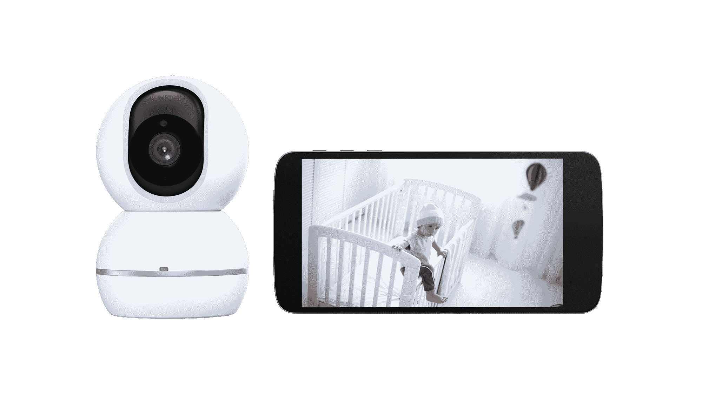

# 联想推出一堆智能家居产品 

> 原文：<https://web.archive.org/web/https://techcrunch.com/2018/08/30/lenovo-launches-a-bunch-of-smart-home-products/>

# 联想推出了一堆智能家居产品

在这一点上，联想已经涉足了几乎所有其他领域，那么为什么不将触角伸向智能家居设备呢？今天在 IFA，该公司宣布即将发布一款智能灯泡、插头和联网安全摄像头，所有这些都由该公司新的 Link 应用程序捆绑在一起。

老实说，这出戏很清楚。该公司最近在上个月发布了第一款(也是最好看的)[谷歌智能显示器](https://web.archive.org/web/20230130100805/https://techcrunch.com/2018/07/26/review-lenovos-google-smart-display-is-pretty-and-intelligent/)，现在它正在寻求提供更多的联网智能家居纸巾。你家里已经有一个联想的产品了，为什么不全押呢？

毕竟，碎片化一直是智能家居早期采用者的一个问题。为家里的每一个新设备开发不同的应用程序的想法有点令人头疼，尽管苹果、亚马逊和谷歌等公司都在努力用自己的解决方案来结束这个循环。

联想试图通过 Link 来规避这一点，同时为用户提供“智能家居的终极启动包”，如果你有新的智能显示器，可以通过 Alexa 或谷歌助手来控制。

降低用户准入门槛的想法可能有些道理，但对我们大多数人来说，在使用苹果 Home 应用程序这样的总括软件解决方案的同时，混合和搭配不同品牌的想法更有吸引力。

无论如何，智能插头和智能灯泡都将于 11 月上市，售价 30 美元，而智能相机将于明年初上市，售价 100 美元。目前还没有关于智能显示屏捆绑销售的消息，不过这可能是显而易见的。