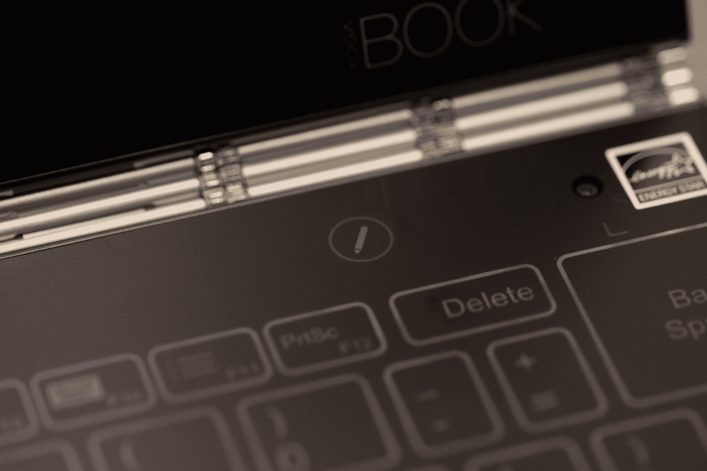

# 联想的 Yoga Book 是重塑混合平板电脑 TechCrunch 的一次精彩尝试

> 原文：<https://web.archive.org/web/https://techcrunch.com/2016/10/21/lenovos-yoga-book-review/>

没有哪家主流电子产品制造商能比联想制造出更有趣、更创新、更怪异的产品。在 Yoga 旗下的扭曲努力和摩托罗拉生产的模块化手机之间，这家中国公司正在承担我们很少在硬件创业公司之外看到的那种外形风险。

这一点在售价 499 美元的瑜伽书《T1》中得到了最好的体现。如果没有别的，令人印象深刻的是，该公司已设法生产出又一个迷人的混合动力世界。这一次，该公司很大程度上依赖于手写是平板电脑崛起的一大无名牺牲品的观点。

事实上，该系统是围绕着便笺簿和纸张的回归而建立的，将 Wacom 的 budget Bamboo line 提供的那种设备的模数输出合并到一个 500 美元的高端设备中。当我们在该产品发布前与该公司交谈时，他们认为它主要是面向大学生的游戏——集笔记设备和独立电脑于一身。

这有点像赌博，因为这种激进的外形设计总是如此。但如果不说别的，这绝对是一个迷人的硬件，来自一个经常默认更多相同的行业。

## 通过它的封面

瑜伽书薄得要命。薄 9.6 毫米。这相当于 0.38 英寸，相比之下，Macbook 的厚度为 0.52 英寸，苹果笔记本电脑的厚度为 2.03 英寸，厚度为 1.5 磅。鉴于屏幕尺寸的差异，这可能是一个有点不公平的比较，但它确实让人们明白了这款设备有多么紧凑。事实上，它确实感觉像是一个工程奇迹——它足够薄和轻，可以在几乎没有注意到的情况下放进背包，同时保持完整笔记本电脑的坚固性。

建造质量的坚固性在很大程度上是由于铰链。起初，它看起来有点笨拙，不合适，就像连接两个面板的金属表带。它可能在美学上与其他低调的作品不一致，但它设法将系统扭曲到近 360 度，从不会一直摇晃。

关闭时，该系统呈现出缩小版 ThinkPad 的外观——尽管它基本上没有端口。你得到的只是一个微型 USB(不是 USB C，请注意)既可以充电又可以插配件和微型 HDMI 更符合其平板电脑的根基，而不是笔记本电脑的愿望。夹在两者之间的是一个 micro SD 插槽。另一边是该设备唯一的物理按钮:电源和音量，以及耳机插孔。

书里面是两块完全平的面板。顶部是一个相当标准的方形触摸屏显示器，周围是厚厚的黑色边框，顶部有一个两百万像素的摄像头，右下角有一个银色的“联想 Yoga Book”标志。然而，底部面板是事情变得真正有趣的地方。

## 光环，再见

这也是联想试图成为每个人的一切的地方。关机后，底部面板完全是黑色的，有点像键盘。一旦打开，按键就会亮起。这是一个很好的效果——光环键盘。它看起来很好，而且肯定会让瑜伽书的轮廓减少几分之一英寸。

但是缺点也同样明显。你在平面上打字，世界上所有的触觉反馈都不会改变这一点。当然，我使用瑜伽书的时间有限，但我真的不认为这种体验适合我。一点点给予对于打字体验来说很重要，而太多的触觉嗡嗡声更令人烦恼。

同样，联想指望这款设备的年轻用户——包括高中生和大学生——他们的打字经历主要发生在触摸屏手机和平板电脑上。Android 体验还有一个额外的好处，就是在你输入时提供预测文本，类似于移动设备，一些用户可能会发现这是一个优势。经验也将归结为你计划在这个东西上精确地打多少字。毕竟，底部的黑色表面隐藏着另一个关键特征。

## 笔到纸

按住键盘上方的小笔图标，在表面变黑之前，你会感觉到触觉嗡嗡声。附带的手写笔大小与标准钢笔相当，具有各种不同的笔尖，既有标准的塑料手写笔，也有圆珠笔墨水，因此用户可以直接在表面上书写，或者在顶部磁性吸附一张纸，以传统方式书写。

无论哪种方式，surface 都是一个显示代理，当您书写时，文本会实时出现在屏幕上。使用笔记保护程序，你可以在三种粗细选项之间切换，圆珠笔/钢笔/铅笔，以及六种颜色。这对于一个类似 MS Paint 的界面来说相当简单，但是对于记笔记来说却很有用。

不幸的是，这款应用缺少 OCR——将手写内容转换为文本。我采访的联想代表说，该公司只是不相信这项技术足够准确，可以在这一次使用——这对我们这些书写糟糕的人来说是一个很大的不利因素，随着我们越来越多地使用键盘，这种情况只会变得更糟。

至少，将 Wacom 和 Livescribe 等公司的模拟到数字笔记功能直接集成到设备中是一种不那么迂回的方式。然而，就目前而言，对这种功能的需求仍然和手机本身一样微不足道

## 目录

我们收到的设备运行 Android(一个相当老的 6.0.1 版本——牛轧糖已经上市了)。再花 50 美元就能买到 Windows 10 版本——对于任何认真寻求将联想笔记本融入日常计算生活的人来说，这可能是一次值得的升级。如果你选择 Android 版本，要预先警告它带有该平台的所有限制。

这两个版本的设备都运行在英特尔凌动处理器上，再加上 4GB 的内存。它足以完成大多数日常功能，但不要指望设备做任何繁重的工作。Yoga Book 更适合课堂/办公设备，而不是全机身笔记本电脑的替代品。与此同时，电池容量高达 8500 毫安时，应该可以让你使用一整天，没有问题。

## 有点夸张

瑜伽书并不适合每个人。但是，联想的方法从来都不是一刀切的。这是一个设计良好的硬件(虽然你会想为你的记事本和手写笔找一个位置，所以设备本身没有空间)，这似乎注定了用户群相当狭窄。

学生和其他人长期以来一直在寻找一款集成了笔和纸笔记功能的制作精良的平板电脑，他们可能已经找到了梦想中的设备。然而，对我们大多数人来说，这是一个平板电脑的怪癖。这是一个引人入胜的大胆尝试，为混合动力领域带来了另一个机会，但就目前情况来看，它还没有准备好点燃平板电脑世界。