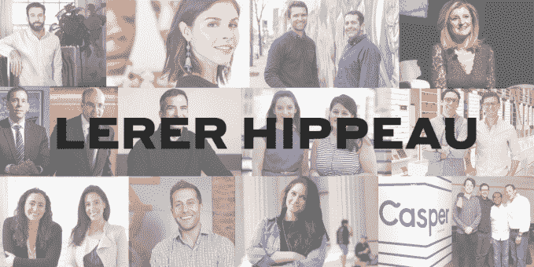

# Lerer Hippeau 筹集了 1.22 亿美元的新基金，外加 6000 万美元的后续投资 

> 原文：<https://web.archive.org/web/https://techcrunch.com/2018/05/15/lerer-hippeau-fund-vi/>

Lerer Hippeau 已经筹集了两只新基金——1.22 亿美元用于第六只基金的种子期投资，6000 万美元用于“精选基金”的后期交易。

管理合伙人埃里克·希波表示，这两只基金都将用于继续公司的现有战略:“我们继续是种子优先投资者和纽约优先投资者。我们是纽约的忠实信徒。”

虽然希波承认，纽约州的生态系统仍在等待那种让“许多人变得非常富有，然后离开并创办自己的公司”的大规模退出，但他提到了最近的成功案例，如[甲骨文公司收购莫亚特](https://web.archive.org/web/20221206102940/https://techcrunch.com/2017/04/18/oracle-acquires-moat/)和[罗氏公司收购熨斗健康](https://web.archive.org/web/20221206102940/https://techcrunch.com/2018/02/15/swiss-pharma-company-roche-is-buying-flatiron-health-for-1-9-billion/)。(勒勒·希波投资了护城河而不是熨斗；两家公司都位于纽约。)

“在纽约有一个庞大的公司管道，这些公司的价值已经达到数亿美元，在某些情况下达到数十亿美元——其中许多是我们的公司，但并不总是如此，”希波说。“短期内，这将是纽约的优势所在，所有这些公司都真正浮出水面，一次增加几十亿美元的价值。”

该公司去年宣布了它的第一个后续基金。当时，Hippeau 表示，它只筹集了 2800 万美元，以便能够与主要基金“同步”，这就是现在正在发生的情况。

第一只精选基金用于对 Lerer Hippeau 已经在种子阶段投资的公司进行后续投资，如 Allbirds 和 Casper。新基金将继续这样做，但希波表示，它也可以用于初创公司的首轮投资，该公司最初没有支持这些投资，现在看来这些投资可能会错过机会。

凯特琳·斯特兰德伯格

与此同时，Lerer Hippeau 团队也在不断壮大，最近聘用了 Caitlin strand Berg(first mark 的前副总裁)担任负责人，Isabelle Phelps 担任助理，Amanda Mulay 担任高级人才经理。

斯特兰德伯格在一份电子邮件声明中说:“加入纽约最活跃的初创公司，我再兴奋不过了，因为它获得了新的资本。”。“Lerer Hippeau 作为一个亲力亲为、平易近人、乐于助人的投资者，已经建立了良好的声誉，同时培养了一个强大的、积极参与的社区。我期待着投资下一代伟大的创业公司，支持我们现有的创始人和团队，并继续在纽约建立一个伟大的科技生态系统。”

Lerer Hippeau 现在有大约 20 人在团队中。虽然像 Andre essen Horowitz(Mulay 曾经工作过的地方)这样的公司将他们庞大的支持人员作为卖点，但 Hippeau 说，在他的公司，“我们真的不希望有几十个人做这件事。我们希望在如何提供帮助方面做到非常精确，非常有选择性。”

尽管如此，他说“最需要的服务是帮助招聘”，所以让 Mulay 帮助初创公司招聘，并帮助他们“建立适当的人力资源职能”是有意义的

勒尔·希珀的投资团队在媒体领域建立了声誉——希珀曾是《赫芬顿邮报》的首席执行官，肯尼斯·勒尔是《赫芬顿邮报》的联合创始人，现在是 BuzzFeed 的董事长，本·勒尔是第九集团媒体的首席执行官。(他们三个的照片在这个帖子的顶部。)但在数字媒体裁员和倒闭的消息看似不断的情况下，希波今天会投资一家媒体初创公司吗？

事实上，该公司最近确实支持了一家这样的初创公司， [podcast network Wondery](https://web.archive.org/web/20221206102940/https://techcrunch.com/2018/03/29/wondery-wants-to-become-hollywoods-podcast-dream-factory/) 。但希波表示，媒体“从未超过我们投资组合的 10%。”(最近的其他投资包括[加密货币钱包 Casa](https://web.archive.org/web/20221206102940/https://medium.com/@LererHippeau/please-welcome-casa-the-worlds-most-secure-cryptocurrency-wallet-22cbcacad6db) 和[大麻人才网 Vangst](https://web.archive.org/web/20221206102940/https://medium.com/@LererHippeau/please-welcome-vangst-the-leading-talent-network-for-careers-in-cannabis-ecf81a0e8763) 。)

“我们热爱媒体，我们继续关注媒体公司，但我们是相对有选择性的，”他说。