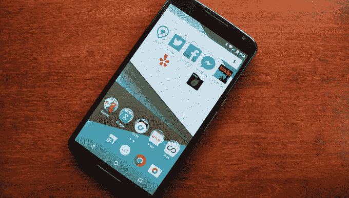
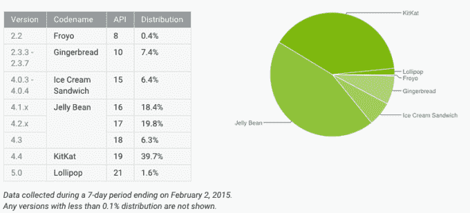

# 发布三个月后，只有不到 2%的 Android 设备运行 Lollipop

> 原文：<https://web.archive.org/web/https://techcrunch.com/2015/02/02/less-than-2-of-android-devices-are-running-lollipop-three-months-after-launch/>

# 发布三个月后，只有不到 2%的 Android 设备运行 Lollipop

我真的真的很喜欢 Android 5.0(或者我们这些可能太关心这些东西的人所知道的“棒棒糖”)。它巩固了我对 Android 的偏好，并让 Nexus 5 又成为我几个月的首选手机。

唉，大多数 Android 设备仍然没有运行 5.0。实际上，在大计划中，几乎没有。

谷歌刚刚更新了其官方的逐版本使用图表，该图表细分了每个版本在安卓市场所占的份额。

Lollipop 目前的数据是:1.6%，几乎正好是上市三个月后。

唯一比 T2 少的安卓版本是安卓 2.2 (Froyo)，这是谷歌仍在追踪的最老版本。绝大多数手机运行 Android 4.1/4.2/4.3(统称为“果冻豆”)，占 44.5%，Android 4.4 (KitKat)占 39.7%。

如果有好处的话，那就是很多重要的面向用户的东西曾经直接内置到 Android 中(比如 Gmail、谷歌地图、谷歌钱包等)。)现在通过 Google Play 分发。这使得它们无需完全升级操作系统即可升级，更重要的是，手机制造商无需做任何事情。

你不会得到操作系统级别的改变，Lollipop 的新外观，性能/安全性的调整，电池的改进，等等。—但是大多数应用程序应该都是一样的。