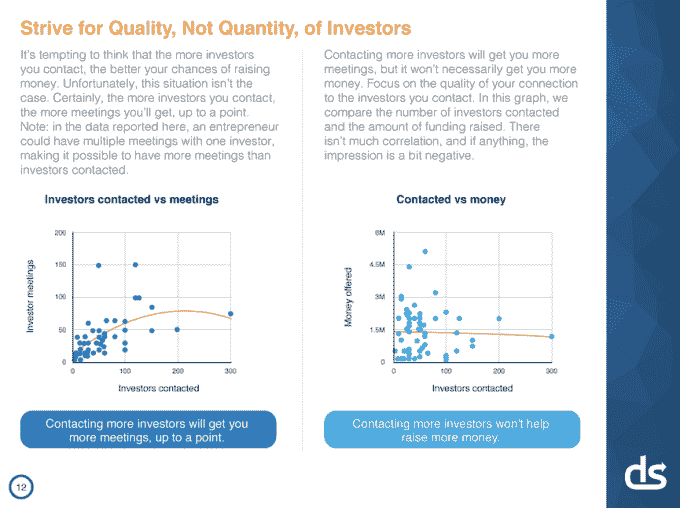
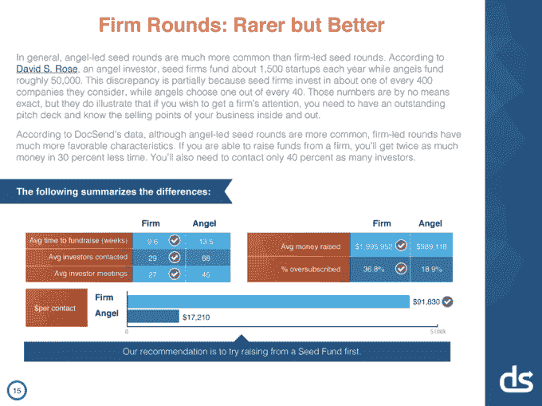
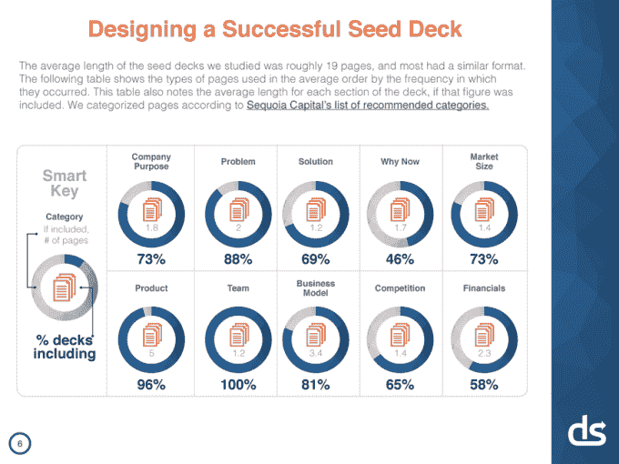
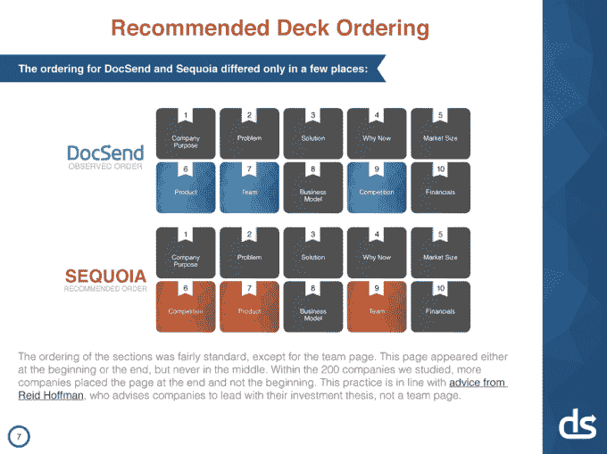
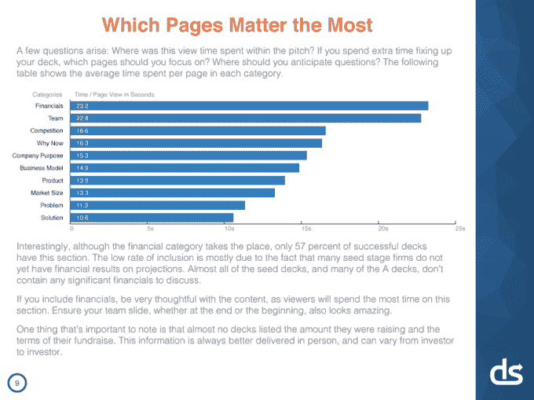
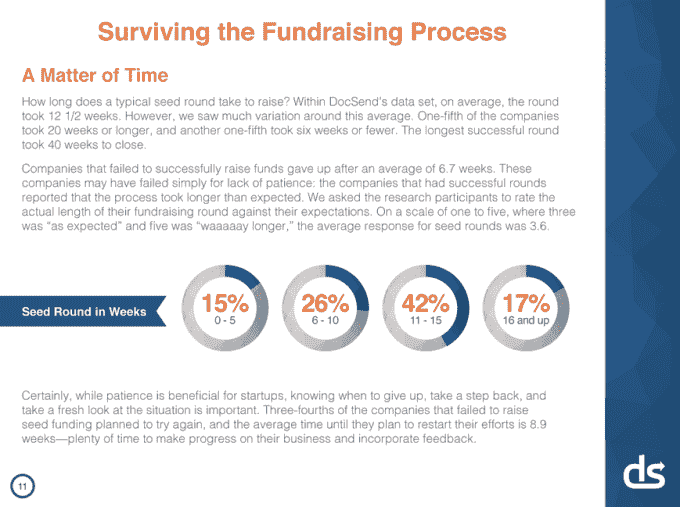
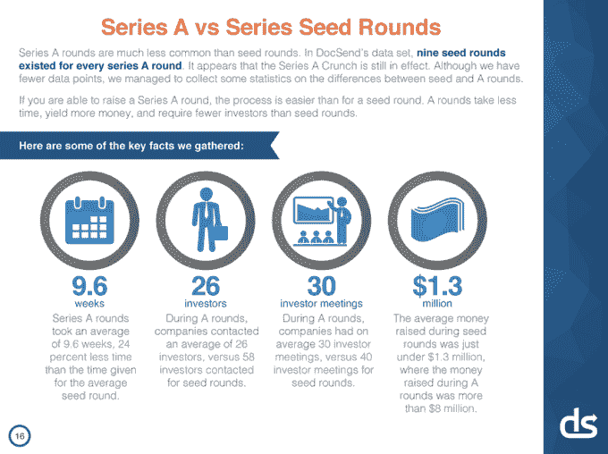
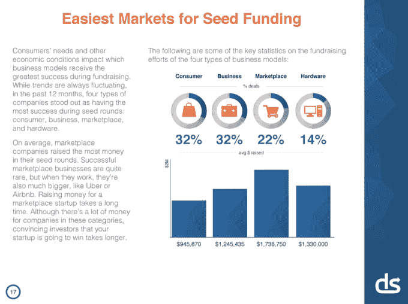

# 一项关于完美推介平台的研究给我们的启示是:风投在这些平台上平均花费 3 分 44 秒

> 原文：<https://web.archive.org/web/http://techcrunch.com/2015/06/08/lessons-from-a-study-of-perfect-pitch-decks-vcs-spend-an-average-of-3-minutes-44-seconds-on-them/>

# 一项关于完美推介平台的研究给我们的启示是:风投们在这些平台上平均花费 3 分 44 秒

[DocSend](https://web.archive.org/web/20230316161016/https://docsend.com/) ，一家为人们提供安全和私密的文件共享方式的初创公司，如聘书或法律协议，[研究了 200 多个宣传资料](https://web.archive.org/web/20230316161016/https://docsend.com/view/p8jxsqr)以找出正确的方式从自举毕业到种子基金，或从天使投资毕业到 a 轮融资

他们与哈佛商学院教授[汤姆·艾森曼](https://web.archive.org/web/20230316161016/http://www.hbs.edu/faculty/Pages/profile.aspx?facId=6452)合作，研究总共融资 3.6 亿美元的公司。

他们发现了什么？你可以在这里看到整个研究。

总之，他们发现，公司平均需要 40 次投资者会议，完成一轮融资需要 12 周多一点的时间。投资者不会看很长时间，平均只有 3 分 44 秒。

更多的会议和更多的资金之间并没有真正的联系。如果你接触更多的投资者，你会得到更多的会议。但接触的投资者数量和筹集的资金数量之间没有相关性。

最好是去找那些已经和你的公司合作的公司，并首先锁定他们。

然后，种子基金可以比天使基金动作更快，提供更多的资金。从公司融资的平均时间比从天使投资人那里融资的时间短了四周。此外，由公司牵头的融资轮往往超额认购 36.8%，而天使轮超额认购 18.9%。

如果您正在做种子幻灯片，这里有 10 张幻灯片，您可能会想要包括在内。显然,“团队”幻灯片是已知的。但是你也要添加描述公司目的、市场规模和竞争的幻灯片。

DocSend 发现最成功的幻灯片排序与红杉资本(Sequoia Capital)为创业者推荐的排序非常相似。唯一改变的是将产品和团队放在订单的前面，而不是后面。

根据投资者研究的时间长短，最重要的页面是财务、团队和竞争。

结束一轮融资是一件需要坚持的事情。15%的回合在 0 到 5 周内结束，但除此之外还有很大的差异。近一半的回合花了 11 到 15 周结束，17%的回合花了 16 周或更长时间。

有趣的是，尽管你已经读到了“首轮融资危机”，这些后期融资比种子融资花费的时间要少。DocSend 样本中的公司花了 9.6 周完成 A 轮融资，平均只需要联系 26 名投资者。当然，这项研究的样本量很小，所以它可能不具有代表性，联合创始人 Russ Heddleston 告诉我。

从消费者到企业再到硬件领域的分裂并不令人惊讶。消费类创业公司占据了融资轮的最大份额，这并不意外，因为在这个领域推出一款最低限度可行的产品更便宜，风险也更小。与之匹配的是企业，然后是市场，然后是硬件创业公司。