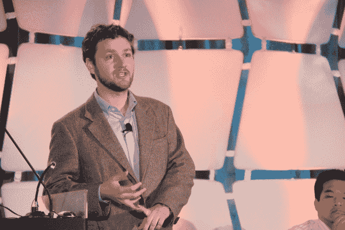

# TechCrunch Disrupt 发布的经验教训

> 原文：<https://web.archive.org/web/https://techcrunch.com/2015/09/01/lessons-from-a-techcrunch-disrupt-launch/>

乔纳森·斯坦撰稿人

2010 年 5 月 26 日，是迄今为止我生命中最可怕也是最美好的一天。

前一天晚上没睡。我醒来时，我的黑莓手机里有 900 字的笔记(那是 2010 年，像我这样的前顾问都有黑莓手机)，每隔 15 分钟就会被注入梦境并打上时间戳，这是我醒来时的物理记录，我在手机里快速输入一个想法，然后躺下，一遍又一遍地重复这个过程。

几个小时后，我将参加 2010 年 TechCrunch Disrupt(有史以来第一次)的最后一轮比赛，在满是媒体和投资者的观众面前，推出 [Betterment](https://web.archive.org/web/20221208090457/https://www.betterment.com/) ，这是一项自动化投资服务，我们确信它至少会获得资金——我们不知道它有机会改变金融的未来。

赌注感觉如此之高。竞争让人觉得不公平。我们白手起家，放弃了工资，而其他 500 多名参赛者已经筹集了超过 700 万美元(2015 年的筹资金额约为 2500 万美元)。我们的未来取决于给人留下好印象。我们必须表演。

Disrupt 在纽约西区的老美林大厦举行，位于华盛顿街 570 号。这是一个由简朴、肮脏和废弃的走廊组成的巨大沃伦，看起来好像在 TechCrunch 决定在那里举办会议之前的 10 年里没有人进入过办公室。

在后面，红牛展台后面，穿过一个没有窗户的房间，有一个更小的没有窗户的房间，不比看门人的壁橱大，供我们练习推销。

> 我们的未来取决于给人留下好印象。我们必须表演。

当时公司里有我们四个人。产品负责人安东尼·施罗德和我在台上做了介绍。我的联合创始人伊莱·布罗弗曼(Eli Broverman)和我们的工程主管基兰·凯沙夫(Kiran Keshav)回答了观众打来的第一个客户支持电话。亚当·朗斯纳，我们当时的实习生(现在是首席工程师)在大厅里负责我们的展位——这是他暑期工作的第二天。

我们展示并赢得了最大的纽约颠覆者。过了一会儿，我们又回去工作了——突然间，我们有了真正的客户，还有很多东西需要学习和开发。

TechCrunch 最大的价值是那些最初的客户——在最初的几天里，400 名勇敢的人将他们的钱托付给了我们(这个 [Disrupt bump](https://web.archive.org/web/20221208090457/https://beta.techcrunch.com/2012/05/03/betterment-talks-about-the-disrupt-bump-and-the-future-of-investing/) 是真实的)。但对我来说，确认几乎同样重要。许多开公司的人会告诉你，这是一个孤独的过程。你花了很多时间在脑子里制定战略。你相信你所相信的，尤其是如果你正在建立一些颠覆性的东西，还没有多少人相信你所相信的。否则他们早就动手了。

如果没有 Disrupt，我们就不会有现在的成就。我们需要那些早期客户，我们需要信誉。在那里，在那栋老建筑里，在这个国家最有影响力的技术会议上发布，对我们来说是一个关键时刻，我们知道这一点——因此所有的肾上腺素和失眠。我不确定如果不这样做，我们会不会起飞。

然而，有时我会想到它的讽刺之处，我们开始的地方——在旧金融服务的肚子里，在一个由一个遗留的现任者腾出的空间里。

如何为舞台做准备，如何为发布设定目标，都是公司特有的。这完全取决于你走了多远，你最需要什么，你知道什么，你不知道什么。但是这里有几个例子来说明这些事情对我们来说是什么，以及如果我们再做一次，我们可能会有什么不同。

上台表演。

## 准备陈述:有时少即是多

我们尽可能地做了准备。在我们最后一次演讲的前一天晚上，在翠贝卡的屋顶上有一段快乐时光；我们和所有其他公司一起去了。但是我们四个来自 Betterment 的人只喝了一杯，因为我们知道我们第二天要做报告。我们举杯畅饮，然后继续工作。

我回去工作，再次检查演示文稿，练习了大约 100 多次。问题是我记住了它。我现在绝不会这么做。当我现在演示时，我可能有幻灯片，也可能没有；不管怎样，我只是讲述改善的故事。如果我再做一次扰乱 发布的话，我会简单地谈谈什么是改善，它能做什么，为什么它是变革性的。

任何出席的人通常都知道不要背诵演讲稿。但是，如果你不是一个经常发言的人，关键是要知道你的三四个观点和轶事，并以一种与观众联系的自然方式告诉他们。当时，我对此一无所知。

## 筹集资金:做好准备，给你的投资者一个具体的行动号召

在我们发布之前的几个月，我在某处读到过，在演示结束时呼吁行动是很好的。因此，在我们的 Disrupt 演示结束时，我们邀请观众到我们在大厅的展位上与我们交谈。这就是我们所想的:让我们与一些投资者进行一些对话，了解一些人。

这很好，但我们可能给一些投资者留下了不好的印象，因为我们不知道我们想要筹集多少资金。如果我们为筹集资金做了更充分的准备，结果会更好。我们太专注于获胜，忘记了奖品。重新来过，我会自信地说，“我们正在寻找 300 万美元，这是我们如何计划花费它。”

客户增长:为' TechCrunch 的颠簸做好计划，然后更加努力地工作

陈楚翔写过 TechCrunch 的低谷和随后的悲伤低谷，他说这是许多科技公司在 Disrupt 上推出后的经历。我们也不例外。

6 月份，这个数字开始下降，好的一天有 10 个注册，不好的一天有 0 个。到夏天结束时，我们仍然有不到 1，000 个资金客户，并且增长稳定在每天几个注册，但是很慢。

那么如何发射，经历颠簸，经历悲伤的低谷，然后重回正轨呢？如果你有一个“病毒式”产品，也许你永远不用担心如何成长。但是没有太多的病毒产品。许多在发布会上“病毒式传播”的东西被证明只是昙花一现。

> 我们太专注于获胜，忘记了奖品。

对于任何真正的业务，你必须建立，你必须了解客户获取，你必须把话传出去，你必须把正确的封锁和处理到位。只是需要做很多工作。

对我们来说，首先意味着利用我们从 Disrupt 中学到的东西来巩固我们的产品路线图。bump 的好处是你有一些真实的客户，他们会告诉你什么对他们最有用。我们听取了他们的意见，他们告诉我们，他们想要一个 iPhone 应用程序，与 Mint.com 集成，以及自动存款。所以我们开始构建这些东西，这些东西并不在我们路线图的顶端，它们成为了我们最突出的特性。

对我们来说，下一阶段还意味着找到合适的投资者，但要做到这一点，我们需要更多的客户。为了吸引更多的顾客，我们需要更多的员工。

我们开始在我们认为最重要的领域招聘人员:开发更多功能的工程师和对外宣传的营销人员。

尤其是在早期，甚至在 Disrupt 之后，我们雇佣的大多数人都是我们员工的朋友或前同事，营销雇佣也没有什么不同。其中一个是伊莱的青梅竹马，另一个是我一个高中朋友的哥哥。

在我们继续发展公司的过程中，Disrupt 不可否认地帮助我们获得了这些新员工。在会议之前，我们的团队只有四个人，几乎没有人使用过 Betterment。对于优秀的候选人来说，这并不是最有吸引力的情况。

如果他或她看到你有这种认可，那么提前录用的人更有可能大胆地与你合作。这就是 Disrupt 带给我们的——验证，使用一篇我们能够发送并放在我们网站上的相当重要的新闻文章，以及一个表明我们正在做创新和颠覆性事情的奖项。获得认可是很重要的。这是件大事。