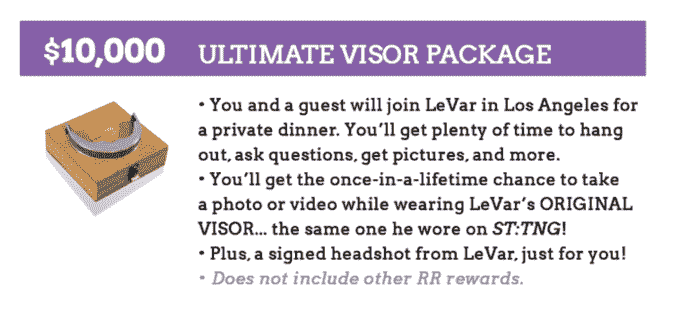

# 莱瓦尔·伯顿走上互联网，为所有孩子带来阅读彩虹 

> 原文：<https://web.archive.org/web/https://techcrunch.com/2014/05/28/levar-burton-takes-to-the-internet-to-bring-reading-rainbow-to-all-kids/>

# 莱瓦尔·伯顿走上互联网，为所有孩子带来阅读彩虹

如果天空中有一只蝴蝶，你觉得你可以飞得更高一倍，为什么不求助于 Kickstarter 来实现阅读彩虹的第二次降临呢？如果你是莱瓦尔·伯顿，那就是你要做的。

这个深受 80 后孩子喜爱的经典教育节目已经在 iTunes 商店[上架](https://web.archive.org/web/20221007123329/https://itunes.apple.com/us/tv-show/reading-rainbow/id563629076)，同时还有一些[阅读彩虹品牌的儿童书籍和应用](https://web.archive.org/web/20221007123329/https://beta.techcrunch.com/2012/06/20/reading-rainbow-ipad/)。伯顿现在想做的是将内容转移到网上，并将所有内容免费提供给学校。该公司希望筹集 100 万美元来完成这一切。

他写道:

阅读彩虹的数字收藏已经包含数百本书籍和视频实地考察…但在您的帮助下，我们将能够使阅读彩虹图书馆在现代儿童用来消费内容的更多设备上可用。当我们达到 100 万美元的最初目标时，我们将在最常用的数字平台:网络上推出新版的《阅读彩虹》。每个教室。我们一起想把阅读彩虹免费提供给尽可能多的教室！当我们达到最初的 1，000，000 美元的目标时，我们可以在超过 1500 个教室里安装 Reading Rainbow，而不需要学校支付任何费用！

我们很幸运地邀请到伯顿，和他谈了几次他和孩子们的工作，他可能是 20 世纪 80 年代儿童识字背后的主要驱动力。他还出现在一个名为“星际迷航:下一代”的电视节目中，我相信这是关于太空旅行的。这家伙了解孩子。

他还为自己的筹款选择了合适的平台。这类项目非常适合众筹。伯顿目前感兴趣的受众是上世纪 80 年代成长起来的父母，他们现在精通 iPad，可能有一点可支配收入。最重要的是，他们的孩子沉迷于平板电脑和手机，不知道该给他们看什么。那么，这就是慈善捐赠的完美风暴，一种感觉良好的三连胜，其特点是心爱的童年人物，酷的应用程序和伟大的内容。

雷丁彩虹团队设置了许多有趣的捐赠关卡，包括价值 750 美元的“遇见莱瓦尔”套餐和终极圣 TNG 特权:与乔迪·拉·福吉本人进行一次遮阳板会议！

我知道，对吧？这比见到星舰进取号的让·吕克·克诺比船长更好！较小的奖品包括冰箱贴和签名书。

伯顿写道:“31 年来，我一直是《阅读彩虹》的主持人和制作人，尽我所能教育一代又一代的孩子，通过阅读，你可以去任何地方，成为任何人。”"这不是我的工作:这是我的个人使命！"

这比手工制作的铅笔盒、iPod 音乐基座或智能手表强多了。