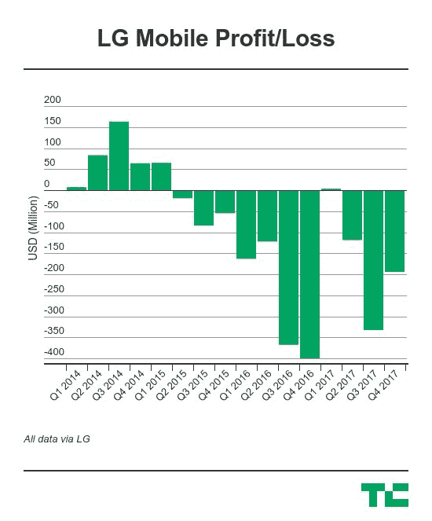

# LG 预测 Q1 利润创纪录，尽管其智能手机部门陷入困境 

> 原文：<https://web.archive.org/web/https://techcrunch.com/2018/04/06/lg-forecasts-record-q1-profit/>

# LG 预测 Q1 利润创纪录，尽管其智能手机部门陷入困境

LG 的移动业务可能是一个连续亏损的公司，但是这家韩国公司的其他业务表现很好……根据其最新的收益预测，比以往任何时候都要好。

[与同胞三星](https://web.archive.org/web/20221025222051/https://techcrunch.com/2018/04/05/samsung-now-the-worlds-largest-chipmaker-forecasts-record-q1-profit/)一样，LG 正在创造公司创纪录的 Q1 财务业绩。该公司预计本季度总销售额为 15.1 万亿韩元(141 亿美元)，营业利润为 1.1 万亿韩元(10.3 亿美元)。

同比增长 20%，这是 LG 在本财年第一季度的利润首次超过 1 万亿韩元。

财务预测不包括对 LG 部门的深入分析——全部收益将于本月晚些时候公布——所以我们还不知道是什么推动了这一记录。从第四季度的收益来看，2017 年成为 LG 自 2009 年以来最赚钱的财年，我们知道该公司的家电和电视部门是明星表现，而其家庭娱乐部门的营业收入增长了 134%，达到 3.4596 亿美元。

[LG 移动很可能再次拖累数字](https://web.archive.org/web/20221025222051/https://techcrunch.com/2018/01/25/lgs-mobile-business-is-still-making-big-losses/)。

其最新设备——V30S ThinQ——不太可能打动消费者，正如 [TechCrunch 的 Brian Heater 在 2 月份的世界移动通信大会上回顾该设备时指出的](https://web.archive.org/web/20221025222051/https://techcrunch.com/2018/02/24/the-curious-case-of-the-lg-v30s-thinq/)。

值得称赞的是，LG 移动新任首席执行官黄镇焕(Hwang Jeong-hwan)于 11 月接任首席执行官一职，他成功地将亏损从第三季度的 3753 亿韩元(3.3137 亿美元)减少到第四季度的 2132 亿韩元(1.9233 亿美元)，但让该部门实现盈利比止血要困难得多。

LG 移动在过去两年中仅实现了一个季度的盈利，这是 Q1 2017 年第一季度 G6 旗舰销售的 320 万美元的小利润。在此之前，你必须追溯到 2015 年的 Q1，才能为其移动部门找到一个积极的季度。

据韩联社报道， [NH 投资&证券在一份报告中称，“由于智能手机具有挑战性的商业环境，移动通信部门的业绩预计不会大幅改善。”。](https://web.archive.org/web/20221025222051/http://english.yonhapnews.co.kr/news/2018/04/06/0200000000AEN20180406007252320.html)

也就是说，该公司最新的旗舰手机——G7——据传将于下个月发布，所以我们不用太久就能看到新管理团队的想法。