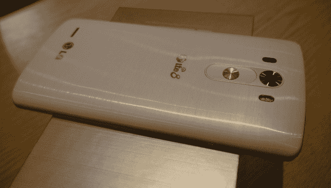
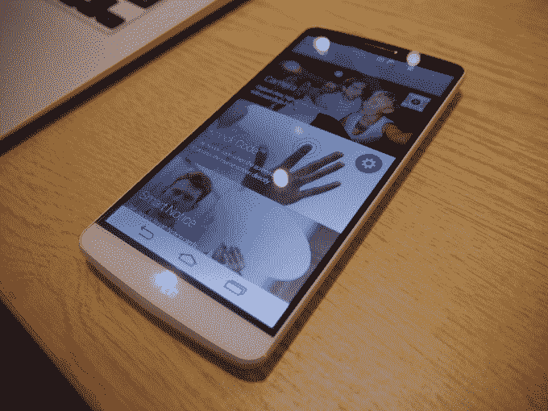

# LG 正式推出其漏洞百出的 G3 智能手机:更大的硬件，更平的软件 

> 原文：<https://web.archive.org/web/https://techcrunch.com/2014/05/27/lg-officially-outs-its-leaky-g3-smartphone-bigger-hardware-flatter-software/>

LG 在伦敦、纽约和旧金山举行的活动上正式发布了其新款旗舰智能手机 G3。

TechCrunch 参加了伦敦的活动，该活动在一个远离任何 3G 工作场所的雨天巴特西公园举行。谢谢 LG。

LG [在上个月底戏弄了新旗舰](https://web.archive.org/web/20230129220954/https://techcrunch.com/2014/04/30/lgs-next-flagship-smartphone-will-launch-on-may-27/)——承诺为其“继 G2 之后的下一个大型全球设备”提供一些“简单”和“伟大”的东西。″

从那以后，泄密事件层出不穷——正如 [Engadget](https://web.archive.org/web/20230129220954/http://www.engadget.com/2014/05/26/lg-g3-specs-and-photos/) 昨天指出的那样——几乎没有留下任何想象空间。

真正的 4G G3 并没有远离漏洞。它运行 Android 4.4，拥有骁龙 801 处理器，并有两种版本:32GB 版本和 3GB 内存，或 16GB 版本和 2GB 内存。

最大的更新是更大的屏幕——与 G2 的 5.2 英寸相比，它有一个完整的 5.5 英寸屏幕。手机后部的设计已经变形，使手掌拉伸器在手中感觉更小，最大厚度为 8.9 毫米，两侧逐渐变细，因此看起来更薄。屏幕是 QHD (Quad HD: 2560×1440)。

[gallery ids="1007822，1007824，1007825，1007823，1007826，1007827，1007829，1007831，1007830"]

LG 还简化了软件设计，放弃了花哨的颜色，转而使用它所谓的更柔和色调的“成熟”调色板。LG 图标被重新设计成圆形。此外，还有一系列新的软件功能，如智能公告，它会提醒用户未接来电等情况，甚至会提示他们在拥有手机一段时间后使用手机上未使用的功能。

轻推技术或唠叨技术，取决于你的观点。唠叨可能更有可能，因为 LG 为其软件的这一方面标出了营销机会——称这将是一个向用户通知新配件甚至手机下一代的渠道。那一点都不会烦。

在其他地方，有一个前置的“自拍相机”——210 万像素，但 LG 认为它比许多前置 500 万像素的“中国制造的手机”要好，这要归功于更高的灵敏度。1300 万像素的后置摄像头有一个激光视锥，通过加快速度，明显改善了自动对焦。

这款手机本身由聚碳酸酯制成，但有些变种有金属膜，所以它看起来比 G2 的闪亮塑料更闪亮。

LG 保留了其不同寻常的背面智能手机控制键，该控制键在去年的 G2 上首次亮相，是与 Android 部落的主要区别点。后面的键是电源键，上下键用于音量控制。

LG 移动设计实验室的负责人副总裁 Chul Bae Lee 解释说，随着手机尺寸的增加，后置键变得更加重要，这意味着用户更难在没有掉落他们心爱的平板手机的风险的情况下按下位于设备边缘的键。他认为，后置可以让他们牢牢抓住手机，同时仍然可以用中指敲击按键。

LG 还调整了键盘软件，使这种手掌伸展器的打字适应性更强。例如，用户可以改变键盘的高度。

G3 上没有指纹传感器。LG 表示，它避开这项技术有两个原因:首先是因为它认为这项技术还不够强大，其次是因为它有自己的敲击代码安全功能，允许用户通过敲击模式解锁手机。

LG G3 将首先在韩国推出，但预计将于下月登陆美国和欧洲。

