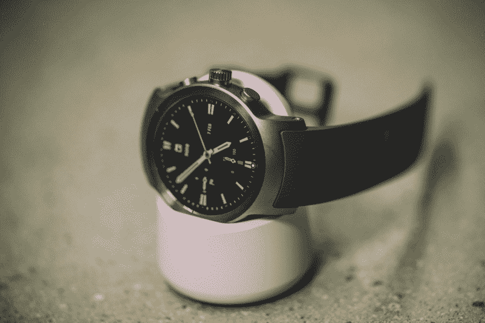
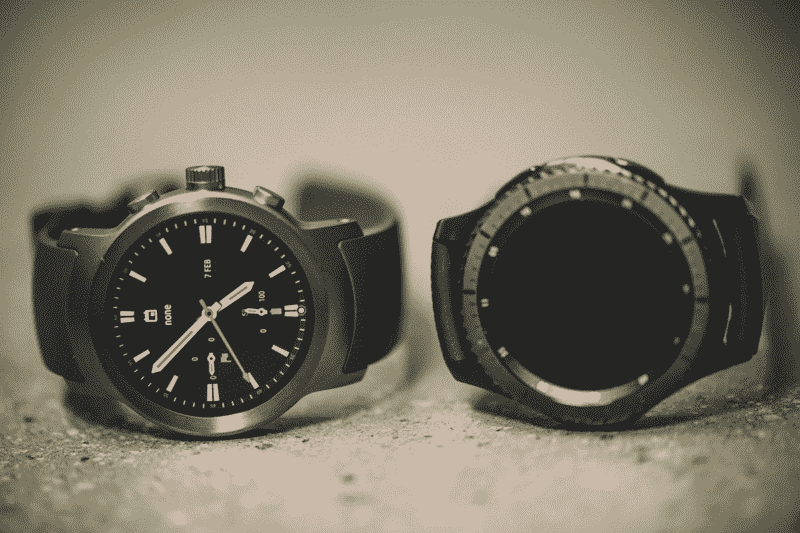
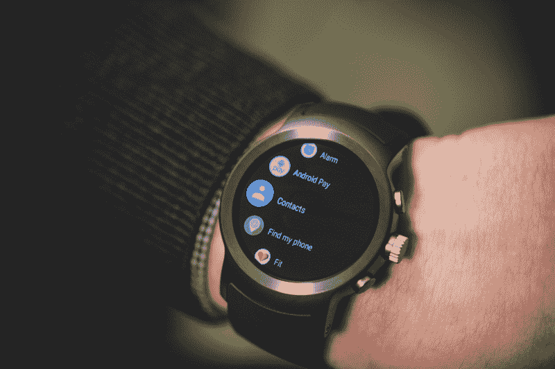
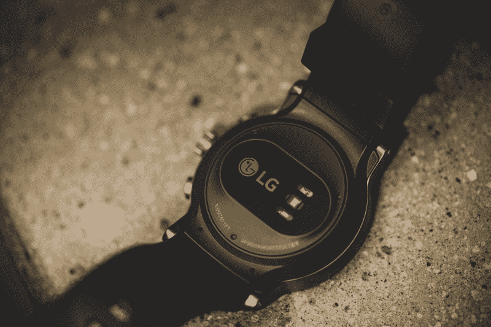
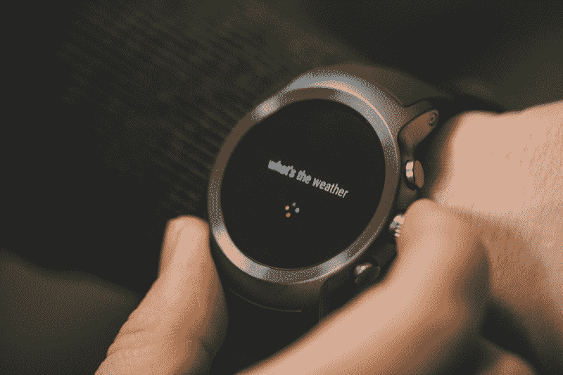
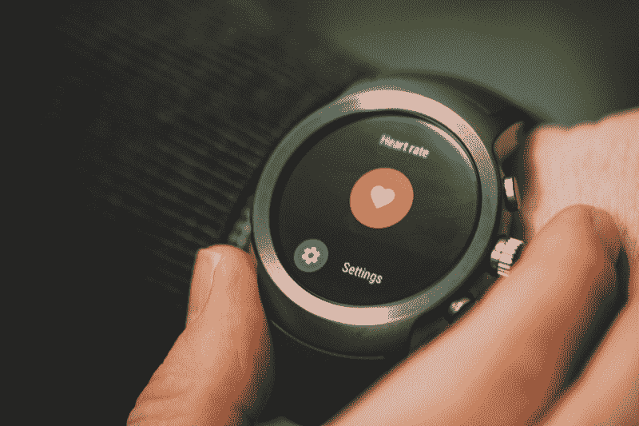

# LG 的 Watch Sport 是 Android Wear 2.0 TechCrunch 的一个重要但普通的大使

> 原文：<https://web.archive.org/web/https://techcrunch.com/2017/02/08/lg-watch-sport-review/>

智能手表的前景与 2014 年夏天迎接第一批 Android Wear 设备的情况截然不同。如今，对整个事情保持乐观要难得多。出货量在下降，去年第三季度下降了 51.6%，根据 IDC 的统计，[，](https://web.archive.org/web/20221207023631/https://beta.techcrunch.com/2016/10/24/smartwatch-sales-are-tanking/)，而一些大公司似乎已经完全放弃了这个领域，其中包括最近彻底放弃的 Pebble。

或许可以预见的是，这个领域已经为几个主导者腾出了空间，包括苹果和三星(以及 Garmin，有点不确定)，这两个名字在智能手机领域也占据了类似的主导地位。曾经支持穿戴设备的三星后来放弃了谷歌的可穿戴操作系统，转而支持其 Tizen，而摩托罗拉最近宣布，在可预见的未来，它将完全退出智能手表游戏。

[https://web.archive.org/web/20221207023631if_/https://www.youtube.com/embed/IB2mIFClEXc?feature=oembed](https://web.archive.org/web/20221207023631if_/https://www.youtube.com/embed/IB2mIFClEXc?feature=oembed)

视频

在首批加入的几家制造商中，只有 LG 还在——因此有理由认为，这家韩国制造商将成为期待已久、推迟已久的 2.0 版操作系统的第一个硬件合作伙伴。Wear 在 5 月份宣布的推迟被认为是最近下滑的一个关键因素，许多制造商选择坚持到下一次大更新，然后再一次冲击这个领域。

今天正式发布的 LG 的两款新智能手表肩负着相当大的重量，[的官方大使佩戴 2.0](https://web.archive.org/web/20221207023631/https://beta.techcrunch.com/?p=1449626) ，就像 Nexus 系列在此之前已经成为 Android 的官方大使一样，只是担任可穿戴操作空间的产品大使的任务显然更加艰巨，而这并没有对市场份额产生太大影响。

LG 聪明地提供了两种不同的规格来引领 Android 2.0 进入这个世界——易于管理的[手表风格](https://web.archive.org/web/20221207023631/https://beta.techcrunch.com/2017/02/08/the-249-lg-watch-style-is-okay/)和万物加厨房水槽运动，它占据了更多的 arm 空间，因为它包含了从 LTE 连接到额外电池寿命的一切。

## 时尚还是运动？

在过去的几天里，我一直穿着 LG Watch Sport 在镇上逛，代价是我的长袖衬衫比我开始穿的时候要长一些。

这种款式比它的同类产品小得多，而且便宜 100 美元。当然，这需要牺牲一些关键功能，其中主要是 LTE，使这项运动成为第二款提供这种无线连接方式的 Android Wear 设备(继去年的 LG Watch Urbane 2^(nd)Edition 之后)。这种风格还牺牲了通过 NFC 的无线支付，这是另一个新的关键功能。

心率监测和 GPS 也只能在更高端的手表上使用——这对 LG 来说真的是一个失误，因为这两项功能近年来已经迅速成为可穿戴设备的标准。如果这两个特征都不划算的话，那么这种款式是两者之间显而易见的选择，比运动款便宜 100 美元，而且更耐磨。

## 巨大成功

我在《Gear S3 评论》上花了很多时间讨论这个小玩意的巨大尺寸，所以再来一次也是公平的。就像三星的最新产品一样，Watch Sport 完全是笨拙的。尺寸与 S3 相当相似，但 Sport 设法变得更厚，为 14.2 毫米，而三星已经非常结实的 12.9 毫米

我意识到，正如三星之前所说，大手表现在风靡一时，但大的表面加上运行智能手表所需的内部零件，构成了一个彻头彻尾的巨大设备。我身高 5 英尺 11 英寸，我认为我的手腕是中等尺寸的，这只表感觉太大了——我只能想象这只表戴在个子小的人身上会有多大。

这是智能手表的一个相当普遍的问题，可以追溯到早期的三星设备，如原始设备，这似乎跨越到未来风格的手腕通信领域。就像这些设备一样，很容易想象几年后当尺寸大幅缩小时，这些设备看起来会有多傻。与此同时，LG(不像三星)提供了一款更小版本的手表，即使它在这个过程中放弃了一些关键功能，这也是好事。

## 运动的风格

除了尺寸问题，LG 实际上设计了一款非常漂亮、低调的手表，光滑的线条更让人想起 Gear S2，而不是 S3 的许多棱纹和编号边缘。这是一个干净的工业设计，尽管它的名字是“运动”，但并没有向许多其他户外手表的方向走得太远。

左侧是一个小扬声器端口，右侧是三个导航按钮——或者更确切地说，是两个导航按钮和中间的一个大表盘，它利用了 Android Wear 的改进，以类似于 Apple Watch 的方式在用户界面上导航。

这比滑动或点击按钮要快得多，尽管鉴于手表的圆形设计，我确实发现自己错过了三星的旋转表圈功能，这是目前在智能手表界面上导航的最快和最好的方式。

与这种风格的搭扣表带不同，这种运动表带牢牢地固定在表壳上，这意味着它们没有弹性，不容易用标准表带更换，所以选择一种你喜欢的颜色，因为你会坚持一段时间。这也意味着你不能像很多其他智能手表那样自由，这些智能手表让用户能够在健身房和办公室之间改变事情。

## 视觉和听觉

1.38 英寸的显示屏实际上明显大于齿轮 S3 (1.3 英寸)，这至少在一定程度上增加了手表的占地面积。它的像素密度也高得多，为 430 x 480，相当于 348 PPI(S3 的 278 PPI)。结果是一个可爱的小展示，最大限度地利用相对有限的房地产。

至于侧边扬声器，虽然小，但是功能强大。我不得不承认，利用车载 LTE 在手表上进行通话非常自由。这大概是你最接近迪克·特雷西十年来的愿望实现的时刻了。虽然这位演讲者并不出色，但他做到了。

当把它放在离佩戴者的嘴一两英尺远的地方时，它当然足够清晰，可以进行对话。板载麦克风也是如此。通过手表进行交流与使用手机的免提功能进行通话并没有什么不同。也就是说，它不是最清晰的，但对于进行随意的谈话来说是完全可以接受的。

## 手表零件

就像 Gear S3 一样，手表运动给人的感觉就像是一家公司竭尽全力开发一款产品。对于一家真正需要在这个迄今为止还在蹒跚起步的领域大获全胜的公司来说，这有点孤注一掷。在内部，你可以获得 768MB 的内存和 4GB 的存储空间(与 S3 相同)，如果你想不带手机去跑步，但不想消耗你的数据计划，可以在本地存储音乐文件等东西。

处理器是 1.1GHz 的骁龙 Wear 2100，无论我扔给它什么，它都表现得相当流畅。内置 NFC 意味着你可以在不拿出手机的情况下用 Android Pay 买东西(欢迎回到谷歌免提)，只需将手表拿到兼容的商店机器上——类似于 Apple Watch 和三星最新产品提供的功能。

所有这些增加的功能自然需要更大的电池。这项运动在这方面提供了 430 毫安时，S3 的 380，但我很难让它持续下去。在启用 LTE 和永远在线显示的情况下，我能够在现实世界中进行大约 13 个小时的测试——足以度过一个工作日，但其他时间就不多了。

然而，当我关掉永远在线的屏幕时，这个数字跳到了更容易控制的 18。不错，但我们真的应该在可穿戴设备上拍摄至少 24 小时。虽然也许我只是被我一直带在身边的 [he Withings hybrid](https://web.archive.org/web/20221207023631/https://beta.techcrunch.com/2017/01/10/withings-steel-hr-review/) 三周的电池寿命宠坏了。还值得指出的是，手表在执行更多资源密集型任务(如打电话)时有发热的趋势。

## 可以穿了

这是我们一直在等待的——Wear 自 2014 年发布 1.0 以来最大的一款。有什么新鲜事吗？我建议[阅读弗雷德里克](https://web.archive.org/web/20221207023631/https://beta.techcrunch.com/?p=1449626)的报告，了解新功能的完整分类，因为它与新手表有关，所以我们在这里只涉及它。

这次最新的升级似乎更多的是为了让 Android Wear 跟上 watchOS 和三星内部版本的 Tizen。总体而言，这并没有推动智能手表的发展，而是将谷歌的可穿戴操作系统与该领域的其他两家主要公司置于一个公平的竞争环境中。

除了上面提到的一些额外的硬件优势，这些更新还有助于提高设备的整体可用性，增加了拨号功能，可以快速访问设置、通知和表盘。

这次手表的表面也更加动态，模块化的部分让用户可以定制主屏幕上提供给他们的内容，如健身数据、应用程序快捷方式、约会等。它类似于智能手机上的工具栏，让你把最常用的功能移到前面和中间。绝对是操作系统中更方便的附加功能之一。

谷歌助手可以通过长按一个拨号盘来访问，功能非常好。你可以通过快速语音命令来查看天气、查找体育比分、呼叫优步等等。这种认知很好，整合也很好很深入。考虑到有限的屏幕空间，这是与小工具交互的最合理的方式。

也就是说，谷歌还增加了一个屏幕键盘，对于这样一个小东西来说，它的效果出奇的好。即便如此，除非你以一种极其简略的方式回应，否则这并不那么方便。除了几个词之外的任何东西都有点烦人。与 watchOS 一样，Wear 也有一些固定的响应，以及一个快速记下表情符号的绘图功能，因此不缺乏尝试绕过小屏幕问题的方法。

## 厌倦了等待

2017 年初，智能手表类别可以使用一个救世主。然而，遗憾的是，LG Watch Sport 显然不是。首先，它对大多数手腕来说都太大了。用户可以选择这种风格，但是在这个过程中会失去一些关键的功能。

这次有一些不错的补充。LTE 是一个很好的选择，即使它可能会继续成为已经存在的利基空间中相对利基的一部分。拨号导航加上增加的菜单功能使系统更容易使用，助手无疑是一个方便的补充。

乏善可陈的电池续航时间绝对是手表的一大败笔，从硬件角度来看，也没有什么特别之处。如果你以前不相信你需要智能手表，LG 的新产品不太可能扭转局面。Wear 2.0 也是如此，它给操作系统带来了一些受欢迎的变化，但并没有改变多少对话。