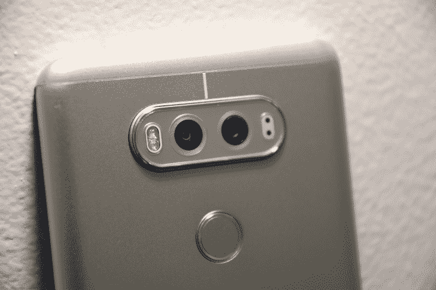
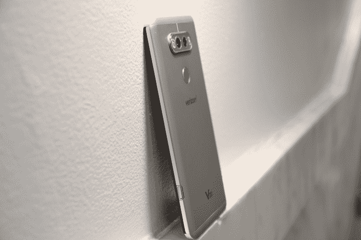
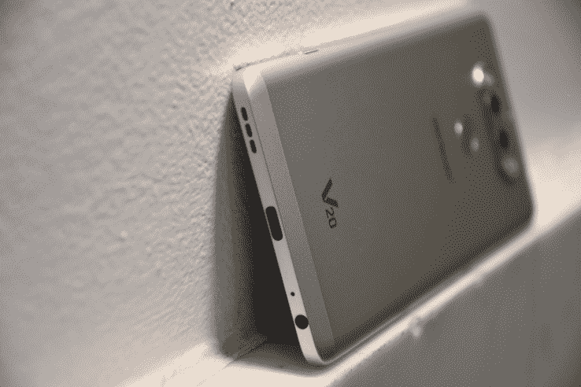

# LG 的 V20 是一款巨大的手机，配有两个智能摄像头

> 原文：<https://web.archive.org/web/https://techcrunch.com/2016/10/26/lgs-v20-is-a-huge-phone-with-two-clever-cameras/>

LG V20 是 V10 的直接继任者，LG 称这是第一款带有通知栏的智能手机，也是“第二屏幕”。他们的第一次尝试是加固手机，结果受到购买者的喜爱，但 V20 旨在超越这一点，巩固这一概念。

V20 是一款巨大的手机，默认情况下没有应用抽屉，有很多运营商垃圾软件和平淡无奇的外观。但尽管如此，它仍可被视为 LG 的最佳产品，这很好。

***价格已审核:***[【672 美元或每月 28 美元(根据合同)，在威瑞森](https://web.archive.org/web/20230326080628/https://www.verizonwireless.com/smartphones/lg-v20/?cmp=KNC-C-HQ-NON-R-AC-NONE-NONE-2K0PX0-PX-GAW-71700000010306095&gclid=CMiKxbyi9M8CFcJONwodbvQC7w&gclsrc=ds)

## 基础

*   5.7 英寸 IPS Gorilla Glass 4 显示屏，2560 x 1440 分辨率，约 513ppi
*   2.1 英寸辅助显示屏
*   双后置摄像头:16 MP (29mm，f/1.8)和 8 MP (12mm，f/2.4) /w 激光自动对焦、OIS 和 LED 闪光灯
*   500 万像素前置摄像头
*   带 4GB RAM 的高通骁龙 820 四核处理器
*   64GB 存储空间，可通过 microSD 扩展至 256GB
*   安卓 7.0 牛轧糖搭配 LG UX 5.0
*   32 位 Bang & Olufsen DAC，带 3.5 毫米音频插孔
*   可拆卸 3，200 毫安时电池
*   指纹传感器

## 使用它(和我的抱怨)

在我开始将 V20 用作手机之前，我需要谈谈美学:LG V20 很大。比谷歌 Pixel XL、iPhone 7 Plus 或其他任何东西都大。它的尺寸为 159.7 x 78.1 x 7.6 毫米(6.29 x 3.07 x 0.30 英寸)，因此它又高又宽，因此不适合单手使用。通常，我可以相对轻松地使用平板电脑大小的设备，但 V20 严格来说是双手操作。

让这个难题雪上加霜的是，V20 是一个光滑的平板，不像 V10，V10 的特点是加固的构造和纹理化的背部，所以它不仅大，而且光滑，由塑料制成——没错，LG 仍然没有完成销售塑料旗舰级手机。

> 所有的应用程序都显示在主屏幕上(你好，iOS)，包括威瑞森垃圾软件和其他所有捆绑在手机上的应用程序。这要么是软件设计中一个残酷的笑话，要么是一个明目张胆的错误，而不是软件的“特性”。

现在，作为一名日常司机，V20 有点烦人。你看，LG 认为在发布时包含 Android 7.0 牛轧糖是一个很好的主意(这很好，这是最新的！)，但为了阻碍我的希望，我移除了应用程序抽屉。

所有应用程序都显示在主屏幕上(你好，iOS)，包括威瑞森垃圾软件和手机上捆绑的所有其他应用程序。这要么是软件设计中一个残酷的笑话，要么是一个明目张胆的错误，而不是软件的“特性”。

让我们来谈谈通知屏幕:只有当你设置了非常具体的快捷方式，或者喜欢在手机上随时查看时间时，它才是有用的。当然，您可以在必要时访问蓝牙无线电，但您也可以在主屏幕上轻松设置快捷方式。请记住，非 LG 应用程序无法利用额外的屏幕空间(通知之外)。

> 否则其他都按预期运行(真的很快)。

否则其他都按预期运行(真的很快)。这是一款具有旗舰规格的 Android 手机，几乎这一级别的所有手机都在使用。因此，由于谷歌在 7.0 牛轧糖中的改进(除了 LG 对大部分操作系统的审美改变)，它变得快速、可定制，而且最值得注意的是，变得更加完美。

电池寿命很长，可以让我度过白天和黑夜的大部分时间，从早上 8 点开始，让蓝牙、GPS、自动亮度调节和所有通知一直开着。

至于指纹传感器:根据谷歌的标准，装有 7.0 牛轧糖的安卓手机上的指纹传感器应该只需轻轻一点就能解锁并唤醒设备。LG V20 也不例外；传感器工作正常。虽然，因为它均匀地位于电池盖的其余部分，起初它可能很难被发现(因此需要你实际上看着它，这是一个设计缺陷)。

## 那些摄像机是做什么的？

> 再加上 LG 神奇的相机软件和 DSLR 的手动模式，你可以拍出一些非常令人满意的照片。

V20 上的双后置摄像头的秘密其实很简单。其中一款的分辨率是另一款的一半，并且采用了不同的镜头和光圈。图像可以在普通视图或广角下拍摄，包括全景拍摄。

再加上 LG 神奇的相机软件和 DSLR 的手动模式，你可以拍出一些像样的照片。我说不错，因为有时颜色单调或焦点似乎有点偏离，但总的来说，V20 有一对很好的摄像头。

下面是几个例子。

[gallery ids="1407311，1407319，1407316，1407314，1407320，1407313，1407318，1407317，1407315，1407312，1407310"]

如果你更喜欢视频，LG 也能满足你。有 24 位无损音频记录(由三个麦克风提供动力)，FHD (1080p)模式下的运动跟踪或 4K 分辨率，你可以看着你的存储空间慢慢填满，但很确定。

## 结果

> 如果你有 V10，换成 V20 就不会错。如果你以前从未有过 LG 手机，你需要意识到你会遇到什么。

总的来说，作为一款设备，LG V20 比去年的型号有了很大的改进:它有更快的处理器，更好的后置摄像头，USB-C 和一些软美学改进。另外，它保留了一个可拆卸的电池(对于那些仍然关心！).

如果你有 V10，换成 V20 就不会错。如果你以前从未有过 LG 手机，你需要意识到你会遇到什么。

从更宏观的角度来看，尽管进行了所有的添加和改进，并纳入了 Android 7.0，但 V20 给人的感觉就像 V10 一样:一款智能手机，规格很高，有几个引人注目的功能，但设计不起眼。此外，这款手机今年没有那么耐用，所以 LG 没有迎合购买了上一代设备的合法观众。

尽管如此，LG V20 对于喜欢 3.5 毫米音频插孔、想要超大屏幕(和手机)或喜欢使用双摄像头的发烧友来说是一个很好的推荐。没有一部安卓手机能做所有这些事情，而 V20 能有效地执行所有这些事情。

最终，我只希望它的应用抽屉仍然默认开启。