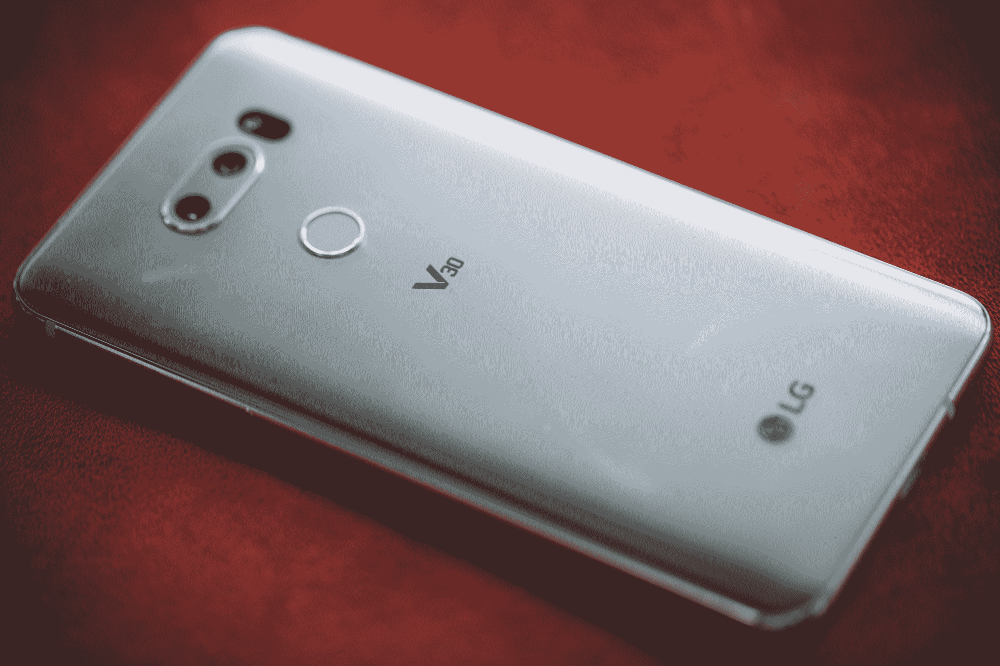
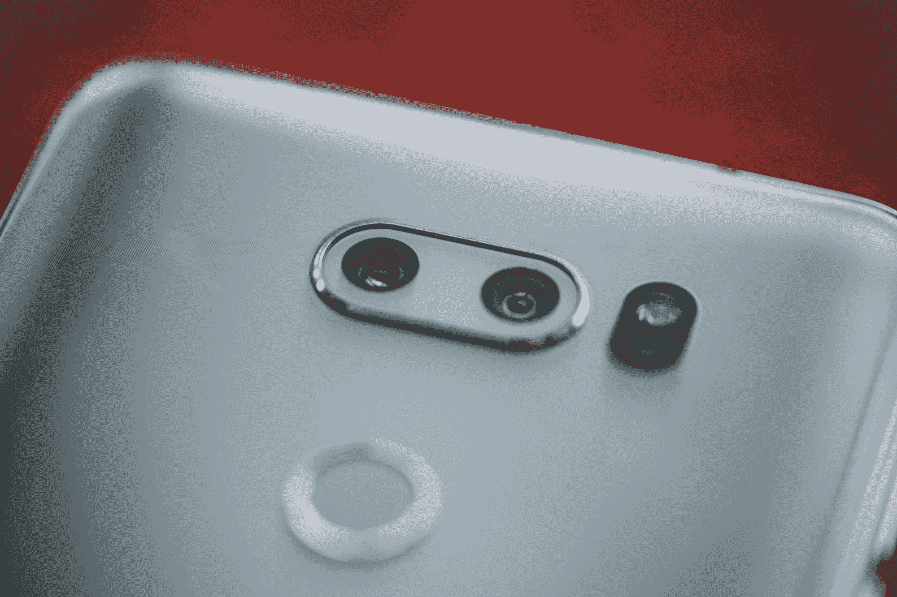

# LG 的 V30 是另一款坚固的、专注于相机的旗舰产品

> 原文：<https://web.archive.org/web/https://techcrunch.com/2017/08/31/lgs-v30-is-another-solid-camera-focused-flagship/>

# LG 的 V30 是另一款坚固的、聚焦相机的旗舰产品

LG 得到了三星和苹果等重量级公司的一小部分青睐，但这并不是因为它缺乏尝试。该公司生产优秀的——在许多情况下是突破极限的——手机。回想一下该公司最近进军双镜头和新的长宽比。见鬼，该公司甚至在很酷之前就发布了一款模块化手机——当然，这有点糟糕，但绝对有趣。

也许随着 V30 的发布，该公司这次会有更多的运气。毕竟，这可能会是今年 IFA 发布的最重要的公告——自从几年前三星决定以自己的方式推出 Galaxy Note 以来，这一区别就一直存在。V30 无疑在推动智能手机形象方面走了一条路，甚至超过了许多竞争对手过去所做的事情。

v 30 具有相当引人注目的视听组合拳。该公司增加了一个四高清 6 英寸屏幕，长宽比为 18:9，上次开始大力推广。色彩复制很棒，没错，黑的很黑。就车载智能手机扬声器而言，它还配有可靠的车载音频体验。

该公司在控制手机尺寸的同时增加了大屏幕。整体设计也非常漂亮。我和 TC 的工作人员一起做了一些盲测，所有人都非常喜欢这个非常时尚的版本。这款手机的防水等级为 IP68，两侧覆盖有大猩猩玻璃，以增加跌落保护。

也就是说，摄影确实是这里的特色。这款手机的镜头很棒，在处理 HDR 图像方面表现出色。LG 还在其相机皮肤中加入了一系列固体滤镜选项。这些软件增强也适用于视频方面，具有高度可定制的设置和板载编辑。

当然，在摄影战线上脱颖而出越来越难了。旗舰智能手机相机都不错，几乎全线。除了双摄像头设置的一些不同配置和对更好的深度传感的推动(见:增强现实)，制造商之间的大多数差异都归结于软件。主流手机购买者往往忽略了这些细微的调整。也就是说，我确实喜欢摆弄 V30 的设置——这款手机有各种不同的视频录制选项，只需轻点几下就可以访问。

v 30 是 LG 的另一款全面手机。该公司并没有为了强行引入其他功能而牺牲任何功能。从我使用它的时间来看，这款手机似乎已经准备好与竞争对手的旗舰产品竞争——该公司是否找到了一种令人信服的销售方式完全是另一个问题。