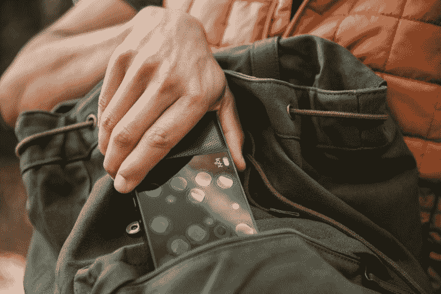

# Light 筹集了 3000 万美元并宣布 L16 相机推迟到 2017 年 

> 原文：<https://web.archive.org/web/https://techcrunch.com/2016/07/06/light-raises-money-yay-and-announces-delays-boo/>

# Light 筹集了 3000 万美元，并宣布 L16 相机将推迟到 2017 年

如果你正在急切地等待你的预购的 [Light L16 相机](https://web.archive.org/web/20221025222908/http://light.co/)的“夏末”交付，今天会让你不耐烦地流泪。在宣布从[GV](https://web.archive.org/web/20221025222908/http://www.gv.com/)(*nee*Google Ventures)获得 3000 万美元的同时，该公司向早期支持者发送了一封电子邮件，告诉他们还需要再等一段时间。

我知道推迟一段时间是可能的，但该公司一直否认有任何差错。今年 3 月，当我向该公司询问此事时，一位发言人说，“我们正在按计划进行，第二批货物将于秋季发货。”

## 规格变更

自从预购发布以来，很多事情都发生了变化。最初，该公司宣布它计划提供 35-150 毫米光学变焦当量。该公司声称，其预购客户想要更宽的焦距，并将变焦范围改为 28-150 毫米光学变焦当量。

毫无疑问，Light 的 L16 是一只看起来不同寻常的动物——但教会它看东西比该公司预期的更具挑战性。

此外，该公司宣布将内置内存规格从 128GB 提高到 256GB。

目前还不清楚到底是什么原因导致这款相机被推迟到“2017 年初”，但当一家公司改变已经宣布的产品规格时，这从来都不是好消息；当然，这听起来不错，但更多的时候，这意味着规范的变化解决了工程中的一个问题。也许纯粹是猜测，但公司内部的一个消息来源告诉我，它在让相机的固件合理运行方面遇到了问题，相机正在努力按预期运行。

“自从我们推出以来，我们已经非常熟悉硬件很难这句口头禅，”该公司告诉其预购客户。"多亏了一个出色的团队，我们取得了巨大的进步。"

“我们在生产关键的、高度定制的 ASIC 芯片时遇到了不可预见的延迟，”该公司的一位发言人今天告诉我。[芯片](https://web.archive.org/web/20221025222908/https://en.wikipedia.org/wiki/Application-specific_integrated_circuit)“承担了 L16 的大部分繁重工作，也是预期发货延迟的原因。”