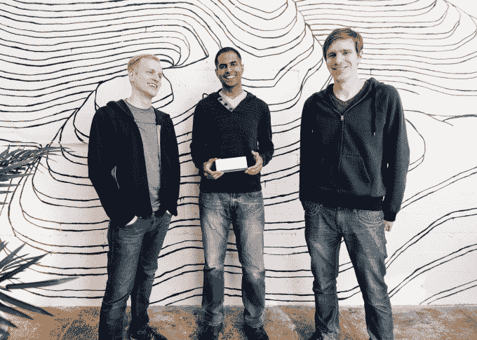
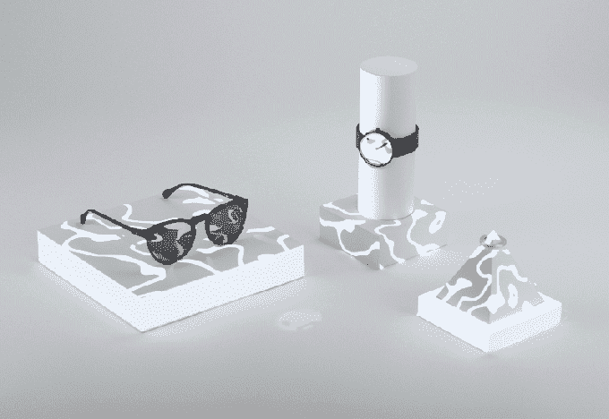

# Lightform 筹集 500 万美元将旧投影仪变成增强现实机器 

> 原文：<https://web.archive.org/web/https://techcrunch.com/2017/11/21/lightform-raises-5m-to-turn-old-projectors-into-augmented-reality-machines/>

# Lightform 筹集 500 万美元将旧投影仪变成增强现实机器

在《银翼杀手 2049》中，更有趣的风格选择之一是电影如何想象未来的增强现实。虽然我们现实反乌托邦世界的微软和谷歌目前正在通过耳机和智能眼镜来接近 AR 技术，但《银翼杀手 2049》完全依赖外部投影来增强其世界和其中的人。

这种未来的愿景似乎仍然有点令人担忧，但这对旧金山的 AR 初创公司 [Lightform](https://web.archive.org/web/20221127191031/https://lightform.com/) 来说是个好消息。

Lightform 不是一家全息初创公司，但通过捕捉结构光，他们安装在投影仪上的计算机能够轻松扫描空间的几何形状，并将迷人的动画和静止图像放在物体和表面上。这个有趣的小而昂贵的设备可以插入任何投影仪的背面，并为它可以照亮的任何表面带来增强现实。这家初创公司附带的 Lightform Creator 桌面软件随后允许用户轻松编辑投影仪如何与其投影的空间进行交互，让他们添加 AR 效果或显示媒体。

Lightform 在由 Lux Capital 牵头的一轮融资中筹集了 500 万美元。Dolby Family Ventures、CrunchFund、Comet Labs、Presence Capital 和 Anorak Ventures 也参与了这轮融资。这家初创公司迄今已筹集了 780 万美元。

乍一看，该公司的产品似乎具有很酷的 Kickstarter 硬件项目的所有特征，你只能在几年后才看到它，或者根本没有。然而，Lightform 做了一些看似激进的事情，因为他们已经筹集了必要的资金来生产第一批 2000 台。

Lightform 首席执行官布雷特·琼斯(Brett Jones)表示:“AR/VR 领域有很多尚未交付的宣传，所以我们希望确保我们能够向客户交付产品，并兑现我们的承诺。”。“鉴于对 AR vaporware 的怀疑，我们希望明确 Lightform 是真实的，并且正在用于实际应用。用这笔新资金为开发提供资金，使我们能够在开始销售产品之前完成产品，而不是相反。”

该公司的技术已经被用来帮助展示我最喜欢的旧金山时尚咖啡馆 Vive La Tarte 的菜单，这家咖啡馆出售 14 美元的“碎 Avo 吐司”。可以肯定地说，Lightform 技术的早期市场是审美至上的，该公司的创始人确实强调，“设计空间的设计师”可能是他们的第一个客户，尽管他们指出，任何具有 Adobe Photoshop 或 Illustrator 工作知识的人都应该能够处理它。

Lightform 还没有给出这款设备的最终价格，但其创始人表示，该公司希望以低于 1000 美元的价格出售这款设备。该团队目前正在与合作伙伴进行“阿尔法测试”，因为它开始制造，并将于明年开放预购。