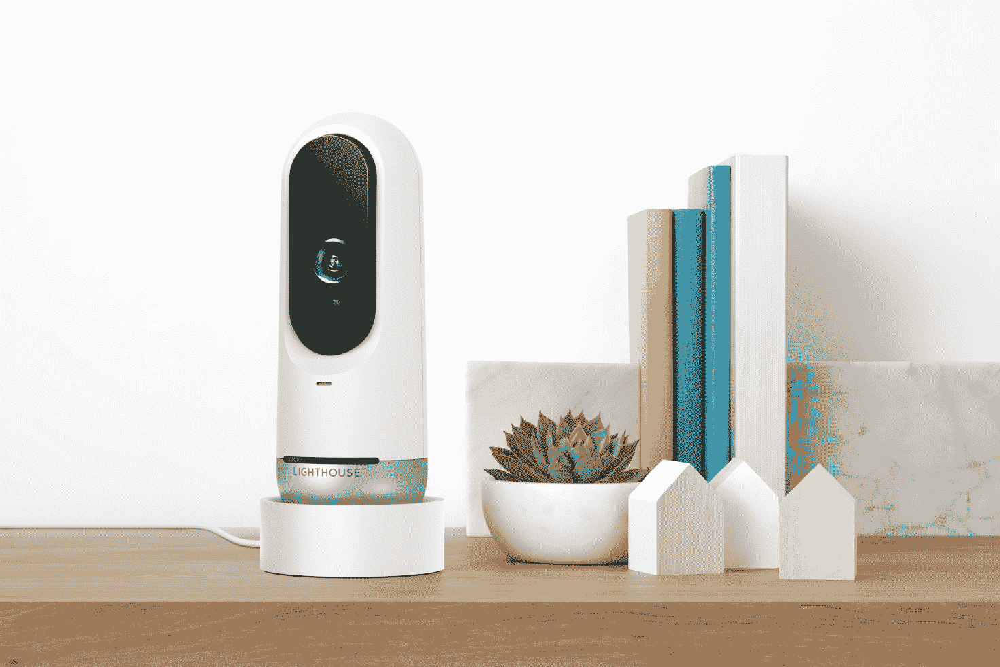

# Lighthouse 的 3D 感应人工智能相机现已上市，售价 299 美元 

> 原文：<https://web.archive.org/web/https://techcrunch.com/2018/02/22/lighthouses-3d-sensing-ai-powered-camera-is-now-available-for-299/>

# Lighthouse 的 3D 感应人工智能相机现在售价 299 美元

如果你带着一个家庭安全摄像头，扔掉它，然后和来自自动驾驶汽车世界的工程师一起回到绘图板，会发生什么？

这就是[灯塔](https://web.archive.org/web/20221007130035/https://www.light.house/)背后的基本前提。他们试图建造一台相机，由于它的 3D 传感激光器和大量的机器学习能力，它对正在看的东西有一些感觉。经过多年的酝酿，它将于今天上午公开出售。

《灯塔》特别独特的一个方面是你应该如何仔细阅读你的镜头；它的目标是更少的安全摄像头，更多的助手。你可以向应用内的自然语言处理系统(想想谷歌助手或 Alexa，但它只关心你家里发生的事情)询问你想要的东西，而不是擦洗时间线。你会问它类似“遛狗的人周三来过吗？”，或者“昨天孩子们什么时候到家的？”，它会用相关的片段来回应。

您还可以根据正在发生的事情设置提醒。如果家里来了新的人，要不要提醒一下？说“如果你看到不认识的人，请通知我。”或者你可以根据*没有*发生的事情来设置它们，比如“如果孩子们 5 点前没有回家，请通知我”。

要做到这一点，需要一些非常密集的机器学习和计算机视觉；幸运的是，该公司的联合创始人亚历克斯·泰希曼和亨德里克·达尔坎普有一些这方面的经验。Teichman 在斯坦福大学的巴斯蒂安·特龙自动驾驶汽车实验室完成了博士学位；达尔坎普是 Google X 的第一位工程师，也是 DARPA 自动驾驶大挑战的获胜者。

据 Crunchbase 报道，该公司已经筹集了 1700 万美元[,并且是安迪·鲁宾的孵化器 Playground 的一部分。我们第一次写](https://web.archive.org/web/20221007130035/https://www.crunchbase.com/organization/lighthouse-5)[灯塔是在去年五月。](https://web.archive.org/web/20221007130035/https://techcrunch.com/2017/05/11/lighthouse-tells-you-what-happens-in-your-home-when-your-not-there/)

人们准备好接受一台努力真正知道它在看什么的家用相机了吗？Nest 已经在这一领域进行了一段时间的探索，开发了面部识别和人工智能等技术，试图判断房间里的运动是人在走动还是只是一台开着的电视。但 Nest 的推出速度非常慢，一次只能推出一个新的人工智能功能，这是有充分理由的:如果人们开始感到奇怪，那么没有人知道它在哪里。

他们最终的定价有点独特，所以细分一下:299 美元就能买到灯塔本身。之后，你可以每月支付 10 美元购买 30 天的云视频存储和云辅助人工智能，也可以预付 200 美元的一次性费用(按月计算相当于 20 个月)购买终身计划。

Lighthouse 让我们借一个单元来看看，所以过几天再来看看我们的印象。