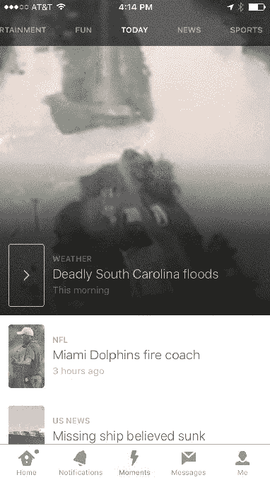
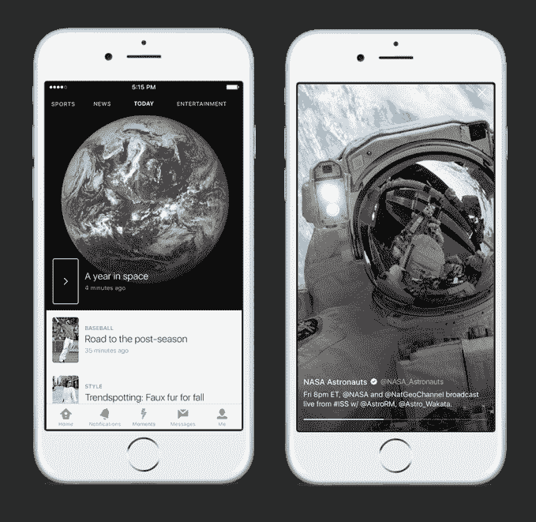
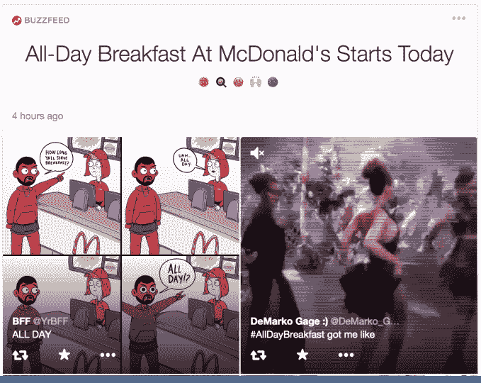

# 关于 Twitter Moments 的 9 大未解问题

> 原文：<https://web.archive.org/web/http://techcrunch.com/2015/10/06/lightning-round/>

给我解开这个谜。为什么人们不会忽略 Twitter 的新时刻标签？瞬间会如何赚钱？Twitter 会付钱给创造它们的出版商吗？今天，Twitter 推出了 Moments ，这是一种轻松跟踪时事的方式，可以帮助它吸引新用户，并唤醒那些从未上瘾的用户。

在许多方面，它解决了 Twitter 最大的问题——这项服务很难获得，只有你经常查看它，它才能发挥最好的作用。但对于 Twitter 的用户、企业和合作伙伴来说，这意味着什么还有很多不确定性。

以下是当下面临的主要困惑和挑战:

**1。时刻只有在吸引更多人使用时才重要，那么 Twitter 将如何向非用户推广这一功能呢？**电视广告？创建可视化工具，以便电视频道展示该功能？让合作伙伴出版物从他们的网站上推广它？让你的推文在你跑去告诉你的朋友来查看的那一刻显示出来看起来很酷，就像你被包含在 Snapchat Live 故事中一样？我的一棵[葡萄树](https://web.archive.org/web/20230407051613/https://vine.co/v/bnHnDTZWXF3)被选中参加今天的[加拉帕戈斯时刻](https://web.archive.org/web/20230407051613/https://twitter.com/i/moments/651260177874853888)，而我甚至没有被通知。如果产品令人愉快并留住用户，Twitter 需要尽一切努力让人们知道这只鸟有了一双新翅膀。

**2。任何不是主页的标签都很容易被忽略，那么 Twitter 如何将时刻融入应用程序的其他部分呢？**当你自然而然地看到一条被选中的推文时，提示你关注或查看相关的时刻？询问“您愿意自动关注我们认为您会喜欢的时刻吗？”只是单方面地将瞬间注入主馈中？目前，Moments 并没有扰乱这个老派的实验，但过于激进可能会激怒忠诚者。

**3。Twitter 将如何在新的用户体验中构建时刻？**它会默认让 n00bs 自动跟随顶级时刻或它认为他们会喜欢的时刻吗？如果用户没有关注很多账户，它会在最近的推文下面的主提要中阻塞时刻列表吗？或者时刻真的会成为新用户的默认标签吗？从理论上讲，从 Moments 中获取即时价值比从主 feed 中获取要容易得多。

**4。Twitter 将如何决定在主要的“今天”时刻提要中放置什么？**除了最初的 BuzzFeed、Vogue 和美国职业棒球大联盟(Major League Baseball)之外，Twitter 还将与多少官方的创造时刻的合作伙伴合作？如果它最终的合作伙伴比它希望的多，一次弄乱了提要，它将如何排序或决定在哪个类别中显示哪个？如果伴侣不够有趣，他们的时刻会被拒绝吗？Twitter 表示，它希望与各种各样的出版商合作，但这与严格监管的理念相冲突，可能会让时刻变得像主提要一样混乱。

**5。Twitter 会把 Moments 变成一个更开放的平台吗？**它会考虑让你关注非合作的 Moments 创建者，看看他们在 Moments feeds 中拼凑了什么吗？Twitter 与开发者的不一致的历史可能会损害这样一个平台的采用。

**6。推广时刻广告将如何运作？** Twitter 告诉 TechCrunch，这些广告被定为 24 小时购买，就像推广的趋势一样，可能会出现在顶部的第一时间。但是，这样一个精选的列表会因为注入赞助内容而比主 feed 遭受更多的损失吗？Twitter 会要求某种质量门槛来允许广告商购买推广时刻吗？如何确定“质量”的标准？Twitter 会将麦当劳这样的品牌与 BuzzFeed 这样的内容聚合商联系起来，制作这些广告并从中分一杯羹吗？这已经是今天的一个时刻了。如果做得好，推广时刻可以成为 Twitter 的招牌，迅速吸引大量观众的广告单元。

**7。Twitter 会给制造瞬间的合作伙伴发工资吗？**如何？它会像脸书出售广告时脸书支付即时文章出版商的方式，与他们分享推广时刻的广告收入吗？Twitter 会让品牌在出版商的时刻插入一个推广的 Tweet 广告，并与他们分享收入吗？如果这不能给他们带来回报，Moments 反馈给出版商的流量、关注者或影响范围是否足以让他们为 Twitter 建立专门的内容？出版商有理由担心，他们可能会通过将推文拼凑成时刻来免费赠送牛奶，而不是专注于让读者回到他们的网站。

**8。为什么瞬间被“[搞不好差点杀了四次](https://web.archive.org/web/20230407051613/http://www.theverge.com/2015/10/6/9457267/twitter-moments-project-lightning)”？如果有价值的实时新闻事件是其最独特、最主流的增值机会，为什么这必须来自一个随机的黑客马拉松项目？如果 Moments 失败了，它还能如何吸引这些软核的主流观众呢？对于如此重要的事情，时刻听起来危险地接近从未发生过。**

**9。Twitter 将如何衡量成功的时刻？**如果它说团队[的任务不是推动增长或收入](https://web.archive.org/web/20230407051613/https://about.twitter.com/company/moments-guidelines)，Twitter 是在寻找时机打开还是人们滚动到最后？[杰克的背影](https://web.archive.org/web/20230407051613/https://techcrunch.com/2015/10/05/twitter-names-jack-dorsey-ceo-adam-bain-becomes-coo-dick-costolo-steps-down-from-board/)。Moments 是他的第一个大产品。但是 Moments 的成功和 [Twitter 业务的进展并没有捆绑](https://web.archive.org/web/20230407051613/https://techcrunch.com/2015/10/06/twitter-moments-have-their-own-set-of-guidelines-and-principles/)，那么 Jack 会被如何评判呢？

嗯，首席执行官先生？给我出个谜语。
