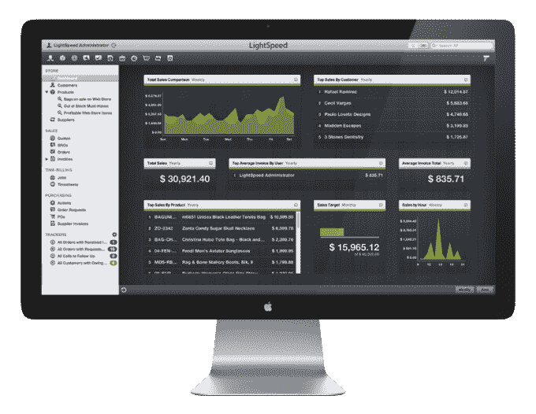

# 零售软件初创公司 LightSpeed 在收购比利时初创公司 POSIOS TechCrunch 后，现在为餐馆提供服务

> 原文：<https://web.archive.org/web/https://techcrunch.com/2014/10/22/lightspeed-now-caters-for-restaurants-after-buying-belgian-startup-posios/>

# 零售软件初创公司 LightSpeed 在收购比利时初创公司 POSIOS 后，现在为餐馆提供服务

总部位于蒙特利尔的初创公司 LightSpeed 向零售商提供销售点软件，该公司正在向餐饮和酒店业扩张。该公司上个月[获得了由英诺维亚资本(iNovia Capital)牵头的 3500 万美元投资](https://web.archive.org/web/20230130100805/https://techcrunch.com/2014/09/17/lightspeed-35m/)，帮助实体零售商增加销售额并改善在线客户体验，该公司还宣布收购比利时初创公司 [POSIOS](https://web.archive.org/web/20230130100805/http://www.posios.com/) 。

这笔未披露的交易在比利时根特建立了该公司的欧洲发展总部——POSIOS 自己的办公室——及其新的光速餐厅产品，该产品将在欧洲以外进行管理。POSIOS 为餐厅、活动经理和餐饮服务商提供了类似的零售管理应用程序；那个软件被用来驱动光速餐厅。

新的餐厅服务立即可用，像其旗舰零售服务一样，它提供了销售和库存数据的单一视图，为回头客提供了客户洞察，以及一个用于更新多家餐厅和网站的列表、图像和价格的中央平台。

LightSpeed 不仅仅在后端工作，它还可以帮助零售商和餐馆管理他们的可视菜单、客户标签、座位和桌子，以及支付和账单。

LightSpeed 的创始人兼首席执行官达克斯·达席尔瓦在一份声明中说:“扩展到酒店业进一步推进了我们的愿景，即把复杂而又无障碍的技术带到整个主街。”

关于 POSIOS 交易，Dasilva 表示，这“强调了我们对投资欧洲的承诺”，而进军酒店业是“我们希望创造任何人都可以使用的前瞻性技术”的一部分。

在这笔交易之后，LightSpeed 现在为全球超过 21，000 家企业提供服务。该公司声称，其平台有望每年处理 82 亿美元的销售交易。

LightSpeed 成立于 2005 年，在蒙特利尔、纽约、奥林匹亚、渥太华、圣克鲁斯以及现在的比利时都设有办事处。该公司还得到了 Accel 的支持，后者在 2012 年 6 月投资了 3000 万美元。