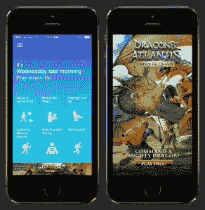
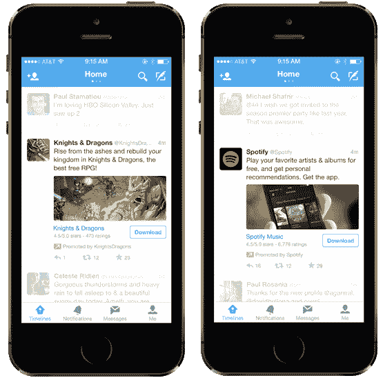
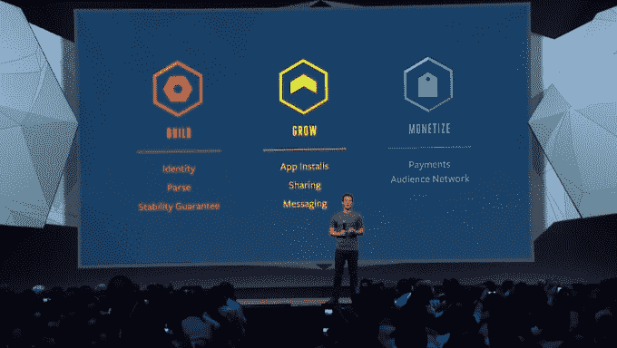
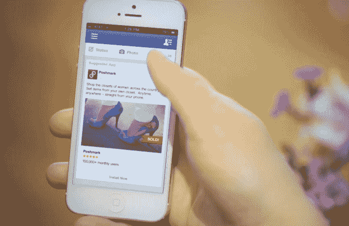
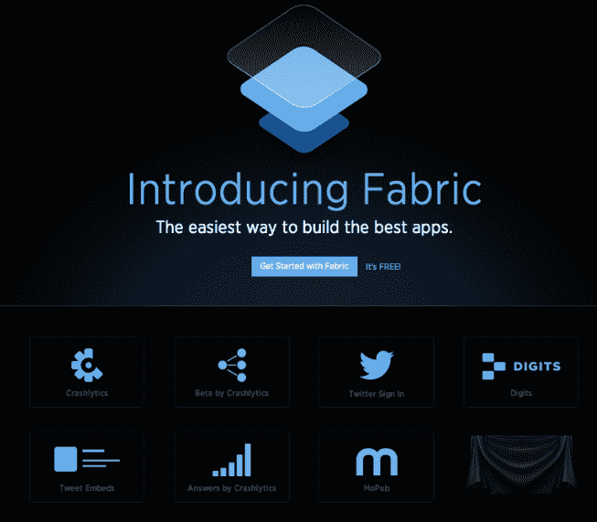
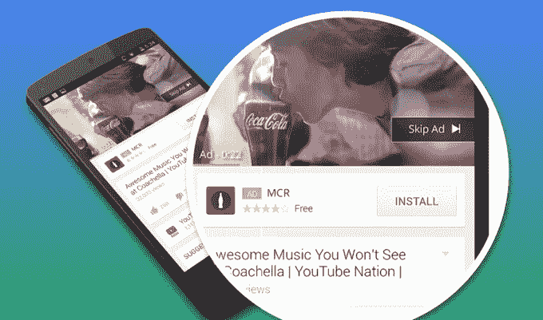
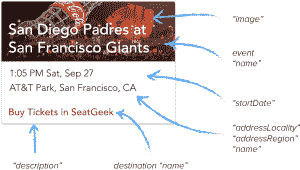

# 脸书、谷歌和 Twitter 的应用安装广告之战

> 原文：<https://web.archive.org/web/https://techcrunch.com/2014/11/30/like-advertising-a-needle-in-a-haystack/>

我们对应用程序的热爱带来了一个意想不到的后果,那就是现在应用程序实在太多了。应用商店人满为患，让开发者迫切需要一种方法来发现他们的游戏和实用程序。这就是为什么 app install ad 已经成为移动平台业务的命脉。

大品牌不再是唯一需要讨好的品牌。没有人会在手机上购买汽车或可口可乐，至少现在还没有，所以证明移动广告对这些业务的投资回报是很困难的。不过，有一样东西*会让*立刻为小屏幕支付几美元:应用程序。

受到每个季度数十亿的应用安装广告支出的诱惑，并希望扩大这块蛋糕，脸书、推特和谷歌已经站了出来。但是为了赢得这些钱，他们必须和开发者结成伙伴。

脸书和推特真的要感谢苹果和谷歌。对应用安装广告的迫切需求源于他们对应用发现的忽视。App Store 和 Google Play 提供搜索引擎和前 10 名排行榜，但在个性化、社交验证的浏览或发现方面几乎没有。基本上，获得热门应用的唯一方法是获得足够的下载量，从而进入排行榜，并让增加的可见性让你留在那里。这是一场斗争，除非你的应用天生就是病毒式的，古怪的，或者伟大到足以激发口碑，或者你赢得了选择谁为特色的应用商店编辑的青睐。

但后来出现了应用安装广告。

## 安装广告的兴起

广告网络应用在 Songza 上安装横幅广告，恳求人们下载一款手机游戏

在大型平台重新定义其路线图以撬开开发者的钱包之前，大量独立广告网络统治着这个领域。

AdMob、InMobi、Jumptap 和千禧传媒在早期移动时代蓬勃发展。这些让开发者购买广告，在移动网站和其他应用上推广他们的应用，或者托管它们来赚钱。毫无疑问，弹出的小横幅和兜售游戏和购物门户的间隙广告令人讨厌，但即使缺乏先进的目标数据，它们也能在一定程度上发挥作用。如果没有销售团队或专业知识，开发者可以通过出售广告空间或购买产品增长来赚钱。

谷歌看到了移动广告的潜力，并于 2009 年以 7.5 亿美元收购了大狗 AdMob，而苹果于 2010 年收购了 Quattro Wireless 并推出了自己的广告网络 iAd。两家公司都运营应用安装广告，但这不是他们唯一的关注点。直到 2012 年，当从桌面使用到移动使用的真正滑坡发生时，脸书才明白过来。

马克·扎克伯格的公司处境不妙。随着用户的迁移，刚上市的脸书公司在移动端没有收入，股价开始下跌。虽然它曾拥有一个流行的游戏网络平台，并在应用内购买时获得 30%的税收，但在其 HTML5 移动网络平台失败后，它没有在移动设备上拥有一个游戏网络平台。所有的税收都流向了苹果的 iOS 和谷歌的 Android 商店，尽管应用程序依赖于脸书的免费社交登录、交友和分享功能。

脸书所做的是与开发商的关系，深入的广告定位数据，以及稳定流入的大量移动眼球。

脸书的移动货币化平台战略有点牵强:将开发者与社交分享 API 联系起来，并希望用户将他们在脸书连接的应用程序中的内容推回到网络或移动新闻源，再到脸书显示广告的地方。

脸书的第一个应用安装广告丑陋而模糊，但证明了开发者会为下载付费

然而，在多年的产品和 API 变化之后，社交网络与开发者的关系变得紧张起来。即使是其名为“Operation Developer Love”的程序警告应用程序制造商即将发生的变化，也无法摆脱这一耻辱。病毒式的渠道打开又关闭，功能出现又消失，开发人员厌倦了在不稳定的平台上投资开发。

但应用安装广告让脸书利用其持续的移动应用流量扭转了局面。2012 年 8 月，[脸书宣布将让 app install ads](https://web.archive.org/web/20230404054415/https://techcrunch.com/2012/08/07/facebook-mobile-app-ads/) 成为其第一个不是由朋友的行为触发的广告单元。到了 10 月份，它们开始铺开，我把脸书的战略描述为“[在应用经济上下了大赌注](https://web.archive.org/web/20230404054415/https://techcrunch.com/2012/10/17/facebook-mobile-app-install-ads/)…成为应用商店之外的顶级发现来源。”

与后来的版本相比，广告单元看起来非常丑陋，但来自广告商的早期报告是积极的。至少从 2012 年开始，Twitter 就已经看到开发者尝试用[广告来推动应用安装](https://web.archive.org/web/20230404054415/http://online.wsj.com/news/articles/SB10001424052702304458604577491170573156612?mg=reno64-wsj&url=http%3A%2F%2Fonline.wsj.com%2Farticle%2FSB10001424052702304458604577491170573156612.html)。2013 年 4 月，随着其应用安装卡的正式推出，可以通过推文广告进行推广，它让开发者可以在全球饮水机旁下载他们的应用。

战线已经划定。脸书的应用安装广告、Twitter 的可推广应用安装卡和谷歌的 AdMob。各有所长。脸书非常了解你，推特知道你谈论什么，对什么感兴趣，谷歌深刻理解你在互联网上做什么，并且在市场上领先一步。在接下来的几年里，他们将把应用安装广告从固定在业务外部的自动取款机转变为建立在平台战略基础上的成熟银行。

## 为什么应用程序安装广告有效

网络的衰落正在把横幅广告拖向坟墓。在手机上，没有空间用小尺寸、低质量、针对性差的营销信息来筛选小屏幕。

相反，移动广告通常是一次显示一个。这意味着更好的定位大有帮助。这使得像谷歌、脸书和推特这样的平台通过将强大的个人数据与融入其内容的本地应用安装广告格式相结合，在竞争中击败了像千禧传媒这样的独立广告网络

虽然许多人希望[看到横幅广告痛苦地死去，但应用安装广告是唯一能在手机上成功的横幅广告。这是因为与传统品牌广告相比，应用安装广告在移动领域有两大优势:](https://web.archive.org/web/20230404054415/http://www.nytimes.com/2014/11/06/technology/personaltech/banner-ads-the-monsters-that-swallowed-the-web.html)

*   **应用程序很容易购买**——大多数 iOS 和 Android 用户已经将他们的信用卡连接到他们操作系统的应用程序商店。用户不需要在任何地方笨拙地输入他们的支付细节。应用程序提供即时的满足感，因为没有等待实物发货的延迟，它们的低价格意味着它们可以作为冲动购买而不需要额外的研究，应用程序的多样性意味着它们吸引了非常广泛的人群。
*   **安装易于跟踪**–与推广线下购买产品的移动广告相比，应用安装广告的转化率易于衡量。广告商要求看到广告投资回报的证明，以保持支出。这对于传统品牌的移动广告客户来说很困难，因为很难判断本田或可口可乐的广告是否真的导致了转化。这是有可能的，但即便如此，还不清楚手机广告对购买决定的影响有多大。但是通过软件开发工具包(SDK)和移动跟踪合作伙伴，[脸书](https://web.archive.org/web/20230404054415/https://developers.facebook.com/docs/ads-for-apps/measurement#step3)、[推特](https://web.archive.org/web/20230404054415/https://blog.twitter.com/2014/introducing-mobile-app-promotion)和[谷歌](https://web.archive.org/web/20230404054415/https://developers.google.com/app-conversion-tracking/docs/ios/conversion-tracking-server)都可以清楚地衡量一个应用安装广告何时直接导致实际安装。只要这些安装产生的用户终身价值高于广告价格，他们的投资回报率是积极的，开发者会继续购买他们。

随着应用商店变得越来越混乱，开发者开始向广告形式投入资金。到 2013 年 4 月底，我建议 app [install ads 可以成为脸书的“成长中的现金牛犊”](https://web.archive.org/web/20230404054415/https://techcrunch.com/2013/04/30/facebook-earnings-apps/)，并写道“虽然品牌广告是脸书桌面广告业务的基石，但 app install ads 可以形成其未来所依赖的移动广告业务的基础。”

当脸书公布该季度的收入时，它指出开发者，包括 iOS 和 Android 上前 100 名中的 40%，已经购买了 2500 万次安装。马克·扎克伯格说，广告[为其底线贡献了“实际收入”](https://web.archive.org/web/20230404054415/https://techcrunch.com/2013/05/01/facebook-app-install-ads/)，并帮助移动广告总收入从 23%跃升至 30%。与此同时，应用安装广告帮助 Twitter 申请上市，超过 65%的广告收入来自移动终端。到 2013 年底，全世界都有证据表明，应用安装广告将成为一项巨大的业务。

## 平台战略

不过，单纯销售广告可能会错失良机。推动安装对开发者如此重要，以至于在缺乏操作系统的情况下，脸书和 Twitter 围绕应用广告构建了他们的移动平台战略。目标:为开发者提供高质量的服务和工具，以便形成导致广告购买的关系。

### **脸书+解析**

这就是为什么[脸书收购了 Parse](https://web.archive.org/web/20230404054415/https://techcrunch.com/2013/04/25/facebook-parse/) ，这是一个移动后端即服务，将一些开发工作从构建和托管应用程序中剥离出来。这将成为脸书“建设-增长-盈利”战略的基础。

本质上，脸书提供了可靠的、负担得起的开发工具和 SDK，用于通过 Parse 管理和测试应用程序，或者将社交登录和共享添加到新闻订阅中。这也有助于广告定位，让脸书知道谁安装了其 SDK 的应用程序。一旦上钩，脸书就可以通过购买其应用安装广告来诱使这些开发者成长。

最后一部分，“货币化”，直到最近才有点模糊。人们的期望是，由于脸书的发展和增长援助，应用程序可以通过托管广告、虚拟商品或电子商务来赚钱。但脸书直到 2014 年 4 月才开始分一杯羹，当时它推出了[脸书观众网络，这是一个广告网络](https://web.archive.org/web/20230404054415/https://techcrunch.com/2014/04/30/facebook-audience-network-mobile-ad-network-launches-at-f8/)，让广告商利用脸书广泛的个人数据宝库，将他们在第三方应用中购买的广告定向投放。突然，[脸书*可以通过让开发者托管其广告来支付*开发者](https://web.archive.org/web/20230404054415/https://techcrunch.com/2014/10/07/facebook-audience-network-ads/)…这很可能是来自其他开发者的应用安装广告。

这是一个反馈循环，脸书帮助应用程序建立，直到他们付钱让它成长，直到它们足够大，它付钱让它们帮助其他人成长。而且利润丰厚。2014 年第三季度，仅移动广告一项，脸书就赚了[19.5 亿美元](https://web.archive.org/web/20230404054415/https://techcrunch.com/2014/10/28/facebook-q3-2014/)，据猜测其中很大一部分来自应用安装。

### Twitter + MoPub

它知道自己是这场战斗中的小角色，其广告服务网站的流量低于脸书的 feed 或谷歌的搜索页面加 AdMob。它还关注了脸书的首次公开募股，但由于缺乏移动广告收入，其股价受到重创。因此，2013 年 10 月， 在首次公开募股之前，Twitter 明智地以 3.5 亿美元的股票收购了领先的广告交易平台 MoPub ，该平台让开发者在顶级广告网络中获得最大的安装回报，其单元分布在其他移动网站和应用程序中。

为了在首次公开募股期间向开发者发出不可抗拒的吸引力并赢得华尔街的芳心，它需要 MoPub 的影响力。八个月后，Twitter 继续收购 TapCommerce ,以提升其应用再参与广告定位能力。

但直到 2014 年 10 月，Twitter 的战略才在发布 Fabric 的[飞行会议上成为焦点。](https://web.archive.org/web/20230404054415/https://blog.twitter.com/2014/introducing-fabric)这是一套[开发者工具](https://web.archive.org/web/20230404054415/http://marketingland.com/costolo-flight-105015),包括用于挤压 bug 的 Crashlytics，用于提升应用程序有机病毒传播的增强登录和 tweet composer 选项，通过名为 Digits 的电话号码快速建立登录的方法，以及通过托管广告赚钱的 MoPub。

Twitter 狡猾地忽略了开发人员使用的每个 Fabric 工具，他们更接近 Twitter，可能更有可能购买其应用安装广告。就在本周，Twitter 宣布将开始跟踪用户手机上的所有应用程序，以提高其广告的针对性，其应用程序安装广告将获得最大的好处。首先，你不会看到你已经拥有的应用程序的广告，它可以知道向你显示旅游或体育应用程序的广告，因为这些都是你已经拥有的应用程序。

除了更传统的品牌广告，应用安装广告帮助 Twitter 从移动端获得了 75%的广告收入，在 2014 年第三季度达到了惊人的 2 . 72 亿美元。现在，它吸引开发者的计划正在加速，预计应用安装广告将在下个季度成为其收入的更大一部分。

### Google + AdMob

自始至终，谷歌似乎都在固步自封，满足于享受其有先见之明的收购 AdMob 所带来的收益。但它终于看到了别人追逐市场的艰辛，投入了更多的资源。与脸书和 Twitter 相比，谷歌没有太多理由匆忙行事，因为它拥有安卓系统，从应用内购买的税收中获得了稳定的收入。在他们忙乱的时候，谷歌冷静地不断改进 AdMob 的定位和转换跟踪。

到 2014 年 4 月，谷歌已经准备好争夺风头，[在 AdMob](https://web.archive.org/web/20230404054415/https://techcrunch.com/2014/04/22/google-to-offer-mobile-app-install-ads-in-search-and-youtube-expands-app-deep-linking-to-adwords/) 上推出增强的应用安装广告，利用这个巨头关于人们下载、使用和花钱的应用的数据。除了安装之外，它还将与[脸书](https://web.archive.org/web/20230404054415/https://techcrunch.com/2013/10/01/facebook-mobile-app-ads-calls-to-action/)和 [Twitter](https://web.archive.org/web/20230404054415/https://techcrunch.com/2014/06/30/twitter-rolls-out-app-install-and-engagement-ads-and-new-click-pricing-globally/) 一起提供基于深度链接的应用再参与广告，让用户回到他们已经下载的应用，并直接进入相关的购买页面，如他们刚刚到达的城市的 HotelTonight 列表。

在 Google+为第三方应用开发登录平台的混乱一年后，Google 终于在 8 月份将应用安装广告引入移动搜索和 YouTube。这是脸书将它们放入移动 feed 整整两年之后。

尽管谷歌的移动搜索流量在总移动广告份额中遥遥领先，但它的份额预计会缩小，而脸书的份额会增长。 [eMarketer](https://web.archive.org/web/20230404054415/http://www.emarketer.com/Article/Driven-by-Facebook-Google-Mobile-Ad-Market-Soars-10537-2013/1010690) 认为[到 2014 年底，谷歌的移动广告市场份额将从两年前的 50%以上下降到 44.6%，同时它预计脸书将从 2012 年的 5.4%增长到 20.4%，Twitter 预计将从 2013 年的 2.25%增长到 2014 年的 2.64%。这就是为什么谷歌首席财务官](https://web.archive.org/web/20230404054415/https://techcrunch.com/2014/10/16/google-drops-3-after-reporting-weaker-than-expected-third-quarter-revenue-and-profit/)[在最近的收益电话会议上说“我们的重点是帮助开发者创造应用下载量。”](https://web.archive.org/web/20230404054415/https://gigaom.com/2014/10/16/facebook-may-have-solved-mobile-but-google-is-still-struggling-with-it/)

### 苹果在哪里？

除了 iAd 广告网络，苹果对应用安装广告业务基本上保持沉默，尽管这是它存在的一个重要原因。主流 iPhone 用户依靠苹果的排行榜和编辑推荐来发现应用程序。尽管[在 2012 年收购了应用发现网站 Chomp](https://web.archive.org/web/20230404054415/https://techcrunch.com/2012/02/23/apple-chomp/) ,但从商店的数百万个应用中挖掘优秀应用的体验并没有变得更好。

如果开发者没有足够的影响力或病毒力登上排行榜，他们就不得不通过购买的方式登上排行榜。这使得一些喜欢[亨特沃克的人想知道苹果是否可以通过在应用商店本身或 iPhones 和 iPads 上的应用安装广告闯入市场。iOS 8 可以为附近其他人经常下载的应用](https://web.archive.org/web/20230404054415/http://hunterwalk.com/2013/04/24/promoted-apps-could-native-advertising-come-to-ios-app-store/)提供基于[位置的推荐，比如当你在一家咖啡馆时的星巴克应用。假设它能卖出这些推荐位置是明智的。](https://web.archive.org/web/20230404054415/https://techcrunch.com/2014/06/03/apple-delivers-location-based-app-suggestions-on-your-lock-screen-in-ios-8/)

不过，就目前而言，它似乎完全专注于高利润的硬件业务，将机会让给了其他平台。

## 决出胜者

随着应用商店人口过剩的问题越来越严重，应用安装广告的重要性只会增加。不过，它们可能会呈现出新的形式。

随着应用程序变得更加生动，它们的广告也可能变得更加生动。脸书正在大力投资视频广告，最近收购了 LiveRail。它可以将 LiveRail 在网络上的视频广告库存与其定位和开发者联系结合起来，销售视频应用安装广告，真正展示一个应用可以有多有趣或有用。

开发者也在尝试 Twitter 的 Vine 视频分享社交网络。他们让拥有大量追随者的 Vine 创作者为他们的应用程序制作草图，或者通过像 Niche 这样的内容货币化网络委托明星来命名应用程序[披露:Niche 是由我的堂兄达伦·拉赫曼创建的]。然后，一些开发者再次付费推广包含兜售其应用的藤蔓的推文。

上下文相关的主屏幕取代了 Android 的默认启动器应用导航和文件夹，为你提供了当前可能需要的应用的动态建议，也可以承载应用安装广告。[流行的主屏幕 Everything.me](https://web.archive.org/web/20230404054415/http://everything.me/) 已经开始销售其应用推荐槽。也有与运营商和制造商的预装协议，开发者可能会预先支付或未来收入的一部分，让他们的应用程序与手机一起出现。

【更新:在应用安装广告之后，将会是应用参与广告的兴起。iOS 上禁止公开推广的推送通知，如果恼怒的用户关闭推送，它们可能会让应用程序的生命线静音。广告可能是让某人打开隐藏在后台文件夹中的应用程序的唯一方式。

像 [URX](https://web.archive.org/web/20230404054415/https://techcrunch.com/2014/04/28/mobile-deep-linking-startup-urx-raises-12-million-launches-universal-link-service-called-omnilinks/) 和[纳尼根斯](https://web.archive.org/web/20230404054415/https://techcrunch.com/2014/11/18/nanigans-mopub/)这样的广告科技初创公司的复杂的重新定位将帮助开发者将休眠的现有用户拉回到应用程序中，或者引发鲸鱼进行购买。这些广告可以提醒人们在时尚应用程序中查看新的服装系列，购买额外游戏关卡的访问权限，或者查看可以让他们重返社交网络的必看内容。

随着越来越多的品牌和企业转向移动，并开始为他们的应用建立用户基础，部分通过安装广告，他们将寻求通过再参与广告从最初的投资中挤出更多的终身价值。]

最终，资产负债表将决定应用广告战的赢家，尽管这可能是一场持续的地盘战，而不是一场毫无争议的征服者。哪个平台拥有最佳的定位和广告形式，能够提供最佳的规模化转化率，并能以最低的广告价格证明最高的用户终身价值？

如果脸书、推特或谷歌能为应用广告支出提供最高回报，开发者就会蜂拥而至。随着开发者打开钱包，胜利者不仅会获得战利品，他们还将成为新应用经济中成功的守门人。