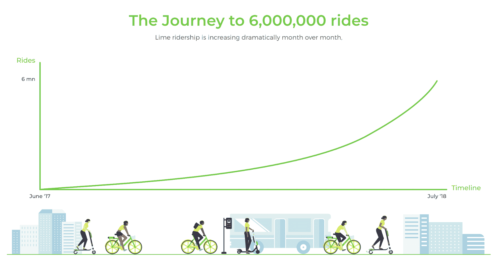

# Lime 点击率达到 600 万次 

> 原文：<https://web.archive.org/web/https://techcrunch.com/2018/07/23/lime-hits-six-million-rides/>

# Lime 点击量达到 600 万次

自行车和滑板车共享公司 Lime 最近从 GV、优步和其他公司融资 3.35 亿美元，自去年 6 月推出以来，点击量已达 600 万次。Lime 首先在北卡罗来纳州的格林斯博罗推出，后来已经扩展到 70 个城市。

相比之下， [Bird 在 4 月宣布，自 11 月推出以来，它已经达到了 100 万次。](https://web.archive.org/web/20221128122519/https://www.bird.co/blog/bird-riders-fly-one-million-rides)

Lime 在旧金山的乘客数量目前处于暂停状态，因为该市审查允许 12 家公司申请经营电动滑板车服务。但在 Lime 在旧金山运营的短暂时间内(从 3 月到 6 月)，其滑板车的访问量达到了 30 万次。在加利福尼亚州的圣地亚哥，它的踏板车在五个月内帮助了一百万次自行车和踏板车的骑行。

电动滑板车现在炙手可热，风投公司向这个领域投入了数十万美元，打车公司也将赌注押在了滑板车初创公司上。例如，lyft[已经在电动滑板车](https://web.archive.org/web/20221128122519/https://techcrunch.com/2018/07/16/lyft-outlines-bike-and-scooter-plans/)和自行车上展示了它的雄心。与此同时，如上所述，优步投资 Lime，作为将优步品牌推广到 Lime 滑板车交易的一部分。

请务必查看下面 TechCrunch 的滑板车报道。