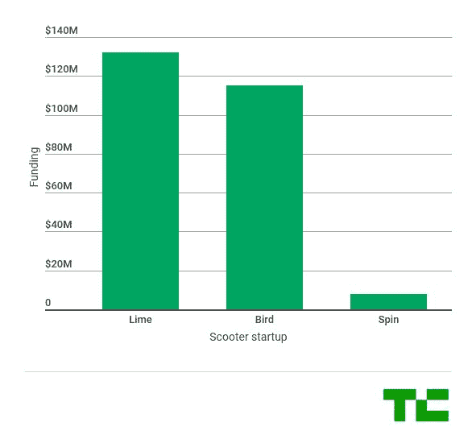

# 据报道，Lime 正试图从风投那里挤出高达 5 亿美元的资金

> 原文：<https://web.archive.org/web/https://techcrunch.com/2018/05/15/lime-is-trying-to-squeeze-up-to-500-million-out-of-vcs/>

# 据报道，Lime 正试图从风投那里挤出高达 5 亿美元的资金

Axios 援引消息来源报道称，电动滑板车和自行车公司 Lime 正在寻求筹集高达 5 亿美元的新资金。Axios 表示，这轮融资可能以股权和债务的形式进行。

迄今为止，Lime 已经从投资者那里筹集了 1.32 亿美元。它最近的一轮融资是在二月份，在 T2，它从第五墙筹集了 7000 万美元。Lime 拒绝对此事发表评论。

本月早些时候，Lime 宣布与 Segway 合作生产其电动滑板车的第二版。Lime 及其竞争对手 Bird 和 Spin 最终都依赖于 Ninebot，这是一家与 Segway 合并的中国滑板车公司。Ninebot 的投资者包括红杉资本、小米和顺为。

不考虑 Lime 的潜在回合，这里是 Lime 对比 Bird 和 Spin 的地方。

电动滑板车领域最近一直受到审查——部分原因是 Bird、Spin 和 Lime 今年 3 月在旧金山未经明确许可部署了各自的滑板车。

不到一个月前，旧金山市交通局宣布了电动滑板车的许可程序。你可以在这里了解更多。

如果你想了解旧金山电动滑板车交易的详细情况，这里有个故事。