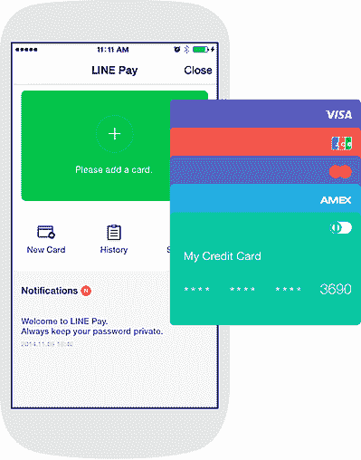

# 消息应用 Line 的支付服务开始向全球用户推出 

> 原文：<https://web.archive.org/web/https://techcrunch.com/2014/12/16/line-pay-finally-rolling-out/>

# 消息应用程序 Line 的支付服务开始向全球用户推出

本月早些时候，Line 过早地宣布推出聊天应用支付功能，但现在它已经开始向其 5 亿多注册用户推广。

日本公司[宣布](https://web.archive.org/web/20221205111644/http://official-blog.line.me/en/archives/1015721641.html)一项新的更新，为所有用户(除了中国和韩国的用户)带来 [Line Pay](https://web.archive.org/web/20221205111644/http://line.me/en/pay) ，但迄今为止，TechCrunch 的美国员工没有一个人注意到这个选项出现在我们的 Line 应用程序中。(更新:现在有了。)

正如《亚洲科技》[指出的那样,](https://web.archive.org/web/20221205111644/https://www.techinasia.com/line-pay-launches/)预计全面推广将需要一个月的时间才能覆盖所有用户，但那些早期选择将信用卡绑定到 Line Pay 的用户无论如何都经历了一些初期问题。

Line Pay 的主要目标是让用户能够通过聊天应用进行支付，就像韩国的卡考和中国的微信用户已经可以做到的那样。(中国和韩国的缺席可能是因为这两个国家的聊天应用将面临竞争。)

支付不仅仅是亚洲的事情——Snapchat 已经跳上了马车，而脸书似乎已经测试了自己的解决方案，Kik 也很感兴趣。

Line 表示，它可以使用美国运通、Diner's Club、JCB、万事达卡和 Visa 卡。它最初将只支持在线商店(销售贴纸和主题)的支付，但该公司计划未来允许全球用户在线/应用内购买，向在线朋友汇款，以及离线支付商品。

可以理解，安全性是一个主要问题。Line 表示，交易将需要一个唯一的 7 位数字密码，而如果用户通过该服务的桌面版本进行支付，则需要通过手机进行认证(在 iOS 上使用密码或触控 id)。

Line Pay 是一个有趣的新项目，因为除了增加用户的便利，如果大量用户注册，Line 也会受益。大量采用为引入新服务奠定了潜力，如在东南亚测试的[电子商务服务](https://web.archive.org/web/20221205111644/http://thenextweb.com/asia/2014/07/16/chat-app-line-experiments-e-commerce-prepares-ipo/)，即将在 T2 推出的音乐流媒体服务等，因为用户的银行卡已经与 Line Pay 绑定，支付壁垒大大降低。